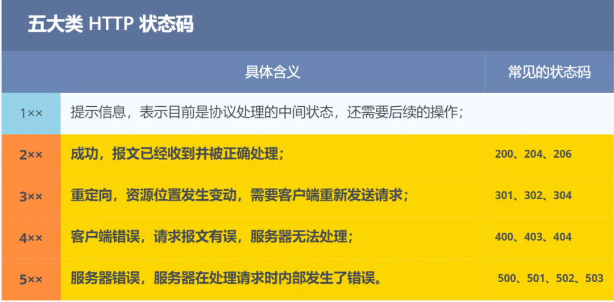

# 图解网络 HTTP篇

## HTTP 常见面试题

### HTTP基本概念

#### HTTP是什么

* HTTP 是超⽂本传输协议，也就是HyperText Transfer Protocol。  

* HTTP 是⼀个在计算机世界⾥专⻔在「两点」之间「传输」⽂字、图⽚、⾳频、视频等「超⽂本」数据的「约定和
  规范」。  

#### HTTP常见的状态码有哪些

* 5大类HTTP状态码

#### HTTP常见字段有哪些

* Host 字段 ：
* Content-Length 字段 ：
* Connection 字段 ：
* Content-Type 字段  ：
* Accept 字段  ：
* Content-Encoding 字段  ：
* Accept-Encoding  字段：

### GET和POST

#### GET和POST有哪些区别

* Get ⽅法的含义是请求从服务器获取资源，这个资源可以是静态的⽂本、⻚⾯、图⽚视频等。  
* POST ⽅法则是相反操作，它向 URI 指定的资源提交数据，数据就放在报⽂的 body ⾥  

#### GET和POST方法都是安全和幂等的吗

* GET ⽅法就是安全且幂等的，因为它是「只读」操作  
* POST 因为是「新增或提交数据」的操作，会修改服务器上的资源，所以是不安全的，且多次提交数据就会创建多
  个资源，所以不是幂等的。  

### HTTP（1.1） 特性

#### HTTP有哪些优点

* 简单  
* 灵活和易于扩展  
* 应⽤⼴泛和跨平台  

#### HTTP有哪些缺点

* ⽆状态双刃剑  
* 明⽂传输双刃剑  
* 不安全  

#### HTTP/1.1的性能如何

* HTTP/1.1的**长连接**通信方式相比HTTP/1.0的短连接减少了**TCP 连接的重复建⽴和断开所造成的额外开销，减轻了服务器端的负载。**  
* **管道⽹络传输**允许客户端可以发起多个请求，只要第⼀个请求发出去了，不必等其回来，就可以发第⼆个请求出去，可以减少整体的响应时间。  
* 因为当顺序发送的请求序列中的⼀个请求因为某种原因被阻塞时，在后⾯排队的所有请求也⼀同被阻塞了，会招致客户端⼀直请求不到数据，这也就是「**队头阻塞**」。  
* 总之 HTTP/1.1 的性能⼀般般，**后续的 HTTP/2 和 HTTP/3 就是在优化 HTTP 的性能**  

### HTTP与HTTPS

#### HTTP与HTTPS有哪些区别？

* HTTP 是超⽂本传输协议，信息是**明⽂传输**，存在安全⻛险的问题。 HTTPS 则解决 HTTP 不安全的缺陷，在TCP 和 HTTP ⽹络层之间加⼊了 SSL/TLS 安全协议，使得报⽂能够**加密传输**。
* **HTTP 连接建⽴相对简单**， TCP 三次握⼿之后便可进⾏ HTTP 的报⽂传输。⽽ **HTTPS 在 TCP 三次握⼿之后，还需进⾏ SSL/TLS 的握⼿过程**，才可进⼊加密报⽂传输。
* HTTP 的**端⼝号**是 80， HTTPS 的端⼝号是 443。
* HTTPS 协议需要向 CA（证书权威机构）**申请数字证书**，来保证服务器的身份是可信的  

#### HTTPS解决了HTTP的哪些问题？

* 窃听⻛险  
* 篡改⻛险
* 冒充⻛险   

#### HTTPS是如何解决HTTP不安全问题的

* **混合加密**的⽅式实现信息的机密性，解决了窃听的⻛险。  
* **摘要算法**的⽅式来实现完整性，它能够为数据⽣成独⼀⽆⼆的「指纹」，指纹⽤于校验数据的完整性，解决了篡改的⻛险。  
* 将服务器公钥放⼊到**数字证书**中，解决了冒充的⻛险。  

#### HTTPS是如何建立连接的？期间交互了什么？

SSL/TLS 协议基本流程：

* 客户端向服务器索要并验证服务器的公钥。
* 双⽅协商⽣产「会话秘钥」。
* 双⽅采⽤「会话秘钥」进⾏加密通信。  

### HTTP/1.1、HTTP/2、HTTP/3 演变

#### 说说HTTP/1.1 相比 HTTP/1.0 提高了什么性能？

* 使⽤ TCP ⻓连接的⽅式改善了 HTTP/1.0 短连接造成的性能开销。
* ⽀持管道（pipeline）⽹络传输，只要第⼀个请求发出去了，不必等其回来，就可以发第⼆个请求出去，可以减少整体的响应时间。  
*  HTTP/1.1 还是有性能瓶颈：
  * 请求 / 响应头部（Header）未经压缩就发送，⾸部信息越多延迟越⼤。只能压缩 Body 的部分；
  * 发送冗⻓的⾸部。每次互相发送相同的⾸部造成的浪费较多；
  * 服务器是按请求的顺序响应的，如果服务器响应慢，会招致客户端⼀直请求不到数据，也就是队头阻塞；
  * 没有请求优先级控制；
  * 请求只能从客户端开始，服务器只能被动响应。  

#### HTTP/2针对HTTP/1.1做了哪些优化？

* 头部压缩  
* ⼆进制格式  
* 数据流  
* 多路复⽤  
* 服务器推送  

#### HTTP/2有哪些缺陷？HTTP/3做了哪些优化？

* HTTP/2 主要的问题在于，**多个 HTTP 请求在复⽤⼀个 TCP 连接** ，⼀旦发⽣了丢包现象，就会触发 TCP 的重传机制，这样在⼀个 TCP 连接中的所有的 HTTP 请求都必须等待这个丢了的包被重传回来。  
*  HTTP/3 把 HTTP 下层的 TCP 协议改成了 UDP！  

## HTTP/1.1如何优化？  

* 使⽤ KeepAlive 将 HTTP/1.1 从短连接改成⻓链接。  

### 避免发送HTTP请求

#### 缓存

* 把「请求-响应」的数据都缓存在本地，那么下次就直接读取本地的数据，不必在通过⽹络获取服务器的响应  

### 减少HTTP请求次数

#### 减少重定向请求次数

* 重定向的⼯作交由代理服务器完成，就能减少 HTTP 请求次数了  

#### 合并请求

* 把多个访问⼩⽂件的请求合并成⼀个⼤的请求，虽然传输的总资源还是⼀样，但是减少请求，也就意味着减少了重复发送的 HTTP 头部。  

#### 延迟发送请求

* 通过「按需获取」的⽅式，来减少第⼀时间的 HTTP 请求次数。  

### 减少HTTP响应的数据大小

* 对响应的资源进⾏压缩，这样就可以减少响应的数据⼤⼩，从⽽提⾼⽹络传输的效率。  

#### 无损压缩

#### 有损压缩

## HTTPS RSA 握⼿解析  

### TLS 握手过程

* 不同的密钥交换算法， TLS 的握⼿过程可能会有⼀些区别。  

### RSA 握手过程

#### TLS 第一次握手

#### TLS 第二次握手

#### 客户端验证证书

#### TLS 第三次握手

#### TLS 第四次握手

### RSA 算法的缺陷 

* 使⽤ RSA 密钥协商算法的最⼤问题是不⽀持前向保密。  

## HTTPS ECDHE 握⼿解析  

* ECDHE 密钥协商算法是 DH 算法演进过来的，所以我们先从 DH 算法说起。  

### 离散对数

### DH 算法

### DHE 算法

### ECDHE 算法

### ECDHE 握手过程

## HTTPS 如何优化？  

### 分析性能消耗

#### TLS 协议握手过程

#### 握手后的对称加密报文传输

### 硬件优化

#### 选择支持AES-NI特性的CPU

### 软件优化

#### 软件支持

### 会话复用

#### Session ID

#### Session Ticket

#### Pre-shared Key

### 协议优化

#### 密钥交换算法优化

#### TLS升级

### 证书优化

#### 证书传输优化

#### 证书验证优化
