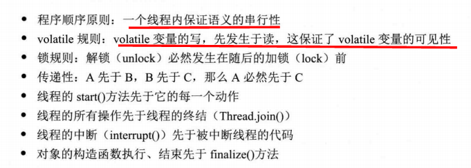

# 实战java高并发程序设计chr01 走入并行世界

## 第1章　走入并行世界 1

> Give it up. The whole "parallel computing is the future" is a bunch of crock.

### 1.1　何去何从的并行计算 1

#### 1.1.1　忘掉那该死的并行 2

- BitKeeper真惨
- Git真好用
- 并行计算只有在图像处理和服务器编程2个领域可以使用
- 图像处理拥有极大的计算量
- 服务端程序需要承受很重的用户访问压力

#### 1.1.2　可怕的现实：摩尔定律的失效 4

- CPU主频的提升遇到了不可逾越的瓶颈

#### 1.1.3　柳暗花明：不断地前进 5

- CPU核心在不断变多

#### 1.1.4　光明或是黑暗 6

* 简化的硬件设计方案【将多个cpu内核塞进一个cpu】带来软件设计的复杂性

### 1.2　你必须知道的几个概念 6

#### 1.2.1　同步（Synchronous）和异步（Asynchronous） 7 面试点

* 同步和异步通常用来形容一次方法调用。
* 同步方法调用一旦开始，调用者必须等到方法调用返回后，才能继续后续的行为。
* 异步方法调用就立即返回，调用者可以继续后续操作，异步方法会在**另一个线程**中“真实”地执行。【异步方法 内的执行线程都是守护线程 如果主线程关闭 则系统停止执行 】
* 对于调用者来说，异步调用似乎时瞬间完成的。如果异步调用需要返回结果，那么这个异步调用真实完成时，则会通知调用者。

- 见书中图

#### 1.2.2　并发（Concurrency）和并行（Parallelism） 8 面试点

* 并发偏重于多个任务交替执行，而多个任务之间有可能还是串行的，执行过程是交替的，多个任务之间是串行并发的，会造成多任务并发执行的错觉。
* 并行是真正意义上的“同时执行”

- 见书中图
- 系统只有一个CPU，而使用多线程或者多线程任务，真实环境中这些任务不可能是真实并行的，毕竟一个cpu一次只能执行一条指令，这种情况就是并发的。
- 真实的并行只可能出现在拥有多个cpu的系统中

#### 1.2.3　临界区 9 面试点

* 临界区用来表示一种公共资源或者说是共享数据，可以被多个线程使用。
* 每一次只能有一个线程使用它，一旦临界区资源被占用，其他资源想使用这个资源，就必须等待
* 在并行程序中，临界区资源是保护对象

#### 1.2.4　阻塞（Blocking）和非阻塞（Non-Blocking） 9 面试点

* 阻塞和非阻塞用来形容多线程间的相互影响。
* 一个线程占用了临界区资源，其他所有需要这个资源的线程就必须在这个临界区等待。等待会导致线程挂起，这种情况就是阻塞。
* 非阻塞则与之相反，强调没有一个线程可以妨碍其他线程执行。

#### 1.2.5　死锁（Deadlock）、饥饿（Starvation）和活锁（Livelock） 9 面试点

* 死锁、饥饿和活锁都属于多线程的活跃性问题
* 死锁可以说是彼此之间相互占用了对方所需要的资源，并且双方都不愿意释放自己的资源，那么这个状态将一直维持下去。
* 饥饿是指某一个或者多个线程因为种种原因无法获得所需要的资源，导致一直无法执行。
  * 一种可能是线程优先级太低，高优先级线程不断抢占它所需的资源，导致低优先级线程无法工作。
  * 另一种情况是，某个线程一直占着关键资源不放，导致其他需要这个资源的线程无法正常执行。
* 与死锁相比，饥饿还是有可能在未来一段时间内解决的
* 活锁是线程秉承着“谦让”的原则，主动将资源释放给他人使用，就会出现资源不断在两个线程中跳动，而没有一个线程可以同时拿到所有资源而正常执行。

### 1.3　并发级别 11 面试点

* 由于临界区的存在，多线程之间的并发必须收到控制。
* 对控制并发的级别进行以下分类。

#### 1.3.1　阻塞（Blocking） 11

* 一个线程是阻塞的，在其他线程释放资源之前，当前线程无法继续执行，使用synchronized关键字或重入锁得到阻塞线程。
* synchronized或者重入锁，都会视图执行后续代码前，得到临界区的锁，如果得不到，线程就会被挂起等待，直到占有了所需资源为止。

#### 1.3.2　无饥饿（Starvation-Free） 11

* 通过公平锁实现，满足先来后到分配，饥饿不会产生。

#### 1.3.3　无障碍（Obstruction-Free） 12

* 最弱的非阻塞调度。如果两个线程是无障碍执行，那么他们不会因为临界区的问题导致一方被挂起。
* 非阻塞调度是一种乐观策略，它认为多个线程之间很可能不会发生冲突，或者说冲突概率不大。因此线程都应该无障碍的执行，但是一旦检测到冲突，就应该进行回滚。

#### 1.3.4　无锁（Lock-Free） 12

* 无锁的并行都是无障碍的。所有线程都能尝试对临界区进行访问，不同的是，无锁的并发保证必然有一个线程能够在有限步内完成操作离开临界区。

#### 1.3.5　无等待（Wait-Free） 13

* 无等待在无锁的基础上，要求所有线程都必须在有限步内完成，这样就不会引起饥饿问题。

### 1.4　有关并行的两个重要定律 13

* 使用并行程序最重要出于两个目的。
  * 获得更好的性能
  * 业务模型的需要，确实需要多个执行实体。

#### 1.4.1　Amdahl定律 13

* 定义了串行系统并行化后的加速比的计算公式和理论上限

#### 1.4.2　Gustafson定律 16

* 切入角度与Amdahl定律不同。

#### 1.4.3　Amdahl定律和Gustafson定律是否相互矛盾 16

* 两者的差异其实是因为这两个定律对同一个客观事实从不同角度去审视后的结果，他们的偏重点有所不同。
* Amdahl定律强调：当串行比例一定时，加速比是有上限的，不管你堆叠多少个Cpu参与计算，都不能突破这个上限。
* Gustafson定律出发点与之不同，其关心的是：如果可被并行化的代码所占比重足够多，那么加速比就能随着cpu的数量线性增长，

### 1.5　回到Java：JMM 17 面试点

* Java的内存模型

* 并发程序下数据访问的一致性和安全性将会收到严重挑战。

* 定义一种规则，保证多个线程间可以有效地、正确地协同工作。JMM就为此产生。

* JMM地关键技术点 都是围绕着多线程的原子性、可见性和有序性来建立的。

* JMM其实是在遵循一个基本原则：只要不改变程序的执行结果（指的是单线程程序和正确同步的多线程程序），编译器和处理器怎么优化都行。例如，如果编译器经过细致的分析后，认定一个锁只会被单个线程访问，那么这个锁可以被消除。再如，如果编译器经过细致的分析后，认定一个volatile变量只会被单个线程访问，那么编译器可以把这个volatile变量当作一个普通变量来对待。这些优化既不会改变程序的执行结果，又能提高程序的执行效率。

  

#### 1.5.1　原子性（Atomicity） 18

* 原子性是指一个操作是**不可中断**的。即使是在多个线程一起执行的时候，一个操作一旦开始，就不会被其他线程干扰。
* 读写数据的类型是否保证原子性由操作系统位数决定，32位的操作系统不能保证64位long类型数据的读写能有原子性。

#### 1.5.2　可见性（Visibility） 20

* 可见性是指当一个线程修改了某一个共享变量的值，其他线程能否立即知道这个修改。
* 并行程序下，某个线程修改了一个全局变量，其他线程未必可以马上知道这个改动。
* 编译器或者硬件优化的缘故，在不同cpu运行下的线程将全局变量缓存在chache中或者寄存器里，其可能无法意识到变量的改动，依然会读取cache中或者寄存器里的数据，就产生了可见性问题。即读取到的是旧值。
* 指令重排或者编辑器的优化，也可能导致一个线程的修改不会立即被其他线程察觉。

#### 1.5.3　有序性（Ordering） 22

* 并发时，程序的执行可能会出现乱序。
* 有序性问题的原因时因为程序在执行时，可能会进行指令重排，重排后的指令与原指令的顺序未必一致。
* 对于一个线程来说，它看到的指令顺序一定是一致的，即保证串行语义的一致性。但没有义务保证多线程间的语义也一致。
* 因为性能考虑所以需要指令重排。一条汇编指令需要多个步骤完成。
* 流水线技术执行指令可以提高效率，之所以需要做指令重排，是为了尽量少的中断流水线。其对于提高cpu处理性能是非常必要的。虽然可能带来乱序问题。

#### 1.5.4　哪些指令不能重排：Happen-Before规则 27 面试点

* **为了提高性能，编译器和处理器常常会对指令进行重排序**。一般重排序可以分为如下三种：
  * 编译器优化的重排序。编译器在不改变单线程程序语义的前提下，可以重新安排语句的执行顺序；
  * 指令级并行的重排序。现代处理器采用了指令级并行技术来将多条指令重叠执行。如果**不存在数据依赖性**，处理器可以改变语句对应机器指令的执行顺序；
  * 内存系统的重排序。由于处理器使用缓存和读/写缓冲区，这使得加载和存储操作看上去可能是在乱序执行的。
* 1属于编译器重排序，而2和3统称为处理器重排序。这些重排序会导致线程安全的问题，一个很经典的例子就是DCL问题
* **针对编译器重排序**，JMM的编译器重排序规则会禁止一些**特定类型的编译器重排序**；
* **针对处理器重排序**，编译器在生成指令序列的时候会通过**插入内存屏障指令来禁止某些特殊的处理器重排序**。
* **如果两个操作访问同一个变量，且这两个操作有一个为写操作，此时这两个操作就存在数据依赖性**这里就存在三种情况：1. 读后写；2.写后写；3. 写后读，这三种操作都是存在数据依赖性的，如果重排序会对最终执行结果会存在影响。
* **编译器和处理器在重排序时，会遵守数据依赖性，编译器和处理器不会改变存在数据依赖性关系的两个操作的执行顺序**
* as-if-serial语义的意思是：不管怎么重排序（编译器和处理器为了提供并行度），（单线程）程序的执行结果不能被改变。
* **遵守as-if-serial语义的编译器，runtime和处理器共同为编写单线程程序的程序员创建了一个幻觉：单线程程序是按程序的顺序来执行的**。
* as-if-serial语义使程序员**不必担心单线程中重排序的问题干扰他们**，也无需担心内存可见性问题。

* **JMM可以通过happens-before关系向程序员提供跨线程的内存可见性保证**（如果A线程的写操作a与B线程的读操作b之间存在happens-before关系，尽管a操作和b操作在不同的线程中执行，但JMM向程序员保证a操作将对b操作可见）。

* > **as-if-serial   VS   happens-before**

  1. as-if-serial语义保证单线程内程序的执行结果不被改变，happens-before关系保证正确同步的多线程程序的执行结果不被改变。
  2. as-if-serial语义给编写单线程程序的程序员创造了一个幻境：单线程程序是按程序的顺序来执行的。happens-before关系给编写正确同步的多线程程序的程序员创造了一个幻境：正确同步的多线程程序是按happens-before指定的顺序来执行的。
  3. as-if-serial语义和happens-before这么做的目的，都是为了在不改变程序执行结果的前提下，尽可能地提高程序执行的并行度。

  

* 指令重排是有原则的，并非所有指令都可以随便改变执行位置。

  **happens-before与JMM的关系**

* 一个happens-before规则对应于一个或多个编译器和处理器重排序规则。
* 对于Java程序员来说，happens-before规则简单易懂，它避免Java程序员为了理解JMM提供的内存可见性保证而去学习复杂的重排序规则以及这些规则的具体实现方法

### 1.6　参考文献 27

- © 2021 GitHub, Inc.

