* 块注释符（/*...*/）是不可以嵌套使用的。

  **#if 0 ... #endif** 属于条件编译，0 即为参数。

  此外，我们还可以使用 **#if 0 ... #endif** 来实现注释

* **现在才算理解声明和定义的区别了：**

  定义包含了声明，但是声明不包含定义，如

  ```
  int a = 0;     //定义并声明了变量 a
  extern int a;  //只是声明了有一个变量 a 存在，具体 a 在哪定义的，需要编译器编译的时候去找。
  ```

  函数也是类似，定义的时候同时声明。但如果只是声明，编译器只知道有这么个函数，具体函数怎么定义的要编译器去找。

  ```c
  void fun1();  //函数声明
  
  void fun1(){  //函数定义
      cout<<"fun1"<<endl;
  }
  
  ```

* 变量的类型间是可以互相转换的，转换又分为**自动转换和强制转换**。

  **自动转换规则：**

  - 1、若参与运算量的类型不同，则先转换成同一类型，然后进行运算。
  - 2、转换按数据长度增加的方向进行，以保证精度不降低。如int型和long型运算时，先把int量转成long型后再进行运算。   a、若两种类型的字节数不同，转换成字节数高的类型   b、若两种类型的字节数相同，且一种有符号，一种无符号，则转换成无符号类型
  -  3、所有的浮点运算都是以双精度进行的，即使仅含float单精度量运算的表达式，也要先转换成double型，再作运算。
  -  4、char型和short型参与运算时，必须先转换成int型。
  -  5、在赋值运算中，赋值号两边量的数据类型不同时，赋值号右边量的类型将转换为左边量的类型。如果右边量的数据类型长度比左边长时，将丢失一部分数据，这样会**降低精度**:

  ```c++
  int a=1;
  double b=2.5;
  a=b;
  cout << a; //输出为 2，丢失小数部分
  int a = 1;
  double b = 2.1;
  cout << "a + b = " << a + b << endl;  //输出为a + b = 3.1
  ```

  **强制转换规则：**

  强制类型转换是通过**类型转换运算来实现的**。其一般形式为：（类型说明符）（表达式）其功能是把表达式的**运算结果强制转换成类型说明符所表示的类型**

  ```
  int a = 1;
  double b = 2.1;
  cout << "a + b = " << a + (int)b << endl;  //输出为a + b = 3
  ```

* C/C++ 编译 cpp 文件是**从上往下编译**，所以 main 函数里面调用其他函数时，如果其他函数在 main 函数的下面，则要在 main 函数上面**先声明这个函数**。

  或者把 main 函数放在最下面，这个不仅限于 main 函数，其他函数的调用都是如此。**被调用的函数要在调用的函数之前声明**。

* extern 关键字声明在变量和函数之前的说明。

  **1、作用在变量之前**

  变量**只允许定义一次**，但**可以在多个文件中声明**。

  Test.cpp 中：

  ```c++
  int s32Val = 0;     // 定义一个变量 s32Val，并赋初值为 0
  ```

  Test1.cpp 中：

  ```c++
  extern int s32Val;  // 声明变量 s32Val，它在 Test.cpp 中被定义，此处不可赋值
  ```

  Test2.cpp 中：

  ```c++
  extern int s32Val;  // 声明变量 s32Val,它在 Test.cpp 中被定义，此处不可赋值
  ```

  **2、作用在函数之前**

  Test.h：

  ```c++
  extern void Fun();   // 函数声明，extern 用于标识次函数为外部可调用函数
  ```

  Test.cpp：

  ```c++
  void Fun();  // 函数定义
  ```


## 内存管理

* 编译与链接

  * 编译：

    

    * 定义：**将我们编写好的代码最终翻译为机器可执行的二进制指令**
    * 处理过程：编译器**读取源文件 `cpp`，并将其翻译为可执行文件**ELF，ELF 文件可以**经过操作系统进行加载执行**。
      * **编译预处理**：在预编译过程中主要**处理源代码中的预处理指令**，比如引入头文件（#include），去除注释，处理所有的条件编译指令（#ifdef, #ifndef, #else, #elif, #endif），宏的替换（#define），添加行号，保留所有的编译器指令；
      * **编译**：简单来说编译的过程即为**将 `.cpp` 源文件翻译成 `.s` 的汇编代码；**
      * **汇编**：**将汇编代码 `.s` 翻译成机器指令 `.o` 文件【目标文件】**，一个 `.cpp` 文件只会生成一个 `.o` 文件；
      * **链接**：汇编程序生成的**目标文件**即为 .o 文件，单独的 .o 文件可能无法执行。**因为一个程序可能由多个源文件组成，此时就存在多个 .o 文件。**文件 A 中的函数**引用**了另一个文件 B 中**定义的符号**或者调用了某个库文件中的函数，这就**需要链接处理**。那链接的目的就是**将这些文件对应的目标文件连接成一个整体，从而生成一个可被操作系统加载执行的 ELF 程序文件。**
      * **静态链接是由连接器完成的，动态链接最终是由操作系统来完成链接的功能**，动态链接在不同的操作系统下可能由不同的实现原理
        * 静态链接：
          * 代码在**生成可执行文件时**，**将该程序所需要的全部外部实现全部拷贝到最终的可执行程序文件中**，在该程序被执行时，该程序运行时**所需要的全部代码都会被装入到该进程的虚拟地址空间中。**
          * 缺点：**浪费空间，每个可执行程序都会有目标文件的一个副本**，这样如果目标文件进行了更新操作，就需要**重新进行编译链接生成可执行程序**（**更新困难**）
          * 优点：**执行的时候运行速度快，因为可执行程序具备了程序运行的所有内容**。
        * 动态链接：
          * 代码在生成可执行文件时，该程序**所调用的部分程序被放到动态链接库中**，**链接程序只是在最终的可执行程序中记录了共享对象的名字等一些信息**，最**终生成的 ELF 文件中并不包含这些调用程序的机器指令。**在程序执行时，当**需要调用这部分程序时，操作系统会从将这些动态链接库中进行加载**，并将全部内容会被映射到该进行运行的虚拟地址的空间。
          * 缺点：**每次执行都需要链接，相比静态链接会有一定的性能损失。**
          * 优点：**节省内存、更新方便**

  * C++程序内存分布：

    * ELF文件：
      * 定义：**可执行与可链接格式** (Executable and Linkable Format) 是一种用于可执行文件、目标代码、共享库和核心转储 （core dump） 的标准文件格式，**每个 ELF 文件都由一个 ELF header 和紧跟其后的文件数据部分组成**，可以参考ELF 文件的构成如下: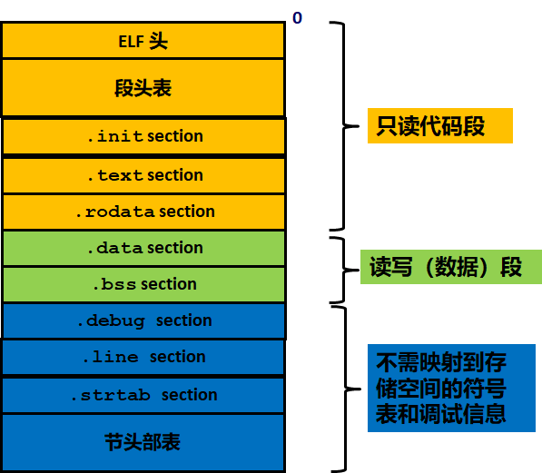
      * 可执行程序内部是**分段存储的**
        * 只读段：
          * .text section：代码段。通常存放**已编译程序的机器代码**，一般操作系统加载后，这部分是只读的。
          * .rodata section：只读数据段。**此段的数据不可修改**，存放程序中会**使用的常量**。比如程序中的常量字符串 "aasdasdaaasdasd"。
        * 读写段：
          * .data section：数据段。主要用于存放**已初始化的全局变量、常量。**
          * .bss section: bss 段。该段主要存储**未初始化全局变量，仅是占位符，不占据任何实际磁盘空间。**目标文件格式区分初始化和非初始化是**为了空间效率。**
    * 操作系统在加载 ELF 文件时会将**按照标准依次读取每个段中的内容，并将其加载到内存中，同时为该进程分配空间**，并将 **pc 寄存器指向代码段的起始位置**，然后启动进程。
    * C++**程序**的内存分区：**按照不同的功能划分不同的段**，`C++` 程序使用的内存分区一般包括：**栈、堆、全局/静态存储区、常量存储区、代码区。**
      * **栈**：目前绝大部分 CPU 体系都是基于栈来运行程序，**栈中主要存放函数的局部变量、函数参数、返回地址等**，栈空间**一般由操作系统进行默认分配或者程序指定分配**，栈空间在进程生存周期一直都存在，**当进程退出时，操作系统才会对栈空间进行回收。**
      * **堆**：**动态申请的内存空间，就是由 malloc 函数或者 new 函数分配的内存块，由程序控制它的分配和释放**，可以在程序运行周期内随时进行申请和释放，**如果进程结束后还没有释放，操作系统会自动回收**。
      * **全局区/静态存储区**：**主要为 .bss 段和 .data 段，存放全局变量和静态变量，程序运行结束操作系统自动释放，**在 C 中，**未初始化的放在 .bss 段中**，**初始化的放在 .data 段中，C++ 中不再区分了。**
      * **常量存储区**：.rodata 段，**存放的是常量**，不允许修改，程序运行结束自动释放。
      * **代码区**：.text 段，**存放源程序编译后的机器码**，不允许修改，但可以执行。**编译后的机器码存放在这里。**
    * 从操作系统的本身来讲，以上存储区在该程序内存中的虚拟地址分布是如下形式（**虚拟地址从低地址到高地址，实际的物理地址可能是随机的**）：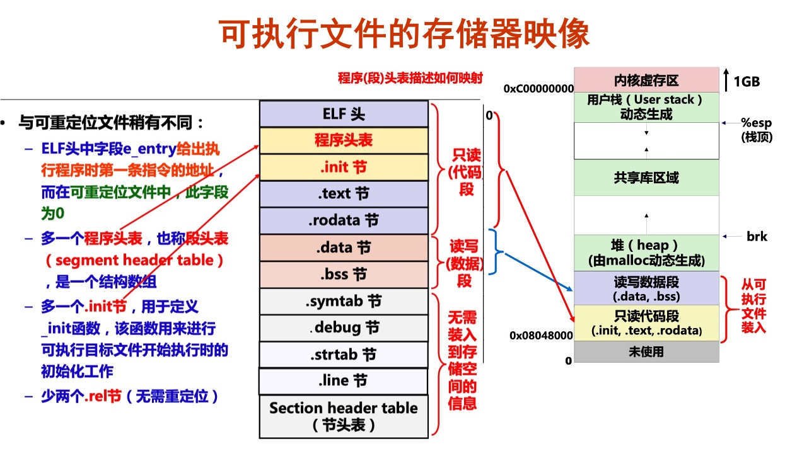


* 堆与栈：

  * 栈：
    * 定义：每次在调用函数时，会按照顺序依次**将函数调用参数压入到栈中，并在栈中压入返回地址与当前的栈帧**，然后跳转到调用函数内部，**程序计数器 跳转函数内部执行该函数的指令**
    * 栈溢出：一般情况**操作系统为每个进程会固定栈空间的大小**，也可以**根据自己的需要来分配每个进程的栈空间**，如果**剩余栈空间不够新的申请大小时，会分配失败导致栈溢出。**

  * 堆：
    * 定义：堆的内存空间一般**由操作系统或者专门内存程序来管理的**。在 C/C++ 一般用 malloc 或者 new 来从堆中申请内存，使用 free 或者 delete 来释放空间，空间释放后会有操作系统进行回收。
  
  * 栈和堆的对比：
    * **申请方式**：
      * **堆中存放的变量由程序运行时决定的，会有操作系统或者内存管理模块来进行分配的。**
      * 栈中存放的变量**在编译时由编译器为其在栈上分配了空间**，即**程序编译后该变量在栈中使用的内存即确定**，释放时也由于函数调用的返回，**栈的空间会自动进行回收。**

    * **申请后系统响应**：
      * 分配栈空间时如果**剩余空间大于申请空间则分配成功**，否则分配失败栈溢出，绝大多数情况下，栈的空间较小，一般栈上分配的变量不会占用太大的空间，且**当函数返回时，当前栈帧中的变量生存周期会结束；**
      * 申请堆空间，**堆在内存中呈现的方式类似于链表**（记录**空闲地址空间的链表**），在链表上寻找第一个大于申请空间的节点分配给程序，将该节点从链表中删除，堆上可以分配较大的空间，**如果不对申请的内存进行释放，则堆上存储的变量生存周期一直存在，直到当前进程退出。**

    * **安全性**：
      * 栈在内存中是**连续的**一块空间（**向低地址扩展**）**最大容量是系统预定好的，且只能被当前的线程访问；**
      * 堆在内存中的空间（**向高地址扩展**）**是不连续的**，中间允许有间隔，**堆中的内存并不是线程安全的，同一进程的线程都都可访问。**
  
    * **申请效率：**
      * 栈是由**系统自动分配，申请效率高**，但程序员无法控制；堆是**由程序员主动申请，效率低**，**使用起来方便但是容易产生内存碎片。**
  
    * 存放内容：
      * **栈中存放的是局部变量、函数的参数、返回地址等**；**堆**中**存放的内容由程序员控制**。
  
* 变量定义与生存周期

  * **作用域与生命周期**，这两个属性代表**从时间和空间**两个不同的维度来描述一个变量。
  * 作用域：一个变量可以**被引用的范围**，常见的作用域可分为 6 种：**全局作用域，局部作用域，语句作用域，类作用域，命名空间作用域和文件作用域。**
    * **全局变量**：具有**全局作用域**。**全局变量只需在一个源文件中定义**，就可以作用于所有的源文件。**其他不包含全局变量定义的源文件需要用 extern 关键字再次声明这个全局变量以进行引用**。
    * **静态全局变量**：具有**文件作用域**。它与全局变量的区别在于如果程序包含多个文件的话，**它作用于定义它的文件里，不能作用到其它文件里**，即被 static 关键字修饰过的变量具有文件作用域。这样**即使两个不同的源文件都定义了相同名字的静态全局变量，它们也是不同的变量。**
    * **局部变量**：具有**局部作用域**。它是自动对象（auto），在程序运行期间不是一直存在，而是**只在函数执行期间存在**，函数的一次调用执行结束后，变量被撤销，其所占用的内存也被收回，局部变量对于函数外部的程序来说是不可见的。当然内部实际更复杂**，实际是以 {} 为作用域的。**
    * **静态局部变量**：具有**局部作用域。它只被初始化一次**，自从第一次被初始化直到程序运行结束都一直存在，它和全局变量的区别在于**全局变量对所有的函数都是可见的，而静态局部变量只对定义自己的函数体始终可见**，**只有定义该变量的函数内部可以使用访问和修改该变量。**
  
  * 生命周期：该变量**可以被引用的时间段**（生存期表示变量存在的时间）。
    * **全局变量:**  全局变量在整个程序运行期间都会一直存在，都可以随时访问，当程序结束时，对应的变量则会自动销毁，内存会被系统回收。
    * **局部变量**: 局部变量的生命周期仅限于函数被调用期间，当函数调用结束时，该变量会自动销毁。
    * **静态局部变量**：实际上静态局部变量的作用域仅限于函数内部，它的作用域与局部变量相同，但**实际上该变量在程序运行期间是一直存在的，生命周期贯穿于整个程序运行期间。**局部静态变量只能被初始化一次。

  * 存储位置：
    * **静态变量和全局变量存储于全局存储区。**
    * **局部非静态变量存储于栈区或堆区。**

  * 注意：
    * **全局变量定义在不要在头文件中定义**：如果在头文件中定义全局变量，**当该头文件被多个文件 include 时，该头文件中的全局变量就会被定义多次，编译时会因为重复定义而报错**，因此不能再头文件中定义全局变量。**一般情况下我们将变量的定义放在 .cpp 文件中，一般在 .h 文件使用extern 对变量进行声明。**
  
* 内存对齐：

  * 定义：编译器**将程序中的每个 `数据单元` 的地址安排为机器字的整数倍。**

  * 原因：由于 `CPU` 的访问内存的特性决定，`CPU` 访问内存时**并不是以字节为单位来读取内存**，而是**以机器字长为单位**，内存对齐的主要目的是为了**减少 `CPU` 访问内存的次数，加大 `CPU` 访问内存的吞吐量。**

  * 内存对齐规则：

    * [C/C++内存对齐详解 - 知乎 (zhihu.com)](https://zhuanlan.zhihu.com/p/30007037)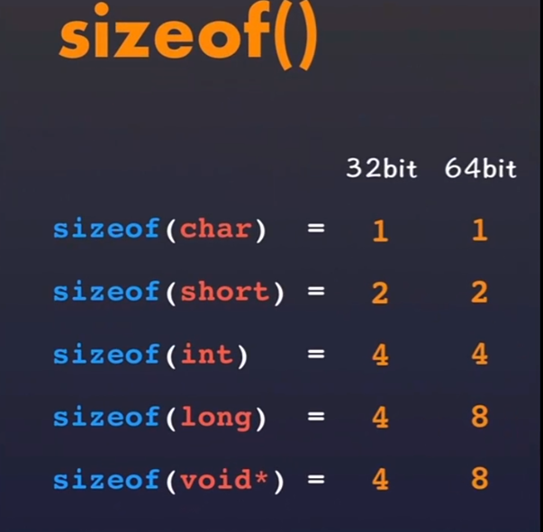

    

    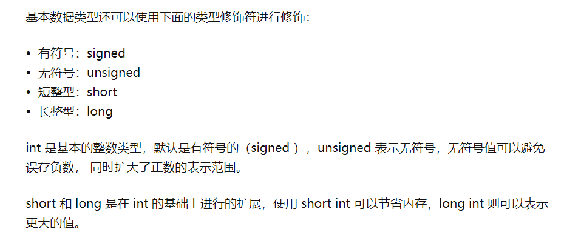

  * **对齐系数**：**不同编译器有不同默认值，预编译命令#pragma pack(n)可对其改变。**

  * **有效对齐值**：**对齐系数和结构体中最长数据类型长度中较小的那个。**

    * (1) 结构体**第一个成员**的**偏移量（offset）**为0，以后**每个成员相对于结构体首地址的** offset 都是**该成员大小与有效对齐值中较小那个**的整数倍，如有需要编译器会在成员之间加上填充字节。
  
    * (3) **结构体的总大小**为 **有效对齐值** 的**整数倍**，如有需要编译器会在最末一个成员之后加上填充字节。
  
  * c++11以后引入两个关键字 [alignas (opens new window)](https://zh.cppreference.com/w/cpp/language/alignas)与 [alignof (opens new window)](https://zh.cppreference.com/w/cpp/language/alignof)。其中`alignof`可以计算出类型的对齐方式，`alignas`可以指定结构体的对齐方式。【对齐方式即**有效对齐值**，**若小于\#pragma pack(n)则失效**，其值在不同编译器有不同值，默认为4】
  
  * 注意如果有**虚函数，别忘了虚指针。**
  
* 大端和小端

  * 字节序：**字节序列的排列方式**。

    不同 `CPU` 可能采用不同标准的字节序，所以**均按照网络标准转化成相应的字节序。**

    * 小端序：**将低序字节存储在起始地址（低位编址）**。**对于机器计算来说更友好和自然。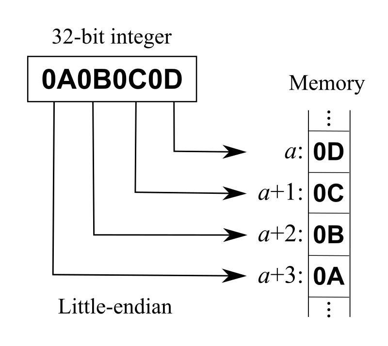**
    * 大端序：**将高序字节存储在起始地址（高位编址）**，内存顺序和数字的书写顺序是一致的，对于人的直观思维比较容易理解，**网络字节序统一规定采用 `Big-Endian`。**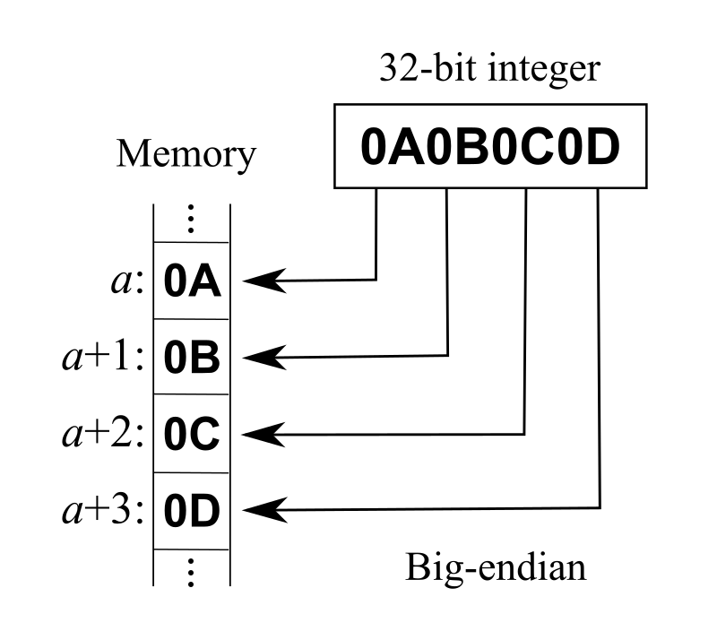
  
  * 检测字节序：
  
    直接调用宏定义 `__BYTE_ORDER` 即可，可以通过引用 `<bits/endian.h>` 即可。
  
    ```c++
    bool byteorder_check() {
        int a = 1;
        return (*(char *)&a); /* 1 为小端机，0 为大端机 */
    }
    ```
  
  * 字节序转换：
  
    **将高位与低位依次进行交换即可完成**
  
* 内存泄漏[一般是**对于动态分配的堆内存**来说]：

  * 定义：指**程序在运行过程中**，由于疏忽或错误而**失去了对该内存的控制，从而造成了内存的浪费。**【**堆是动态分配的**，**一旦用户申请了内存分配而未及时释放**，那么**该部分内存在整个程序运行周期内都是被占用的，其他程序无法再使用这部分内存。**】

  * 导致的问题：

    由于**内存未得到及时释放**，从而可能导致**可使用的动态内存空间会越来越少**，一旦**内存空间全部使用完**，则**程序可能会导致因为内存不够中止运行。**

  * 对于实际的程序来说，我们在调用过程中使用 malloc、calloc、realloc、new 等分配内存时，**使用完后要调用相应的 free 或 delete 释放内存，否则这块内存就会造成内存泄漏。**

  * 内存泄漏的检测：

    * 一般都是**利用各种内存检测工具来检测内存泄漏**，当然关键还是**在于统计和分析申请和释放的相关日志。**
    * 内存检测工具：valgrind
  
  * 如何防止内存泄漏：
  
    * **内部封装**：**将内存的分配和释放封装到类中，在构造的时候申请内存，析构的时候释放内存。**【避免出现内存重复释放问题应使用深拷贝，生命周期结束后会调用析构】
    * **智能指针**：智能指针是 `C++` 中**已经对内存泄漏封装好了一个工具**，智能指针对象**会自动释放所申请的内存**。【一种类似指针的类对象】
    * **良好的编码习惯：**
      * 在 `C++` 中需要**将基类的析构函数定义为虚函数**；
      * 遵循 RAII（Resource acquisition is initialization）原则：**在对象构造时获取资源，在对象生命期控制对资源的访问使之始终保持有效，最后在对象析构的时候释放资源；**
      * 尽量**使用智能指针**；
      * 有效**引入内存检测工具**；
  
* 智能指针：

  * 出现背景：**为了解决动态内存分配时带来的内存泄漏以及多次释放同一块内存空间而提出的**。`<memory>` 头文件中。【正确地管理动态内存非常困难】

  * 定义：smart pointer 遵循 RAII 原则，**当 smart pointer 对象创建时，即为该指针分配了相应的内存，当对象销毁时，析构函数会自动释放内存。**需要注意的是，**智能指针不能像普通指针那样支持加减运算。**【**区别于普通指针**的是它**会自动释放所申请的内存资源**。无需手动释放】

  * 简单实现：**栈比堆要安全的多，因为栈上的变量离开作用域后，会自动销毁并清理。智能指针结合了栈上变量的安全性和堆上变量的灵活性。**

    ```c++
    #include <iostream>
    using namespace std;
    
    template <class T>
    class SmartPtr {
    	T* ptr; // Actual pointer
    public:
    	explicit SmartPtr(T* p = NULL) { ptr = p; }
    	~SmartPtr() { delete (ptr); }
    	T& operator*() { return *ptr; }
    	T* operator->() { return ptr; }
    };
    
    int main()
    {
    	SmartPtr<int> ptr(new int());
    	*ptr = 20;
    	cout << *ptr;
    	return 0;
    }
    ```

  * 智能指针分类：

  * https://zhuanlan.zhihu.com/p/150555165

    https://yuanlehome.github.io/DVejmy5owOXx5WKk/ todo源码
    
    * **unique_ptr**：**独享所有权的智能指针**，**内部资源只能被一个指针占有，该指针不能拷贝构造和拷贝赋值。但可以进行移动构造和移动赋值（调用 move() 函数），移动语义表示资源所有权的移动**，即一个 unique_ptr 对象赋值给另一个 unique_ptr 对象，可以通过该方法进行赋值。
      如图所示，`object` 资源只能被 `P1` 占有，`P2` 无法对 `object` 有所有权，**只能通过移动构造和移动赋值**给 `P2`。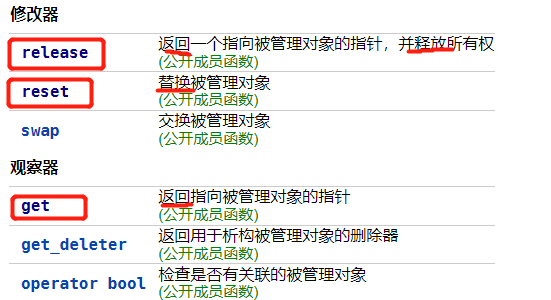
    
      ```c++
      #include <iostream>
      using namespace std;
      #include <memory>
      
      class Rectangle {
      	int length;
      	int breadth;
      
      public:
      	Rectangle(int l, int b){
      		length = l;
      		breadth = b;
      	}
      
      	int area(){
      		return length * breadth;
      	}
      };
      
      int main(){
      	unique_ptr<Rectangle> P1(new Rectangle(10, 5));
      	cout << P1->area() << endl; // This'll print 50
      
      	unique_ptr<Rectangle> P2;
      	// unique_ptr<Rectangle> P2(P1); // 无法拷贝构造
      	// P2 = P1;   // 无法赋值构造
      	P2 = move(P1);
      
      	cout << P2->area() << endl;
      	
      	// cout<<P1->area()<<endl; // 已经传递，P1 无所有权
      	return 0;
      }
      ```

    * **shared_ptr**：与 unique_ptr 不同的是，**shared_ptr 中持有的资源可以被多个指针共享，但是多个指针指向同一个资源不能被释放多次，因此使用计数机制表明资源被几个指针共享。**
    
      `shared_ptr` 并不是线程安全的，**但 `shared_ptr` 的计数是原子操作实现的，利用 `atmoic CAS` 指令实现**
      
      具体实现：**共享指针类中含有两个指针，一个指向具体的共享资源对象，另一个指向整型对象表明资源被几个指针共享**，共享指针对象生命周期结束后【离开作用域后】引用技术减一，如果引用计数为0则通过给定的删除器进行资源的释放，默认是通过delete释放。
      
      构成函数和析构函数都会调用相应修改引用计数的方法进行维护。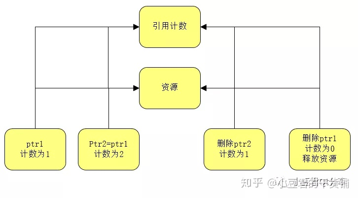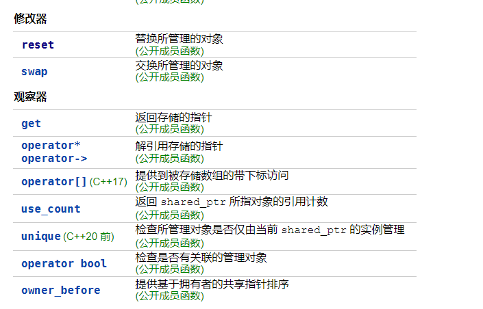
      
      * 缺陷：
      
        * 出现**循环引用**情况时，可能出现**内存泄漏**情况。
      
          ```c++
          #include <iostream>
          #include <memory> // for std::shared_ptr
          #include <string>
          
          class Person
          {
          	std::string m_name;
          	std::shared_ptr<Person> m_partner; // initially created empty
          
          public:
          
          	Person(const std::string &name): m_name(name)
          	{
          		std::cout << m_name << " created\n";
          	}
          	~Person()
          	{
          		std::cout << m_name << " destroyed\n";
          	}
          
          	friend bool partnerUp(std::shared_ptr<Person> &p1, std::shared_ptr<Person> &p2)
          	{
          		if (!p1 || !p2)
          			return false;
          
          		p1->m_partner = p2;
          		p2->m_partner = p1;
          
          		std::cout << p1->m_name << " is now partnered with " << p2->m_name << '\n';
          
          		return true;
          	}
          };
          
          int main()
          {
          	auto lucy { std::make_shared<Person>("Lucy") }; // create a Person named "Lucy"
          	auto ricky { std::make_shared<Person>("Ricky") }; // create a Person named "Ricky"
          
          	partnerUp(lucy, ricky); // Make "Lucy" point to "Ricky" and vice-versa
          	
              // lucy变量 外引用lucy 内m_partener引用ricky 
              // ricky变量 外引用ricky 内m_partener引用lucy 
              // 此时两智能指针变量引用变量都为2
          	return 0;
          }// 离开作用域后 堆上两资源对象都无法析构 此时两智能指针变量引用变量都为1
          ```
      
    * **std::weak_ptr：**
    
      * weak_ptr被设计用来**解决shared_ptr的循环引用问题**。**相当于共享指针所引用资源的观察者，不是资源的所有者**【即**不会计数**】，但是它可以**通过`lock()`方法返回一个`std::shared_ptr`对象，从而访问这块资源**。
    
      * 解决循环引用问题：
    
        ```c++
        #include <iostream>
        #include <memory> // for std::shared_ptr and std::weak_ptr
        #include <string>
        
        class Person
        {
        	std::string m_name;
        	std::weak_ptr<Person> m_partner; // note: This is now a std::weak_ptr
        
        public:
        
        	Person(const std::string &name) : m_name(name)
        	{
        		std::cout << m_name << " created\n";
        	}
        	~Person()
        	{
        		std::cout << m_name << " destroyed\n";
        	}
        
        	friend bool partnerUp(std::shared_ptr<Person> &p1, std::shared_ptr<Person> &p2)
        	{
        		if (!p1 || !p2)
        			return false;
        
        		p1->m_partner = p2;
        		p2->m_partner = p1;
        
        		std::cout << p1->m_name << " is now partnered with " << p2->m_name << "\'\n';
        
        		return true;
        	}
        
        	const std::shared_ptr<Person> getPartner() const { return m_partner.lock(); } // use lock() to convert weak_ptr to shared_ptr
        	const std::string& getName() const { return m_name; }
        };
        
        int main()
        {
        	auto lucy { std::make_shared<Person>("Lucy") };
        	auto ricky { std::make_shared<Person>("Ricky") };
        
        	partnerUp(lucy, ricky);
        
        	auto partner = ricky->getPartner(); // get shared_ptr to Ricky's partner
        	std::cout << ricky->getName() << "'s partner is: " << partner->getName() << '\n';
        
        	return 0;
        }
        ```
    
      * 缺陷：
    
        * 当weak_ptr**所观察的资源已被释放时**，**其成为悬挂指针**，使用它时**将产生未定义行为**。

* C++的构造函数，拷贝赋值函数，和析构函数。什么是深复制和浅复制，构造函数和析构函数哪个能写成虚函数，为什么。

  * 构造函数：

    * 默认构造函数：可以**不用实参进行调用**的构造函数。**合成**默认构造函数：**编译器**自动分配的默认构造函数。自定义构造函数：自己定义的构造函数。

    * 在构造函数中使用**类初始化列表**，会**减少调用构造函数产生的开销**，原因：对于**非内置类型**【如string,容器等】，**少了一次调用默认构造函数和拷贝赋值函数的过程**。【创建临时对象时会调用成员变量默认构造函数进行初始化，且使用临时对象赋值时会调用拷贝赋值函数。】

      【C++ 规定，**对象的成员变量的初始化动作发生在进入构造函数本体之前**，**成员变量的初始化通过初始化列表来完成**，**默认的初始化列表为默认构造函数**】

  * **构造函数不能定义为虚函数**：**构造函数是在创建对象时调用的**，因为**虚表指针需创建对象后才能获得**，故如果将构造函数定义为虚函数，那么就无法通过虚表指针获取虚构造函数指针进行调用完成对象的创建了。

  * **析构函数一般定义为虚函数**：析构函数定义成虚函数是为了**防止内存泄漏**，因为当基类的指针或者引用指向或绑定到派生类的对象时，如果**未将基类的析构函数定义成虚函数**，delete该指针时会调用基类的析构函数，那么**只能将基类的成员所占的空间释放掉**，**派生类中特有的就会无法释放内存空间导致内存泄漏**。故需将析构函数定义为虚函数，以便**delete时先调用派生类的析构函数再自动【编译器默认行为，避免内存泄漏】调用基类析构函数。**

  * **拷贝赋值函数**：赋值运算符重载实现，没自定义拷贝赋值函数，编译器会自动分配，其实质是一个bit一个bit的拷贝，拷贝构造也是类似的。

    可以通过**弃置函数delete和private继承来避免对象拷贝**：

    ```c++
    class noncopyable {
    protected:
        noncopyable() = default;
        ~noncopyable() = default;
    public:
        noncopyable(const noncopyable&) = delete;
        // 有返回值的原因是为了支持链式赋值 a = (b = c);
        // 返回类型为引用的原因是为了运行效率，减少拷贝带来的开销
        noncopyable& operator=(const noncopyable&) = delete;
    };
    
    class foo : private noncopyable { 
    };
    ```
    
    

* **虚函数和虚表的原理是什么（重点）**

  https://blog.twofei.com/496/

  https://zhuanlan.zhihu.com/p/410786957

  * 虚函数表：即函数指针数组，数组元素为指向各虚函数的指针。

  * 虚表指针：**指向虚函数表的指针**，存在于**含有虚函数的类对象的内存空间中**【位置一般最靠前】。

  * **同一个类的不同实例共用同一份虚函数表**，故虚表指针也相同。

  * 类对应的**虚函数表在编译期就创建好**，只存在一份。**定义类对象时, 编译器自动将类对象的__vfptr指向这个虚函数表。**

  * 父类指针指向子类对象时，会自动计算父类在子类内存布局中的偏移并进行转换，**使得指针指向子类中父类部分的起始地址**。

  * 派生类对象的内存布局中靠前的为父类对象数据，多继承时按声明顺序【含有虚指针的父类靠前】，虚函数覆盖后，子类内存布局中相应父类的虚表会进行替换，且子类内存布局中一定保证虚指针在首位，无论是父类数据虚指针还是自己的。如果父类有虚指针，子类定义虚函数，则虚指针对应的虚表会添加子类定义的虚函数指针，否则，外部定义一个子类自己的虚指针。

  * **只有通过指针进行虚函数调用才会发生动态绑定**，因为指针无法知道指向的对象是哪个派生类，其需要**获取指针类型对应的虚指针**【地址就是指针的地址】然后**再调用该虚表对应的方法**。【多继承的情况下会先定位到指向虚函数对应的虚表的虚指针，如下反汇编所示。】
  
  * ```c++
    
    class Base1
    {
    public:
        int base1_1;
        int base1_2;
    
        virtual void base1_fun1() { cout << "Base1 base1_fun1" << endl; }
        virtual void base1_fun2() { cout << "Base1 base1_fun2" << endl; }
    };
    
    class Base2
    {
    public:
        int base2_1;
        int base2_2;
    
        virtual void base2_fun1() { cout << "Base2 base2_fun1" << endl; }
        virtual void base2_fun2() { cout << "Base2 base2_fun2" << endl; }
    };
    
    // 多继承
    class Derive1 : public Base1, public Base2
    {
    public:
        int derive1_1;
        int derive1_2;
    
        // 基类虚函数覆盖
        virtual void base1_fun1() { cout << "Derive1 base1_fun1" << endl; }
        virtual void base2_fun2() { cout << "Derive1 base2_fun2" << endl; }
    
        // 自身定义的虚函数
        virtual void derive1_fun1() { cout << "Derive1 base1_fun2" << endl; }
        virtual void derive1_fun2() { cout << "Derive1 derive1_fun2" << endl; }
    };
    
    void testVptr() {
        // 转化为Derive1中Base2部分的起始地址
        Base2* base2 = new Derive1();
        // 无法通过编译 Base2中没有定义
        //base2->base1_fun1();
        //base2->derive1_fun1();
        //base2->derive1_fun2();
        
        // 使用Base2部分的虚表【base2_fun2虚函数被Derive1的同名函数覆盖了】
        base2->base2_fun1();
        base2->base2_fun2();
    
        Derive1* derive1 = new Derive1();
        derive1->base1_fun1();
        derive1->base2_fun2();
        // 反汇编情况如下：
            00DA2605  mov         ecx, dword ptr[derive1]
            00DA2608  add         ecx, 0Ch
            00DA260B  mov         eax, dword ptr[derive1]
            00DA260E  mov         edx, dword ptr[eax + 0Ch] // 用的虚指针是Base2的
            00DA2611  mov         esi, esp
            00DA2613  mov         eax, dword ptr[edx + 4] 
            00DA2616  call        eax
            00DA2618  cmp         esi, esp
            00DA261A  call        __RTC_CheckEsp(0D9179Eh)
        derive1->derive1_fun1();
        derive1->derive1_fun2();
    }
    ```

  * 对于**空类**，只会生成 **1 个字节的占位符**，编译器默认会为其生成6个成员函数，**缺省的构造函数、拷贝构造函数、析构函数、赋值运算符、两个取址运算符。**【“只有当一个类的**所有数据成员都能移动构造或移动赋值时**，编译器**才会为它合成移动构造函数或移动赋值运算符**。”】
  
    ```c++
    /*
    class A
    {}; 该空类的等价写法如下：
    */
    class A
    {	
        // 对于非基本数据类型才需考虑移动构造，因为对于基本数据类型其移动构造等价于拷贝构造
    	std::string s1, s2;
    public:
    	A() {};                                       // 缺省构造函数
    	A(const A& tmp):s1(tmp.s1),s2(tmp.s2) {};      // 拷贝构造函数
    	~A() {};                                      // 析构函数
    	A& operator=(const A& tmp) { s1 = tmp.s1; s2 = tmp.s2; };  // 拷贝赋值运算符
    	A* operator&() { return this; };             // 取址运算符
    	const A* operator&() const { return this; }; // 取址运算符（const 版本）
    	A(const A&& tmp):s1(std::move(tmp.s1)),s2(std::move(tmp.s2)) {}; // 移动构造
    	A& operator=(const A&& tmp) { s1 = std::move(tmp.s1); s2 = std::move(tmp.s2); };//移动赋值
    };
    
    ```
  
  * **拷贝构造函数**中的**形参必须为引用**，否则调用该函数时会出现**无限制的递归**，最终导致**栈溢出**。【如果不是引用类型，那么在调用的时候**因参数对象初始化**会**重新实例化一个对象**，但是实例化这个对象又需要调用拷贝构造函数，那么就**递归调用拷贝构造函数了**，**形参初始化时需要调用拷贝构造**】
  
  * **拷贝构造函数中参数是否为常量引用并没有要求**，不加const，编译器也不会报错。但是为了整个程序的安全，还是加上const，**防止对引用类型参数值的意外修改**。（提示这是一个输入参数）
  
  * 拷贝构造函数的使用位置：
  
    * 基于值传递的参数传递时【void fun(A a)】
    * 函数返回类型为非引用类型时【A fun(int val)】
    * 使用同一类型的变量定义变量时【A a2 = a1 或 A a2(a1)】


## C++11 新特性

* delete关键字：可作用于任何函数，**标识该函数不可使用即弃置**。

* lambda表达式：

  * 定义：**一个可调度的代码单元，可以视为一个未命名的内部函数**
  * lambda 函数是一个**仿函数对象**，编译器**在编译时会生成一个 lambda 对象的类**，然后**再生成一个该类未命名的对象**
  * lambda 的形式如下：
    [捕获列表] (参数列表) -> 返回类型 { 函数部分 }
    [capture list] (parameter list) -> return type { function body }
  * 捕获列表是 lambda 函数所定义的函数的**局部变量列表**， 通常为空
    * lambda表达式所在的函数中的局部变量必须被lambda捕获了才能在lambda表达式中使用。
    * 捕获列表**只用于局部非 static 变量**。 lambda 可以**直接使用局部 static 变量** 和在**它所在函数之外的声明的变量**。
    * 捕获列表的变量可以分为 **值 或 引用传递**
      * 值传递： lambda 捕获的**变量在 lambda 函数 创建 就发生了拷贝**而非调用时。

    * 隐式捕获：编译器可以根据 lambda 中的**函数体推导使用的变量，为编译器推断捕获列表**，应该在捕获列表中**写一个 & 或 =**
      & **告知编译器采用引用传递方式**
      = **告知编译器采用值传递方式**
      * 当混合使用时，捕获列表第一个参数必须是 & 或 = 且**显示捕获的变量必须和隐式捕获使用不同的传递方式**
      * 推荐 用 值捕获， 不要用 引用捕获。
        **引用捕获 容易外部被销毁**

  * 参数列表：参数列表和普通函数类似，但是 **lambda 不能有 默认参数**【lambda **实参和形参数目一定相等**】
  * 返回类型：
    * 与一般函数的返回类型为前置定义不同，lambda**必须使用尾置返回类型来定义返回类型**
    * 如果**忽略返回类型**，lambda 表达式会**根据函数体中的代码推断出返回类型**
    * 若函数体**只有一个 return 语句**， 则**返回类型从返回表达式的类型推断而来**，否则，**若未指定返回类型，返回类型为 void**

  * 函数体：与一般函数类似。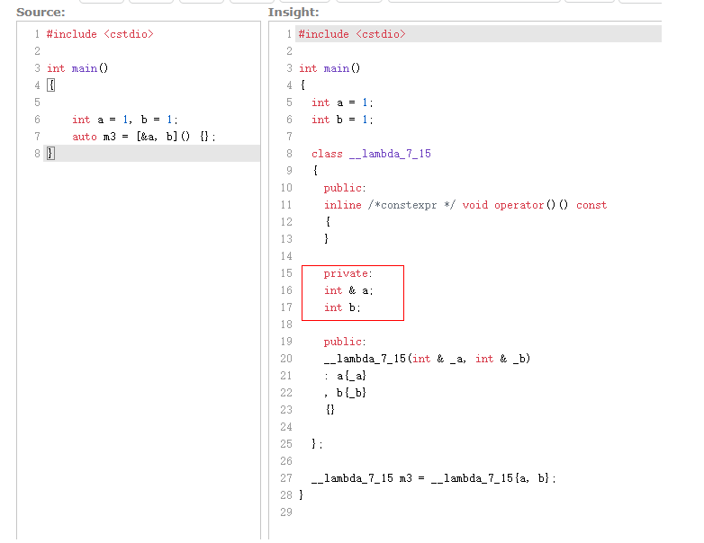

* explict

  * 作用：用来**声明类单参构造函数是显示调用的**，而**非隐式调用**，可以**阻止调用构造函数时进行隐式转换**。【因为**无参构造函数和多参构造函数本身就是显示调用的**】

  * ```c++
    class A {
    private:
    	int m_i;
    public:
    	A(int a) : m_i(a)
    	{
    		cout << "A(int a) 调用" << endl;
    	}
    	A& operator= (const A& a)
    	{
    		cout << "operator= (const A& a) 调用" << endl;
    		this->m_i = a.m_i;
    		return *this;
    	}
    };
    
    int main()
    {
    	A ex = 10; // 相当于A ex(10) 没有赋值操作 发生隐式转换 
    	cout << "-------------------------------" << endl;
    	ex = 11; // 11隐式转换成A类型 再拷贝赋值
    }
    ```

* auto：

  * 作用：
    * 声明变量时**根据初始化表达式自动推断该变量的类型；**[使变量定义变得更简单]
    * 声明函数时**函数返回类型的占位符；**[C++14]
    * 注：无法使用auto作为形参类型声明
    
  * 类型推导规则：
    * 类似模板类型的推导规则。https://zhuanlan.zhihu.com/p/390608866
    * 1、如果初始表达式是引用，则去除引用，如果auto带上&则不去除。如果初始表达式不是引用，则去除顶层const和volatile。
    * 2、如果auto是universal reference则根据规则推到成左值引用或右值引用。【故也可实现完美转发】
  
  * 实现原理：
    * 通过**模板实参推断**的机制实现。**auto会被一个虚构的模板类型参数T代替**，然后进行推断，即相当于**把变量设为一个函数参数，将其传递给模板并推断模板实参**，**auto相当于利用了其中进行的实参推断，承担了模板参数T的作用**。
  
  * 注意：
    * **对初始化列表的推断，auto会将其视为std::initializer_list，而模板则不能对其推断**，故**不能在返回类型为auto的函数返回一个初始化列表**。【C++14还允许auto作为返回类型，但此时**auto仍然使用的是模板实参推断的机制**】


## C++STL

* 除了stack和queue外，STL中的容器都有在指定位置插入元素的函数insert(iterator position, const valueType val)，**第一个参数是相应迭代器不是整型！！**，而string的insert的第一个参数可以是整型也可以是迭代器，且字符串的插入一般是用来插入字符串，如需插入字符则需迭代器。

* STL六大部件：
  
  * 容器（Containers）
    * 定义： **各种数据结构**，如Vector,List,Deque,Set,Map,**用来存放数据，STL容器是一种Class Template**
  
  * 分配器（Allocators）
    * 定义：容器需要占用内存，**容器占用的内存由分配器分配与管理**；
    * 从实现的角度来看，分配器是一个**实现了动态空间配置、空间管理、空间释放的Class Template。**
  
  * 算法（Algorithms）
    * **被独立出来的模板函数，用来操作容器**，比如常见的排序算法、查找算法等；
  
  * 迭代器（Iterators）
    * 算法既然要**操作容器中的数据**，需要**有工具访问容器中数据**，那就是迭代器，是**一种泛化的指针**；
    * 从实现的角度来看，迭代器是一种将：Operators*,Operator->,Operator++,Operator--等相关操作予以重载的Class Template。所有STL容器都附带有自己专属的迭代器——是的，只有容器设计者才知道如何遍历自己的元素，原生指针（Native pointer）也是一种迭代器。
  
  * 适配器（Adapters）
    * 定义：一种用来修饰**容器（Containers）**或**仿函数（Functors）**或**迭代器（Iterators）**接口的东西，本质上，一个适配器是一种机制，能**使某种事物的行为看起来像另外一种事物一样。**
    * 分类：
      * Container Adapter
        * **接受一种已有的容器类型**，使其行为看起来**像一种不同**的类型。
        * 例如：STL提供的Queue和Stack，虽然看似容器，**其实只能算是一种容器配接器**，因为 它们的底**部完全借助Deque，所有操作有底层的Deque供应。**
  
      * Iterator Adapter
        * 改变Iterator接口
  
      * Function Adapter
        * 改变Functor接口
  
  * 仿函数（Functors）
    * 行为类似函数，可**作为算法的某种策略（Policy）**，从实现的角度来看，**仿函数是一种重载了Operator()的Class 或 Class Template。一般函数指针可视为狭义的仿函数。**
    * 如less和greater常用在排序容器set和map中
  
  * 六大部件之间的关联：
  
* STL容器分类：

  * 基本介绍：

    * 1，array、vector、deque的**内存是连续的，连续的内存空间必定是支持随机访问的**，其余容器则不具备该特点。其中array为固定长度，vector、deque为变长，vector只能单向扩充，deque可以双向扩充。
    * 2，list、forward-list为**链条式结构**，这种结构在插入、删除时**只需要局部调整非常方便**。但是**遍历时只能按照链条顺序依次遍历，查找起来并不迅速**。
    * 3，set、map背后的实现为**红黑树**，基于关键字重载的小于操作符进行自动排序，所以对**查找具有先天的优势**，但这种结构**插入删除时会产生联动效应**，所以并**不适合做频繁的删除、插入。**其中各自**multi版本表示内容可以重复。**
    * 4，unordered_set、unordered_map背后实现为哈希表，对查找有很好的支持。其中各自**multi版本表示内容可以重复。**

  * 序列式容器 sequence containers：

    * array【c++11】

    * vector

      * 支持随机访问，动态数组，分配的内存空间是以2的倍数动态增长的，**空间扩展时涉及拷贝操作，性能开销较大。**

      * clear操作**只是把vector的size清为0**，但v**ector中的元素在内存中并没有消除，所以在使用vector的过程中会发现内存消耗会越来越多，导致内存泄露**，现在经常用的方法是swap函数来进行解决： 

        ```c++
        vector<int>().swap(V); 
        //或者 V.swap(vector<int>()); 和临时对象的内容进行交换，之后临时对象会被析构掉 临时对象的生命周期只有一条语句的时间
        ```

      * 为了避免空间扩展造成的开销，一般预估元素个数来提前申请空间。

      * 删除某个位置的元素，该位置后的所有迭代器都失效，因为元素需前移，可以将待删除元素与尾元素交换再删除新尾元素即可，将不涉及元素的前移。

    * deque

      * 类似vector，支持**随机访问**，vector只能在末端插入数据，而**deque支持双端**插入数据。

      * **分段连续**存储结构，deque 容器用数组（数组名假设为 map）存储着**各个连续空间的首地址**，即**数组中存储的是指针**，指向那些真正用来存储数据的各个连续空间。**重新分配空间不涉及元素的拷贝，只涉及指针的拷贝。**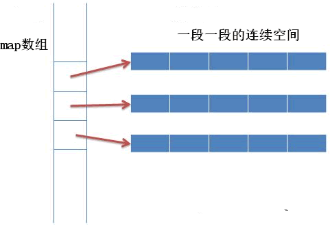

      * 随机访问迭代器的实现：
        * 迭代器移动时需根据**当前是否处于连续空间的边界来判断是否需跳跃到上一个或者下一个连续空间中。**
        * 故deque迭代器内部需包含4个指针：
          - cur：指向当前正在遍历的元素；
          - first：指向当前连续空间的**首地址**；
          - last：指向当前连续空间的**末尾地址**；
          - node：它是一个二级指针，**用于指向 map 数组中存储的指向当前连续空间的指针。**

      * 基于deque实现的适配器容器
        * stack：
        
        * queue：
        
          * priority_queue：默认**大顶堆**，第二根泛型参数为实现方式【其他容器less可以升序是因为，这里的比较是父和子比较故为降序】
        
            ```c++
            //升序
            priority_queue <int,vector<int>,greater<int> > q;
            //降序 默认的
            priority_queue <int,vector<int>,less<int>, decltype(less<int>)>q;
            ```
        
            

    * list

      * **双向链表**，故内存空间不连续，这使list的**随机存储变得非常低效**，因此list没有提供[]操作符的重载。但list可以很好地支持**任意地方的插入和删除**，只需移动相应的指针即可。

    * forward-list 【C++11】

      * 单链表，因此它们**只能向前迭代**。

  * 关联式容器 associative containers（红黑树实现）

    * 关联容器中的元素是按**关键字**来保存和访问的。

      * 红黑树：
        * 默认升序排序，里面的元素都是排序好的，支持**插入，删除，查找**等操作，操作时仅仅移动指针即可，**不涉及内存的移动和拷贝**。所有的操作的都是严格在**logn时间**之内完成，效率非常高。
        * **不允许修改关键字**，因为内部实现是**修改关键字后不会自动调整红黑树结构**，故**需先删除再插入关键字。**
        * 基于比较函数， 对于键类型，唯一的约束就是**必须支持 < 操作符**【两次<操作判断**是否关键字相等**，**一次进行排序**】

      * set
        * 元素唯一

      * multiset
        * 元素不唯一

      * map
        * 键值对形式，**以键作为关键字**

      * multimap

  * 无序容器 unordered containers （hash表实现）

    * 哈希表：通过**对键做哈希运算将键值对存储**，需要定义hash_value函数并且**重载operator==**。
      * 无论是查找效率还是插入、删除效率unordered_map都优于map
      * 负载因子[hashtable的元素个数与hashtable的桶数之间比值]大于等于最大负载因子时，进行rehash
        * rehash：
          * **扩容**，分配一块更大内存，来容纳更多的桶。
          * **重新插入**。按照上述插入步骤将原来桶中的buck_size个节点**重新插入到新的桶中**。

      * unordered_set【C++11】
      * unordered_multiset【C++11】
      * unordered_map【C++11】
      * unordered_multimap【C++11】
    
  * 其他容器：

    * string：

      * 是basic_string类模板对于char类型的**模板特化**

      * 没有split方法，我们可能需要手写

        ```c++
        vector<string> split(string& data, const char flag){
            vector<string> res;
            string temp = "";
            if(data.find(flag) != -1){
                for(const char c in data){
                    if(c == flag){
                        res.push_back(temp);
                        temp = "";
                    }else{
                        temp += c;
                    }
                }
                res.push_back(temp);
            }
            return res;
        }
        ```

      * string库中有一堆转换函数，便于我们编码

        ```c++
        // 以指定基数base解析为整数【默认10进制解析】 如果 idx 不是空指针，该函数还将 idx 的值设置为 str 中数字后面第一个字符的位置。 
        int stoi (const string&  str, size_t* idx = 0, int base = 10);
        ```

* 迭代器：

  * 定义：

    * 一种抽象的设计概念，在设计模式中有迭代器模式，即提供一种方法，**使之能够依序寻访某个容器所含的各个元素，而无需暴露该容器的内部表述方式**。迭代器只是一种概念上的抽象，**具有迭代器通用功能和方法的对象**都可以叫做**迭代器**。
    * **迭代器也是泛化指针**。与智能指针类似，都是行为类似于指针的类。**只不过迭代器的主要工作为了访问容器元素，智能指针用于解决内存泄漏问题**
    * 增强for循环的实现原理即**使用C++11中的新特性，即“迭代器范围”，它允许程序员将迭代器范围传递给for语句，并使用迭代器对容器中的元素进行迭代，从而使循环更加简洁。**

  * 分类：迭代器基本分为五种，**输入输出迭代器，前向逆向迭代器，双向迭代器和随机迭代器。**

    * 输入迭代器(Input Iterator)：只能**向前单步迭代元素**，**不允许修改由该迭代器所引用的元素；**
    * 输出迭代器(Output Iterator)：只能**向前单步迭代元素**，**对由该迭代器所引用的元素只有写权限；**
    * 向前迭代器(Forward Iterator)：该迭代器可以**在一个区间中进行读写操作**，它**拥有输入迭代器的所有特性和输出迭代器的部分特性**，以及**向前单步迭代元素的能力**；
    * 双向迭代器(Bidirectional Iterator)：在**向前迭代器的基础上增加了向后单步迭代元素的能力；**
    * 随机访问迭代器(Random Access Iterator)：不**仅综合以后 4 种迭代器的所有功能**，**还可以像指针那样进行算术计算；**
    * 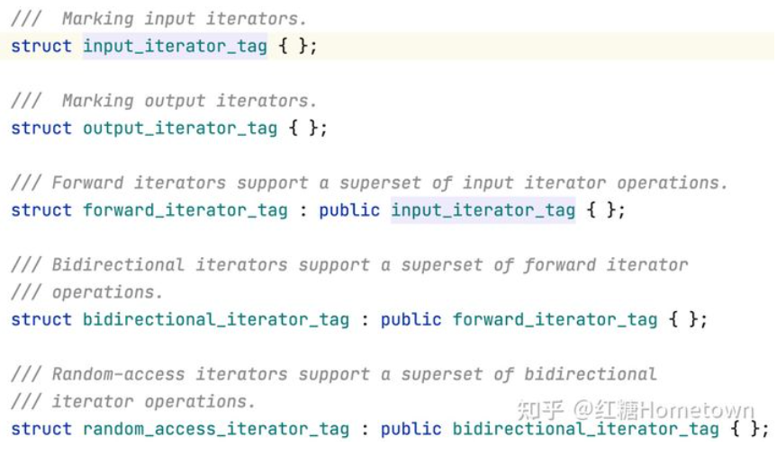

  * 常量迭代器和非常量迭代器类型

    * **只能读或能读写**

  * 支持的运算符

    

    随机访问迭代器：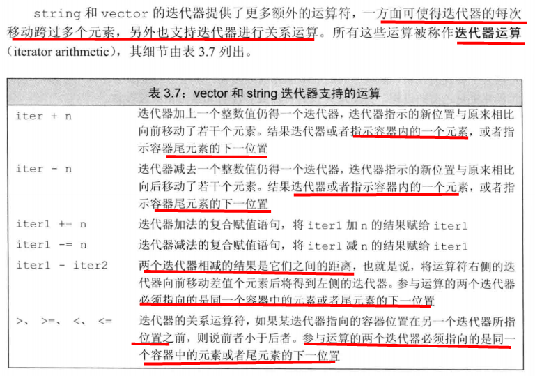

  * 迭代器失效：

    * **向容器添加元素和从容器中删除元素的操作可能会使迭代器失效。**
    * 迭代器有有效和无效之分：
      * 
    * 如何规避迭代器失效问题：
      * **保证每次改变容器的操作之后都正确地重新定位迭代器。**
        * insert和erase操作都会返回迭代器，使用返回值进行更新即可。[insert返回的迭代器指向新插入的元素，erase返回的是删除元素后的下一个元素的迭代器]

      * **不要保存end返回的迭代器。**
        * 

    * 序列式容器的迭代器失效：
      * 
    * 关联式容器迭代器失效
      * 对于关联容器(如map, set,multimap,multiset)，**删除当前的iterator，仅仅会使当前的iterator失效**，只要在erase时，递增当前iterator即可。
      * 使用了红黑树来实现，插入、删除一个结点不会对其他结点造成影响，**整棵树也会调整，以符合红黑树或者二叉树的规范，但是单个节点在内存中的地址没有变化，变化的是各节点之间的指向关系。**
      * erase迭代器**只是被删元素的迭代器失效**，但是返回值为void，所以要**采用erase(iter++)的方式删除迭代器**。

* 常见算法：

  * 

* 各容器常见的坑：

  * 常见容器添加元素时，都会调用**拷贝构造函数**

  * 通过键下标访问unordered_map时，如果**键不存在，则会插入键并使用默认构造函数初始化出对应的值**【值类型默认的初始值】，存在则返回引用。

  * 在插入元素前，如果vector容器元素个数达到2的n次方，**则会进行空间增长呈双倍形式**，其会**先把旧空间的元素通过拷贝构造拷贝进新空间，然后再将新元素插入新空间**，最后会把旧空间的旧元素析构掉。

  * 排序容器，需要写**内部比较器或外部比较器**

    ```c++
        // 内部比较器 
        // 其实插入数据其实要做两步。要调用三次 Compare 。前两次是去重【 !comp(a, b) && !comp(b, a)】，一次是内部红黑树的数据结构需要比较大小。
        constexpr bool operator<(const node& n)const {
            return this->val < n.val;
        }
    
    // 比较函数也可使用lambda表达式实现
    sort(startEnd.begin(), startEnd.end(), [](auto &a, auto &b){
                if(a[0] == b[0]) return a[1] < b[1];
                return a[0] < b[0];
            });
    ```

  * 容器元素**只能是对象类型，故引用不能作为元素。**

  * 注意：算法库中sort()要求自定义比较函数对象是 ，**静态/全局函数指针，非静态成员函数指针不能直接传递给std::sort()。**

  * 定义了数组后，就分配了相应空间，并**调用元素类型的默认构造函数。**

  * List容器为双向链表，其提供的void remove (const value_type& val);通过=运算符进行比较容器中的所有元素返回true的进行删除【先调用析构】，时间复杂度为O(n)。而std::[list](https://cplusplus.com/reference/list/list/)::erase(iterator posi)则是通过指定迭代器位置来进行删除，时间复杂度为O(1)。

  * std::unordered_map::erase有对指定键的删除还有指定迭代器位置的删除。

  * 解引用容器迭代器时返回的是元素引用，如果使用引用类型变量接收，元素删除后，该变量将会失效。

  * 在STL中，容器的元素要满足三个基本要求：可拷贝(copyable)、可赋值(assignable)、可析构(destroyable)。**基本数据类型和自定义的类都满足这些条件，但是引用不满足，因为引用不能析构**。

    * 可拷贝：容器插入元素时需要通过拷贝构造创建副本，注意元素为指针类型时，可能因重复析构和浅拷贝的原因导致内存泄漏问题。【对于含有堆资源的元素对象，我们一般实现深拷贝】

    * 可赋值：获取容器中的元素时需要重载赋值运算符的支持

  * set容器底层为红黑树，无法获取指定排序位置的元素，我们可以加入普通的vector后再进行排序然后获取指定位置的元素。

  * 容器只有基于deque实现的queue、stack和priority_queue的删除API名是pop，其他都是erase(iterator)

  * sort函数原型为void sort (RandomAccessIterator first, RandomAccessIterator last);传入的参数是迭代器，不是容器，内部实现为快排，即不稳定排序。

  * 字符串截取的API为

    ```c++
    basic_string substr( size_type pos = 0, size_type count = npos ) const;
    // 含子串 [pos, pos+count) 或 [pos, size()) 的 string 。
    ```

  * 容器【unordered_map、unordered_set、set】中找元素的API为find()，返回对应迭代器，找不到则返回容器::end();

  * 对于容器中的初始化，如果**类型参数T非类，则元素可能有不确定的值**，如果为类，则调用默认构造函数。

  * 成员变量初始化规则https://blog.csdn.net/littleflypig/article/details/89015638

  * 添加容器的方法

    * push_back() 在向容器尾部添加元素时，会**先创建这个元素，然后再将这个元素拷贝或移动到容器中**（若是拷贝的话，还需要在结束后销毁之前创建的这个元素）；
    * emplace_back() 则是**直接在容器尾部创建这个元素**，**省去了拷贝或移动元素的过程。**
    * https://zhuanlan.zhihu.com/p/213853588 todo阅读

* 前置++与后置++

  https://developer.aliyun.com/article/569874

  * **为了编译器区分前置和后置++**，**C++规定后缀形式有一个int类型参数**，当函数被调用时，**编译器传递一个0做为int参数的值给该函数**。不这样规定，无法区分，**因为都仅以自身对象为入参。**

  * ++操作符重载函数定义：

    ```c++
    前置++: type& operator++(){
        this->member+=1;
        return *this;
    }
    后置++: const type operator++(int ){
        type old = *this;
        ++(*this);
        return old;
    }
    ```

  * 前置比后置效率高，**后置需要构造临时对象并返回。**

  * 前置和后置返回类型不同的原因：

    * 前置返回引用确保可以**直接对这个返回对象再进行操作**，后置**返回的是临时对象不是原来的对象，对其操作没意义**，故**加const限制对返回对象的操作。**


## C++语法

* 浮点数表示：

  value of floating-point = **significand** x **base**^**exponent,** with its corresponding **sign**.
  
  sign：表正负
  
  significand：一系列数字，数字个数即精度。
  
  base：基底，用一个数字表示，2、10、16，对应数字的significand需用对应进制表示，基底默认为2，故实际存储的只有其他三部分。
  
  exponent：幂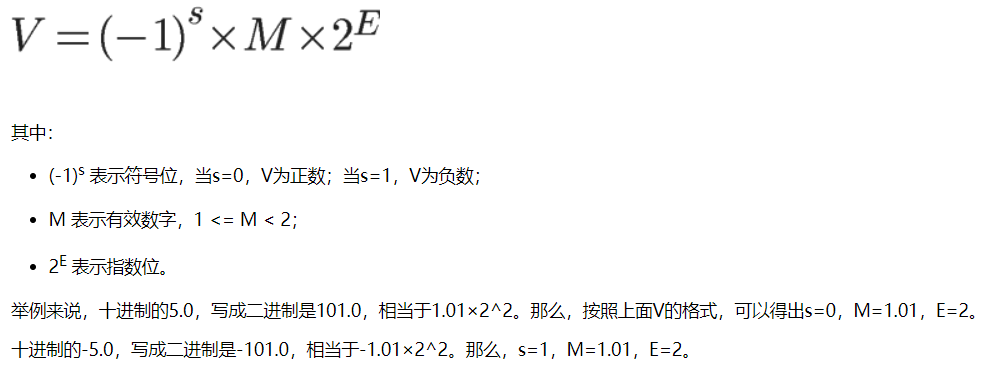https://www.cnblogs.com/chenny7/p/14251913.html
  
* 常见头文件

  ```c++
  #include <bits/stdc++.h> //万能
  #include <algorithm>
  #include <iostream>
  #include <string>
  #include <vector>
  #include <cstdlib> // 常用c函数
  #include <ctime> // 时间函数 设置不同的随机数种子
  #include <climits> // 表示整数类型上下的常量 INT_MAX 
  #include <cfloat> // 表示浮点数的limits FLT_MAX
  #include <cstdint> // 定义了specific width的整型和对应limits
  #include <cmath> // 引入数学运算
  #include <bitset> //获取整数和01字符串对应的bit序列
  #include <cctype> // 对字符的操作
  #include <utility> // 一些实用函数 如swap
  #include <memory> //内存安全相关 如多线程和智能指针
  ```

* 三角函数

  ```c++
  //cmath使用的是弧度值表示角度，范围为[0, pi]表示0-180度
  //一个弧度相当于180 /π度 acos(-1)等于pi
  cout << acos(0.5)*180/acos(-1);
  cout << sin(acos(-1)*30/180);
  ```

* char和unsigned char

  ```c++
      signed char a = 128; // 截取低8位存储 【第8位表正负 -128-127】
      // 这里为signed
      char b = 128; // 是否有符号根据编译器实现而定 ascii码范围0-127,[0,31]表示的是32个控制字符 其不可表示，能表示该范围的数即可
      unsigned char a1 = 128; // 截取低8位存储 【第8位不表正负 0-255】
  cout << a << endl; // 读取字节序列 根据文件的字符编码转换为相应字符 €
  cout << b << endl;  // €
  cout << a1 << endl;// 读取转换为相应字符 €
  ```

* switch的case里不能定义变量的原因：

  * case**跳转可能跳过了变量的定义**

todo 2023-02-20 复习到此处

* 面向对象：

  * ```c++
    #include<unordered_map>
    #include<list>
    #include<iostream>
    using namespace std;
    class Solution {
    private:
        // 记录迭代器
        unordered_map<int, std::list<pair<int, int>>::iterator> cache;
        // 双向链表
        list<pair<int, int>> list;
        int cap;
    public:
        Solution(int capacity) : cap(capacity) {
            // write code here
        }
    
        int get(int key) {
            // write code here
            if (cache.find(key) != cache.end()) {
                // auto 为pair 迭代器解引用返回引用 node使用引用进行构造
                auto node = *cache[key];
                // 去除对应位置的节点 常数时间复杂度
                list.erase(cache[key]);
                // 加入队头
                list.push_front(node);
                cache[key] = list.begin();
                return node.second;
            }
            return -1;
        }
    
        void set(int key, int value) {
            // write code here
            if (cache.find(key) != cache.end()) {
                auto& node = *cache[key];
                // todo erase不是析构了元素吗，为啥引用还可以用 
                // todo 插入元素是插入引用还是新拷贝了？
                node.second = value;
                // 去除对应位置的节点 常数时间复杂度
                list.erase(cache[key]);
                // 加入队头
                list.push_front(node);
                cache[key] = list.begin();
            }
            else {
                if (cache.size() == cap) {
                    auto toRemoNode = list.back();
                    cache.erase(toRemoNode.first);
                    list.pop_back();
                }
                auto node = make_pair(key, value);
                list.push_front(node);
                cache[key] = list.begin();
            }
        }
    };
    
    class Father {
    private:
        int data;
    public:
        // 非虚函数：派生类继承接口和实现
        void DoGetData(int d = 10) {
            data = d;
            // 调用的是子类的
            GetData();
        }
        virtual void GetData() {
            cout << data << endl;
        }
    
        // 纯虚函数 只有接口会被继承 默认实现不会被继承 对于派生类要求有对该纯虚函数的实现
        virtual void SetData(int d) = 0 {
            data = d;
        }
    };
    
    
    class Son : public Father{
    private:
        int data;
    public:
        void DoGetData(int d = 1) {
            data = d;
            GetData();
        }
        // void GetData() override{
        //    cout << data << endl;
        //} 同样效果
        virtual void GetData() {
            cout << data << endl;
        }
    
        // override 用来表明必须重写基类中的某个虚函数
        void SetData(int d) override{
            data = d;
        }
    };
    
    int main() {
        Son son;
        son.DoGetData(); // 1
        son.GetData(); // 1
        son.SetData(100);
        son.GetData();// 100
        son.Father::DoGetData();// 1
        son.Father::GetData(); // 10
        son.Father::SetData(50);
        son.Father::GetData();// 50
        // Father f;// 无法创建纯虚函数对象
        Father* o = new Son;
        o->DoGetData(); // 随机值 调用的是 Father::DoGetData() 非虚函数属于静态绑定 子类同方法签名的非虚函数被掩盖了
        o->SetData(100);
        o->GetData(); // 
    }
    ```

  * 非虚成员函数：基类的接口和对应实现都会被继承，由于静态绑定只能根据声明的类型进行调用。

  * 成员虚函数：基类的接口和对应实现都会被继承，但是由于动态绑定机制，能被派生类的同名虚函数所覆盖。

  * 成员纯虚函数：只有接口会被继承 默认实现不会被继承 对于派生类要求有对该纯虚函数的实现 且无法创建声明有纯虚函数的类对象。

* 继承

  * 多重继承容易出现的问题：**命名冲突**和**数据冗余**问题。

    * 无间接继承一般使用声明属于哪一个类解决

      ```c++
      class a {
      public:
          int var1;
      };
      class b {
      public:
          int var1;
      };
      class c : public a, public b {
      public:
          void printVar1() {
              cout << a::var1 << endl;
          }
          
      };
      ```

    * 有间接继承可通过虚继承解决

      ```c++
      // 间接基类，即虚基类
      class Base1
      {
      public:
          int var1;
      };
      
      // 直接基类 
      class Base2 : virtual public Base1 // 虚继承
      {
      public:
          int var2;
      };
      
      // 直接基类 
      class Base3 : virtual public Base1 // 虚继承
      {
      public:
          int var3;
      };
      
      // 派生类
      class Derive : public Base2, public Base3
      {
      public:
          void set_var1(int tmp) { var1 = tmp; } 
          void set_var2(int tmp) { var2 = tmp; }
          void set_var3(int tmp) { var3 = tmp; }
          void set_var4(int tmp) { var4 = tmp; }
      
      private:
          int var4;
      };
      ```

      菱形继承中存在**对虚基类多次初始化的问题**，采用虚继承，可由**最底层的派生类直接负责虚基类的初始化。**默认的继承是**每个类只负责自己的直接基类的初始化**。

  * 调用函数时，内置类型做实参时，**使用值传递方式的效率要高于引用传递和指针传递**，因此编译器会采用效率最高的方式来实现参数传递，至于其他类型如自定义类，如果采用**值传递则会涉及拷贝构造函数和析构函数的调用问题**，通常会影响性能，所以一般采用**引用和指针传递的形式**，通常交由用户决定。

  * **某个类X的初始化顺序**，其实是一个递归初始化的过程，递归的终点是内置类型。

    1. 按照继承**声明顺序**，**初始化**基类对象。
    2. **初始化**X的成员对象。【声明顺序，不是初始化列表的顺序】
    3. 调用X构造函数

  * **禁止类的实例化**：

    * 1.定义**纯虚函数**，使该类成为**抽象基类**。
    * 2.构造函数声明为**private**。【可以**禁止直接实例化，不能禁止间接实例化**。如单例模式。】
    * 3.构造函数声明为**delete**。

  * 实例化对象的几个阶段

    * 1.分配空间

      **创建类对象首先要为该对象分配内存空间**。不同的对象，为其分配空间的时机未必相同。**全局对象、静态对象、分配在栈区域内的对象**，在**编译阶段进行内存分配**；存储**在堆空间的对象**，是在**运行阶段进行内存分配**。

      【2、3、4先父类再子类】

      2.如果当前类有虚函数，则为虚表指针赋值。【**虚函数表在编译期就会创建】**

      3.初始化

      成员变量初始化，根据调用函数的初始化列表进行，成员变量有默认值了。

      4.赋值

      构造函数中可能为成员变量赋值【调用拷贝赋值函数】，函数体执行完实例化就完成了。

  * **友元**的作用及使用场景

    * 作用：用`friend`在某个类中**修饰函数或类**相当于给该函数或类**访问该类私有成员或保护成员的许可**。

    * 友元函数：某些**虽然不是类成员函数却能够访问类的所有成员的函数。**类授予它的友元特别的访问权，这样该友元函数就能访问到类中的所有成员。

      * ```c++
        #include <iostream>
        
        using namespace std;
        
        class A
        {
        public:
            friend void set_show(int x, A &a);      //该函数是友元函数的声明
        private:
            int data;
        };
        
        void set_show(int x, A &a)  //友元函数定义，为了访问类A中的成员
        {
            a.data = x;
            cout << a.data << endl;
        }
        int main(void)
        {
            class A a;
        
            set_show(1, a);
        
            return 0;
        }
        ```

    * 友元类：**友元类的所有成员函数都是另一个类的友元函数**，都可以访问另一个类中的隐藏信息（包括私有成员和保护成员）。当希望一个类可以存取另一个类的私有成员时，可以将该类声明为另一类的友元类。

      * 注意事项：

        * 友元关系**不能被继承**。
        * 友元关系是**单向的**，不具有交换性。若类B是类A的友元，类A不一定是类B的友元，要看在类中是否有相应的声明。
        * 友元关系**不具有传递性**。若类B是类A的友元，类C是B的友元，类C不一定是类A的友元，同样要看类中是否有相应的申明。

      * ```c++
        #include <iostream>
        
        using namespace std;
        
        class A
        {
        public:
            friend class C;                         //这是友元类的声明
        private:
            int data;
        };
        
        class C             //友元类定义，为了访问类A中的成员
        {
        public:
            void set_show(int x, A &a) { a.data = x; cout<<a.data<<endl;}
        };
        
        int main(void)
        {
            class A a;
            class C c;
        
            c.set_show(1, a);
        
            return 0;
        }
        ```

    * 友元成员函数：**使类B中的成员函数成为类A的友元函数**，这样类B的该成员函数就可以访问类A的所有成员了。

      * 注意事项：

        * 当用到友元成员函数时，需**注意友元声明和友元定义之间的相互依赖**
        * 更一般的讲，必须先定义包含成员函数的类，才能将成员函数设为友元。另一方面，不必预先声明类和非成员函数来将它们设为友元。

      * ```c++
        #include <iostream>
        
        using namespace std;
        
        class A;    //当用到友元成员函数时，需注意友元声明与友元定义之间的互相依赖。这是类A的声明
        class B
        {
        public:
            void set_show(int x, A &a);             //该函数是类A的友元函数
        };
        
        class A
        {
        public:
            friend void B::set_show(int x, A &a);   //该函数是友元成员函数的声明
        private:
            int data;
            void show() { cout << data << endl; }
        };
        
        void B::set_show(int x, A &a)       //只有在定义类A后才能定义该函数，毕竟，它被设为友元是为了访问类A的成员
        {
            a.data = x;
            cout << a.data << endl;
        }
        
        int main(void)
        {
            class A a;
            class B b;
        
            b.set_show(1, a);
        
            return 0;
        
        ```

    * 优点：

      *  可以灵活地实现需要访问若干类的私有或受保护的成员才能完成的任务；

    * 缺点：

      * 一个类将对其非公有成员的访问权限授予其他函数或者类，会**破坏该类的封装性**，降低该类的可靠性和可维护性。

    * 场景：
      * **友元类**：类之间共享数据。
      * **普通函数定义为友元函数**，使普通函数能够访问类的私有成员。

  * 动态绑定和静态绑定

    https://blog.csdn.net/chgaowei/article/details/6427731

    * 对象的**静态类型**：对象在**声明时采用的类型**。是在**编译期**确定的。
    * 对象的**动态类型**：目前**所指对象的类型。**是在**运行期**决定的。对象的**动态类型可以更改**，但是**静态类型无法更改**。
    * 静态绑定：**绑定的是对象的静态类型**，某特性（比如函数）**依赖于对象的静态类型，发生在编译期**。
    * [动态绑定](https://so.csdn.net/so/search?q=动态绑定&spm=1001.2101.3001.7020)：**绑定的是对象的动态类型**，某特性（比如函数）**依赖于对象的动态类型，发生在运行期。**
    * 只有**虚函数才使用的是动态绑定**，**其他的全部是静态绑定**。【动态绑定 = 指针/引用 + 虚函数】
    * 虚函数是动态绑定的，但是为了执行效率，**缺省参数是静态绑定的。**

  * 深拷贝和浅拷贝的区别：

    https://www.cnblogs.com/hellowooorld/p/11259560.html

    * 深拷贝：深拷贝不但对指针进行拷贝，而且**对指针指向的内容进行拷贝**，经深拷贝后的指针是指向两个不同地址的指针【**拷贝栈空间和堆空间。**】
    * 浅拷贝：对指针的拷贝，拷贝后两个指针指向同一个内存空间【**只拷贝栈空间。**】
    * 默认的拷贝构造函数和拷贝赋值函数都是浅拷贝，当类中含有指针成员时一般需要重新定义两个函数。

  * 编译时多态和运行时多态的区别：

    * **编译时多态**：在程序编译过程中出现，发生在**模板**（泛型编程，根据**参数类型实例化不同的实例对象**）和**函数重载**中。
      **运行时多态**：在程序运行过程中出现，发生在**继承体系**中，是指通过**基类的指针或引用访问派生类中的虚函数**。

      编译时多态和运行时多态的区别：

      * **时期**不同：编译时多态发生在程序编译过程中，运行时多态发生在程序的运行过程中；
      * **实现方式**不同：编译时多态运用**泛型编程或函数重载**来实现，运行时多态借助**虚函数**来实现。

  * 类的成员函数后加const的作用

    * 类的成员函数后面加 const，表明这个函数**不会对这个类对象的数据成员（准确地说是非静态数据成员）作任何改变。**

      在设计类的时候，一个原则就是对于不改变数据成员的成员函数都要在后面加 const，而对于改变数据成员的成员函数不能加 const。所以 const 关键字对成员函数的行为作了更加明确的限定：

      （1）有 const 修饰的成员函数（指 const 放在函数参数表的后面，而不是在函数前面或者参数表内），只能读取数据成员，不能改变数据成员；没有 const 修饰的成员函数，对数据成员则是可读可写的。
      （2）除此之外，在类的成员函数后面加 const 还有什么好处呢？那就是**常量（即 const）对象可以调用 const 成员函数，而不能调用非const修饰的函数。**

      **相当于对this指针做了底层const，只能保证this指向的内容不变。**

      【常量成员函数中的this指针是常指针，无法通过this指针修改，只能读取】

    * const修饰的成员函数不能修改所有的数据成员，如果我们想要**在const成员函数修改部分的成员变量**时，可**为变量加上mutable修饰，表示该变量将永远处于可变的状态，即使在一个const函数中。**

      使用mutable的注意事项：
      （1）mutable**只能作用于类的非静态和非常量数据成员。**
      （2）在一个类中，**应尽量或者不用mutable**，大量使用mutable表示程序设计存在缺陷。

  * 如何**让类不能被继承**

    * 1、借助 `final` 关键字，用该关键字修饰的类**不能被继承**。

      ```c++
      class Base final
      ```

    * 2、借助**友元、虚继承和私有构造函数**来实现

      ```c++
      #include <iostream>
      using namespace std;
      
      template <typename T>
      class Base{
          friend T;
      private:
          Base(){
              cout << "base" << endl;
          }
          ~Base(){}
      };
      
      class B:virtual public Base<B>{   //一定注意 必须是虚继承 友元关系不能被继承 虽然 C 类继承了 B 类，B 类是 Base 类的友元，但是 C 类和 Base 类没有友元关系。
      public:
          B(){
              cout << "B" << endl;
          }
      };
      
      class C:public B{ // C类负责Base类的初始化，但是无法访问Base类的构造函数，故无法继承B
      public:
          C(){}     // error: 'Base<T>::Base() [with T = B]' is private within this context
      };
      
      
      int main(){
          B b;  
          return 0;
      }
      ```

  * 运算符

    * 不同的运算符对运算对象的要求各不相同，有的需要左值运算对象，有的需要右值运算对象，返回值也有差异，有的需要左值结果有的需要右值结果，但是有一个简单方法判断需要什么：

    * 常见运算符重载方式：

    * 运算符优先级：
    
      赋值运算符< 逻辑运算符 < 按位运算符 < 关系运算符 < 移位运算符 < 算术运算符 < **一元运算符** 【前面都是二元】< 成员访问运算符 < 作用域运算符
    
      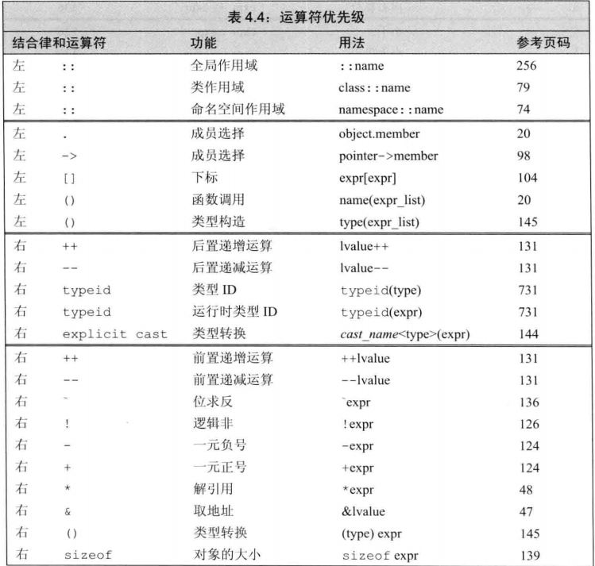
    
      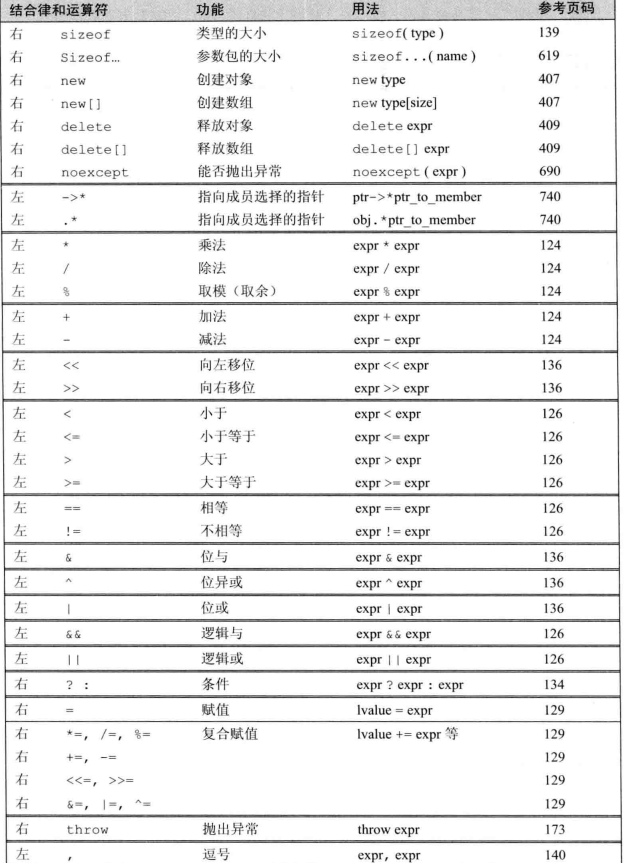
    
  * 右值引用和左值引用相关

    https://www.cnblogs.com/qicosmos/p/4283455.html

    https://blog.csdn.net/guangcheng0312q/article/details/103572987

    * C++标准中定义的值类别：

      * 在C++11中所有的值必属于**左值、将亡值、纯右值**三者之一。

    * 左值【lvalue】：**有标识符、可以取地址**的表达式

      * 变量、函数或数据成员

      * 返回左值引用的表达式

        如 ++x、x = 1、cout << ' '

      * **字符串字面量**是左值，而且是不可被更改的左值。字符串字面量并不具名，但是可以用&取地址所以也是左值。

      * **左值引用是左值**、具名右值引用变量。

    * 纯右值(prvalue)：纯右值 prvalue 是**没有标识符**、**不可以取地址的表达式**，一般也称之为“临时对象”。

      * 返回非引用类型的表达式

        如 x++、x + 1

      * 除字符串字面量之外的字面量如 42、true
    
    * 将亡值(xvalue)：**有标识符，**所以也被称为glvalue。跟左值 lvalue 不同，xvalue 仍然是**不能取地址**的。
    
      * **调用函数的结果**，函数的**返回类型是对所返回对象类型的右值引用**
    
      * **将左值对象转换为右值引用的表达式。**【static_cast<int&&>()、std::move()】
    
      * 访问xvalue对象的成员的表达式

  * C++变量类型：

    * 值类型：表明一个变量是代表实际数值。**所有的原生类型、枚举、结构、联合、类都代表值类型。**
    * 引用类型：表明一个变量引用另外一个数值。**只有引用（&）和指针（*）才是引用类型。**
    * **一个表达式的lvalueness (左值性)或者 rvalueness (右值性)和它的类型无关。**

  * 左值引用：对**左值进行绑定**的引用，一个引号。
  
    *  **常量左值引用**是**万能的引用类型**，可以接受左值、右值、常量左值和常量右值。即使用右值初始化时，如果没有手写移动构造函数且编译器没为其提供默认移动构造函数时，则会调用拷贝构造函数【其形参为常量左值引用且编译器一定会提供】
  
  
  * **右值引用**：对**右值进行绑定的引用**就是右值引用，他的语法是这样的A&&，通过**双引号来表示绑定类型为A的右值**。【也相同于是左值因为具名了】
  
    特点：
  
    1、**绑定的右值的生命周期将会通过右值引用得以延续**，和右值引用变量的生命周期相同。【利用该特定进行性能优化，即**避免临时对象的拷贝构造和析构**】
  
  
  * 右值引用的作用：
  
    * 减少临时对象**非必要的昂贵的拷贝操作**。
  
      * ```c++
        // 这个构造函数并没有做深拷贝，仅仅是将指针的所有者转移到了另外一个对象
        T(T&& a) : m_val(a.m_val){ a.m_val=nullptr; }
        ```
  
      * 提供**深拷贝的拷贝构造函数**虽然可以**保证正确**【为避免指针悬挂】，但是在有些时候会造成**额外的性能损耗**。【函数返回时因创建临时对象会调用拷贝构造，用函数返回值赋值时会调用拷贝构造，赋值完后临时对象又会析构，两次拷贝一次析构，如果涉及的**堆内存**很大，将带来很大的损耗】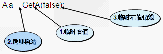
  
      * 通过**移动构造函数来避免对临时对象进行深拷贝，而只是进行浅拷贝**，即**移动语义**。【将**对象资源的所有权从一个对象转移到另一个对象**，**只是转移**，没有内存的拷贝。】
  
      * 如果一个对象**内部有较大的堆内存或者动态数组时**，很有必要写move语义的**拷贝构造函数和赋值函数**，**避免无谓的深拷贝**，以提高性能。【没有对应的拷贝构造和拷贝赋值时，传入右值仍可以进行，**因为拷贝构造的常量左值引用形参仍能接受**】
  
      * move对于**含资源（堆内存或句柄）的对象**来说更有意义。
  
      * 可使用 **std::move 将左值变成右值引用**
  
    * 【**利用万能引用和forward函数实现完美转发**】在模板函数中确保**按照参数的实际类型进行转发。**
  
      * ```c++
        void processValue(int& a){ cout << "lvalue" << endl; }
        void processValue(int&& a){ cout << "rvalue" << endl; }
        template <typename T>
        void forwardValue(T&& val)
        {	
            // 如果无forward函数 直接传val 则走的都是lvalue【因为val是左值】
            processValue(std::forward<T>(val)); //照参数本来的值类别进行转发。
        }
        void Testdelcl()
        {
            int i = 0;
            forwardValue(i); //传入左值 
            forwardValue(0);//传入右值 
        }
        输出：
        lvaue 
        rvalue
        ```
        
      * C++11中的std::forward会**按照参数的实际类型进行转发。**
  
      * **T&&**是一个universal references，**可以接受左值或者右值**，这个特性让他适合**作为一个参数的路由**，然后再通过std::forward**按照参数的实际类型去匹配对应的重载函数**，最终实现**完美转发**。【要求T是一个**被推导的类型**，即**需要模板参数类型推导**的场景，如模板函数、auto关键字、typedef关键字、decltype关键字(与其他的规则不同)】
  
      * 万能引用参数类型推导规则：
  
        * **左值初始化则T&&变成左值引用**，模板参数T被推导为T& 总体为T& &&根据引用折叠规则，最终为左值引用。【**经过类型推导和引用折叠**】
        * **右值初始化则T&&变成右值引用**，模板参数T被推导为T，最终为右值引用。
        * 对于引用类型的变量，需先**去除引用部分，变为值类型**再作为**左值传递**，**故引用类型变量经过完美转发后得到的类型都是左值引用。**
  
    * <utility> **std :: move 函数和std::forward函数的实现原理**：
  
      * C++11确定了**引用折叠**的规则：【来处理某些像**模板实例化情况下带来的"引用的引用"**的问题。】
  
        - 所有的**右值引用叠加到右值引用上仍然还是一个右值引用；（A&& && 变成 A&&）**
      
        - 所有的**其他引用类型之间的叠加都将变成左值引用。（A& & 变成 A&; A& && 变成 A&; A&& & 变成 A&）**
      
        - 细节：
      
          - 引用的引用有四种可能【lvalue reference to lvalue reference, lvalue reference to rvalue reference, rvalue reference to lvalue reference, 以及 rvalue reference to rvalue reference】
  
          - 传入左值，根据类型推导规则，类型参数T被推导为T&，再根据引用折叠规则，T&&&折叠为T&，传入右值时，T被推导为T，最终为T&&。
  
            ```c++
            template<typename T>
            void f(T&& param);
             
            ...
             
            int x;
             
            ...
             
            f(10);                           // invoke f on rvalue等同于void f(int&& param);
            f(x);                            // invoke f on lvalue等同于void f(int& && param);
            ```
      
          - 注意：引用折叠**只会在一些特定的可能会产生"引用的引用"场景下生效**。 这些场景包括模板类型推导，`auto` 类型推导， `typedef` 的形成和使用，以及`decltype` 表达式。
      
          - todo https://zhuanlan.zhihu.com/p/99524127
      
      * typename的作用：
      
        * 模板编程时，**用于指定模板参数中的类型**
        * 声明**依赖于模板参数的名称为类型。**
      
      * **remove_reference(引用移除)**的实现
      
        * **基于对左值引用、右值引用的模板特化**实现
      
          ```c++
          
          //原始的，最通用的版本
          template <typename T> struct remove_reference{
              typedef T type;  //定义T的类型别名为type
          };
           
          //部分版本特例化，将用于左值引用和右值引用
          template <class T> struct remove_reference<T&> //左值引用
          { typedef T type; }
           
          template <class T> struct remove_reference<T&&> //右值引用
          { typedef T type; } 
          ```
      
      * move函数功能：**将一个左值强制转化为右值**，继而可以**通过右值引用使用该值，以用于移动语义。**
      
        函数原型：
      
        ```c++
        template <typename T>
        typename remove_reference<T>::type&& move(T&& t)
        {
        	return static_cast<typename remove_reference<T>::type &&>(t);
        }
        ```
      
        实现原理：
      
        * 通过 remove_refrence 移除引用，**得到具体的类型 T；**
        
        * 传递的是左值，推导为左值引用，仍旧`static_cast`转换为右值引用，**表达式结果为右值。**
        * 传递的是右值，推导为右值引用，仍旧`static_cast`转换为右值。
        
      * std::forward源码剖析：在传递参数的时候，可以保存参数原来的lvalueness 或 rvalueness，即是说把参数转发给另一个函数。】todo
      
        * 转发左值：【万能引用必走】
      
          ```c++
          template<typename _Tp>
          constexpr _Tp&&
          forward(typename std::remove_reference<_Tp>::type& __t) noexcept
          { return static_cast<_Tp&&>(__t); }
          ```
      
          type即为T，T& _t表示左值引用， _Tp为T&时 引用折叠为左值引用转换表达式结果为左值， _Tp为T&&时 引用折叠为右值引用转换表达式结果为右值。
      
      * 总结：
      
        * 在《Effective Modern C++》中建议：对于右值引用使用std::move，对于万能引用使用std::forward。
        * std::move()与std::forward()**都仅仅做了类型转换而已**。**真正的移动操作是在移动构造函数或者移动赋值操作符中发生的。**
        * std::move()可以应用于左值(普通的变量int这些使用move与不使用move效果一样)，但这么做**要谨慎。因为一旦“移动”了左值，就表示当前的值不再需要了**，如果后续使用了该值，产生的行为是未定义。
      
    * 函数返回类型相关细节：
  
      * 返回值类型：
        * 返回某个对象的副本【右值，函数执行完时发生拷贝在栈上创建的临时值】，这样需保证其是可拷贝【拷贝构造】或者可移动的【移动构造】。
      * 返回非常量左值引用：
        * 调用函数的表达式是左值，因为可取地址。
        * 和值类型的比较就是运行时不涉及拷贝构造和析构，减小对CPU的开销。
      * 返回常量左值引用：
        * 主要是避免对引用对象的修改。
      * 相关示例：
  
      ```c++
          Node getValue() {
      
          }
          Node& getNonConstReference() {
      
          }
          const Node& getConstReference() {
      
          }
          // todo 返回右值引用 Node&& getR
          void test() {
                      Node c = getValue(); // 编译器会实现拷贝构造其参数为常量左值引用 即万能引用
                      Node& b = getValue(); // 左值引用无法接收右值
                      Node&& a = getValue();// 右值引用接收
                      getValue().key = 5; // 右值对象无法修改
              
                      Node d = getNonConstReference(); // 拷贝构造
                      Node& e = getNonConstReference();
                      Node&& f = getNonConstReference(); // 右值引用不接收左值【可取地址】
                      getNonConstReference().key = 6; // 左值对象修改
              
                      Node g = getConstReference(); // 使用常量左值引用进行拷贝构造创建的g对象
                      g.key = 6; // 可对g进行修改
                      Node& h = getConstReference(); // 无法引用【必须修饰为常量】
                      const Node& i = getConstReference();
                      Node&& j = getConstReference(); // 右值引用不接收左值【可取地址】
                      getConstReference().val = 5; // 无法对常量对象修改
      
                  }
              
  
* 字符串：

     *  C风格字符串：即字符串字面量，为了表达和使用字符串而约定形成的写法，以空字符'\0'【%c方式输出为空格】标识字符串的结尾。
       ​    

        * 必须用常量字符指针存储C风格字符串

* 指针：

  * 定义：指向其他类型的**复合类型**

  * 大小：32bit，4字节，64bit，8字节

  * 用法：

    * 指向普通对象：A *p = new A();

    * 指向常量对象：

      ```c++
      const int c_var = 10;
      const int * p = &c_var;
      ```

    * 指向函数的指针：**函数指针**【ps：函数名即地址，可不加&】

      ```c++
      int add(int a, int b){
          return a + b;
      }
      
      int main(void)
      {	
          // 注意函数指针语法
          int (*fun_p)(int, int);
          fun_p = add;
          cout << fun_p(1, 6) << endl;
          return 0;
      }
      ```

    * 指向对象成员的指针：分为指向**对象成员变量和对象成员函数**，特别注意：**定义指向成员函数的指针**时，要**标明指针所属的类**。

      ```c++
      class A
      {
      public:
          int var1, var2; 
          int add(){
              return var1 + var2;
          }
      };
      
      int main()
      {
          A ex;
          ex.var1 = 3;
          ex.var2 = 4;
          int *p = &ex.var1; // 指向对象成员变量的指针
          cout << *p << endl;
      
          int (A::*fun_p)();
          fun_p = A::add; // 指向对象成员函数的指针 fun_p
          cout << (ex.*fun_p)() << endl;
          return 0;
      }
      ```

    * this指针：指向当前类对象的**指针常量**【顶层const】

  * 野指针和悬空指针？

    * **悬空指针**：**指针指向的内存空间已经被释放掉了**。

      ```c++
      void *p = malloc(size);
      free(p); 
      // 此时，p 指向的内存空间已释放， p 就是悬空指针。
      ```

    * **野指针**：“野指针”是指**不确定其指向**的指针，**未初始化的指针**、**指针释放后之后未置空**和**指针所指的对象已经消亡**为“野指针”。

      ```c++
      void *p; 
      // 此时 p 是“野指针”。
      ```

    * 如何避免野指针的出现：

      * 使用引用代替指针，如果使用引用可以达到编程目的，就可以不必使用指针。因为**引用在定义的时候，必须初始化，所以可以避免野指针的出现。**

      * 如果一定要使用指针，那么需要在定义指针变量的同时对它进行初始化操作。定义时**将其置为空或者指向一个有名变量。**

      * 对指针进行free或者delete操作后，**将其设置为NULL。**对于使用 free 的情况，常常定义一个宏或者函数 xfree 来代替 free 置空指针。

  * nullptr 和 NULL

    https://zhuanlan.zhihu.com/p/401919037

    * `nullptr`：C++ 11 中的关键字，是一种**特殊类型的字面值**，可以**被转换成任意其他指针类型**
    * `NULL`：**预处理变量，是一个宏**，它的值是 0，定义在头文件 <cstdlib> 中，即 `#define NULL 0`。
    * nullptr的优势：
      * **避免匹配重载函数时存在异议**：函数调用过程使用**NULL做实参传递且存在函数重载时**，可能出现存在异议的情况，但是**传递实参 `nullptr` 就不会出现这种情况。**
      * 更加健壮：**不同类型的指针变量都可以使用nullptr来初始化**，令我们编写的程序更加健壮。

  * 指针和引用的区别：

    * 相同点：

      * 都是地址的概念，**指针指向一块内存，它的内容是所指内存的地址；而引用则是某块内存的别名。**

    * 是否可变：指针所指向的内存空间在程序运行过程中可以改变，而**引用所绑定的对象一旦绑定就不能改变**。

    * 是否占内存：

      * 指针本身在内存中占有内存空间

      * **引用是否占内存依据于编译器的具体实现**

        【无法通过sizeof得到引用所占内存，其得**到的是绑定的对象的大小。**】

        * 如果编译器**用指针实现引用**，那么它**占内存**。
        * 如果编译器**直接将引用替换为其所指的对象，则其不占内存**

    * 是否可为空：

      * **指针可以为空，但是引用必须绑定对象。**

    * 是否能为多级：

      * **指针可以有多级，但是引用只能一级。**

    * 指针从本质上讲就是存放变量地址的一个变量，在逻辑上是独立的，它可以被改变，包括其所指向的地址的改变和其指向的地址中所存放的数据的改变。

    * 引用是一个别名，它在逻辑上不是独立的，它的**存在具有依附性**，所以引用必须在一开始就被初始化，而且其引用的对象在其整个生命周期中是不能被改变的（自始至终只能依附于同一个变量）。

    * 程序**在编译时分别将指针和引用添加到符号表**上，符号表上记录的是变量名及变量所对应地址。**指针变量在符号表上对应的地址值为指针变量的地址值**，而**引用在符号表上对应的地址值为引用对象的地址值**。**符号表生成后就不会再改**，因此指针可以改变其指向的对象（指针变量中的值可以改），而引用对象则不能修改。

  * 常量指针和指针常量：

    * **常量指针（const int *p 【与int const *p等同】）**：表示指向常量的指针，即底层const，**代表不可通过指针修改指向对象的数据，不一定要指向常量**，可以指向其他对象。
    * **指针常量（int * const p）**：**指针对象为常量，指针指向不可修改**。【顶层const】
    * **指向常量的指针常量（const int \* const p）**: p的指向不可修改，p所指的内存区域中的值也不可修改（是常量）。

  * 指针函数和函数指针

    * 指针函数：
      * 定义：**本质是一个函数**，只是**返回值是一个指针。**
      * 形式：`int* fun(int tmp1, int tmp2);` ，这里`*` 表示函数的返回值类型是指针类型。
    * 函数指针：
      * 定义：**本质是一个指针变量**，**指向函数的指针。**
      * 形式：`int (*fun)(int tmp1, int tmp2);`，这里`*` 表示变量本身是指针类型。

  * 强制类型转换：

    * 将**类型名作为强制类型转换运算符**的做法是c的老式做法，c++为**保持兼容而予以保留**。

      * 其有以下缺点：

        1、转换太过随意，可以**在任意类型之间转换。**

        2、**没有统一的关键字和标示符**。对于大型系统，做**代码排查时容易遗漏和忽略**。

    * C++ 引入了四种功能不同的**强制类型转换运算符**以进行强制类型转换：static_cast、reinterpret_cast、const_cast 和 dynamic_cast，

      用法如下：强制类型转换运算符 <要转换到的类型> (待转换的表达式)

      * static_cast：用于数据的强制类型转换，强制将一种数据类型转换为另一种数据类型。

        * a、用于**类层次结构中基类和派生类**之间**指针或引用**的转换；

          　　**上行转换**（派生类---->基类）是安全的。

          下行转换（基类---->派生类）由于**没有动态类型检查**，所以是不安全的。最好用 `dynamic_cast` 进行下行转换。（当类型不一致时，**转换过来的是错误意义的指针，可能造成踩内存，非法访问等各种问题**）

        * b、用于**基本数据类型之间[不包括引用和指针]**的转换，如把int转换为char，安全性问题由开发者来保证；

        * c、把空指针转换成目标类型的空指针；

        * d、把任何类型的表达式转为void类型；

        * 使用特点

            * a、主要执行非多态的转换操作，用于**代替C中通常的转换操作；**
            * b、**隐式转换都建议使用static_cast进行标明和替换**；
      
            ```c++
            class A
            {
            public:
                // 如果对象所属的类重载了强制类型转换运算符 T（如 T是 int、int* 或其他类型名），则 static_cast 也能用来进行对象到 T 类型的转换。
                operator int() { return 1; }
                operator char*() { return NULL; }
            };
            
            int main()
            {
                A a;
                int n;
                char* p = "New Dragon Inn";
            
                n = static_cast <int> (3.14);  // n 的值变为 3
                n = static_cast <int> (a);     // 调用 a.operator int，n 的值变为 1
                p = static_cast <char*> (a);   // 调用 a.operator char*，p 的值变为 NULL
                n = static_cast <int> (p);     // 编译错误，static_cast不能将指针转换成整型
                p = static_cast <char*> (n);   // 编译错误，static_cast 不能将整型转换成指针
            
                return 0;
            }
            ```

  * const_cast：**强制去掉常量属性**，不能用于去掉变量的常量性，只能用于**去除指针或引用**的常量性，将常量指针转化为非常量指针或者将常量引用转化为非常量引用。【**指针和引用的基本类型要相同**】

       * 使用特点：

         * cosnt_cast是四种类型转换符中**唯一可以对常量进行操作的转换符**

         * 去除常量性是一个**危险的动作**，尽量避免使用。


         ```c++
                    const string s = "Inception";
                    string& p = const_cast <string&> (s);
                    string* ps = const_cast <string*> (&s);  // &s 的类型是 const string*
         ```

  * reinterpret_cast：用于进行**各种不同类型的指针之间**、**不同类型的引用之间**以及**指针和能容纳指针的整数类型之间的转换**。转换时，执行的是**逐个比特复制的操作。**

    * 使用场景：不到万不得已，不用使用这个转换符，高危操作；

    * 使用特点：reinterpret_cast是从底层对数据进行重新解释，依赖具体的平台，可移植性差；


    

  * ```c++
       class A
       {
       public:
           int i;
           int j;
           A(int n) :i(n), j(n) { }
       };
       
       int main()
       {
           A a(100);
           int &r = reinterpret_cast<int&>(a);             // 强行让 r 引用 a
           r = 200;                                                            // 把 a.i 变成了 200
           cout << a.i << "," << a.j << endl;                  // 输出 200,100
           int n = 300;
           A *pa = reinterpret_cast<A*> (&n);              // 强行让 pa 指向 n
           pa->i = 400;                                                    // n 变成 400
           pa->j = 500;                                                    // 此条语句不安全，很可能导致程序崩溃
           cout << n << endl;                                          // 输出 400
           long long la = 0x12345678abcdLL;
           pa = reinterpret_cast<A*>(la);                      // la太长，只取低32位0x5678abcd拷贝给pa
           unsigned int u = reinterpret_cast<unsigned int>(pa);    // pa逐个比特拷贝到u
           cout << hex << u << endl;                               // 输出 5678abcd
           typedef void(*PF1) (int);
           typedef int(*PF2) (int, char *);
           PF1 pf1 = nullptr; 
           PF2 pf2;
           pf2 = reinterpret_cast<PF2>(pf1);                   // 两个不同类型的函数指针之间可以互相转换
       }
       ```

  * dynamic_cast：

    * 其他三种都是**编译时完成的**，**动态类型转换**是在**程序运行时处理的**，**运行时会进行类型检查。**

    * 只能用于**带有虚函数的基类或派生类的指针或者引用对象的转换**，转换成功返回指向类型的指针或引用，**转换失败返回 `NULL`**；**不能用于基本数据类型的转换。**


    【**运行时的类型信息需通过虚函数表获取**】

    * 在**向上进行转换**时，即派生类类的指针转换成基类类的指针和 static_cast 效果是一样的，（注意：这里只是**改变了指针的类型**，指针指向的对象的类型并未发生改变）。【向上类型转换不需要虚函数，**向上转换永远是安全的**】

    * 在**下行转换**时，基类的指针类型转化为派生类类的指针类型，**只有当要转换的指针指向的对象类型为转化以后的对象类型及其派生类时**，才会转化成功。

  * 其他类型转换的场景：
    * 条件运算符的隐式转换：
      
           
      
      ```c++
          unsigned int a = 5;
          cout << (true ? -1 : a)<< endl;// 输出转化为左值a的类型unsigned int即-1[类型为signed int]的字节序列用sigend int表示 即4294967295
      ```

* 指针数组和数组指针

  * 不论指针变量的类型是什么，在同一个平台下大小都一样。在 32 位操作系统中占 4 个字节，在 64 位操作系统中占 8 个字节。


  * **指针数组**实质是一个数组，**数组内元素全部是指针变量**； **数组指针**实质是一个指针，该**指针指向一个数组**; 
        区分两者，若**核心和星号\*结合**,表示核心是**指针**如int **(\*n)**[10]，指向int [10]，表示数组指针。
        若**核心和中括号[]结合**，表示核心是**数组**,如 int ***p[10****]**，内部元素为int \*，表示指针数组
        若核心和小括号结合，表示核心是函数，如int **q()**；
        遇到操作符优先级问题，看优先级高低,其中（）、[ ]、->优先级高于\*

    * **指针+1所得结果要根据指针类型加上一定的值**，不同类型的指针+1之后增加的大小不同，a是长度为5的int数组指针，所以要加5*sizeof(int)

      ```c++
      int main(void) {
           int a[5] = {1, 2, 3, 4, 5};
          // &a 类型为int[5] * 即指向长度为5的数组  &a + 1 即地址值加上5*sizeof(int)
          // (int *) 转为指向int类型的指针
           int *ptr = (int *)(&a + 1);
          // *(a + i) == a[i];
           printf("%d %d", *(a + 1), *(ptr - 1)); //输出 2 5
           return 0;
       }
      ```

  * 结构体相关

    * 如何判断结构体是否相等？能否用 memcmp 函数判断结构体相等？

      * 不能有memcmp函数进行比较，因为**memcmp函数是逐个字节比较的**，结构体在内存空间保存时存在字节对齐，字**节对齐时补充的字节内容是随机的**，**无法进行比较**。

      * 可通过重载操作符==来进行比较

        ```c++
        #include <iostream>
        
        using namespace std;
        
        struct A
        {
            char c;
            int val;
            A(char c_tmp, int tmp) : c(c_tmp), val(tmp) {}
        
            friend bool operator==(const A &tmp1, const A &tmp2); //  友元运算符重载函数 友元函数不含this指针 故符合==需要两个操作数的需求
        };
        
        bool operator==(const A &tmp1, const A &tmp2)
        {
            return (tmp1.c == tmp2.c && tmp1.val == tmp2.val);
        }
        
        int main()
        {
            A ex1('a', 90), ex2('b', 80);
            if (ex1 == ex2)
                cout << "ex1 == ex2" << endl;
            else
                cout << "ex1 != ex2" << endl; // 输出
            return 0;
        }
        ```

    * C 和 C++ struct的区别：

      * 在 C 语言中 struct 是**用户自定义数据类型，struct 没有访问权限的设置，是一些变量的集合体，定义该类型的变量时，需要加上 struct 关键字，不能定义成员函数**；在 C++ 中 struct 是**抽象数据类型，定义该类型的变量时不用加该关键字， 可以和类一样，有访问权限，并可以定义成员函数。**

    * Class 和 struct的异同：

      * `struct` 和 `class` 都可以**自定义数据类型**，也支持**继承操作**。
      * **成员的默认访问权限和默认的继承级别**。**struct默认是public，而class默认是private。**
        * 公有继承（public）：当一个类派生自公有基类时，基类的公有成员也是派生类的公有成员，基类的保护成员也是派生类的保护成员，**基类的私有成员不能直接被派生类访问**，但是可以通过调用基类的公有和保护成员来访问。
        * 保护继承（protected）： 当一个类派生自保护基类时，**基类的公有和保护成员将成为派生类的保护成员。**
        * 私有继承（private）：当一个类派生自私有基类时，基**类的公有和保护成员将成为派生类的私有成员。**
      * 当 class 继承 struct 或者 struct 继承 class 时，默**认的继承级别取决于 class 或 struct 本身**， class（private 继承），struct（public 继承），即**取决于派生类的默认继承级别。**
      * `class` **关键字**可以用于**定义模板参数**，`struct` **不能用于定义模板参数**。

    * 有了Class还保留struct的原因：

      - C++ 是在 **C 语言的基础上发展起来的，为了与 C 语言兼容**，C++ 中保留了 `struct`。

    * struct和union的区别

      * 说明：`union` 是**联合体**，`struct` 是**结构体**。

      * 区别：

        * 联合体和结构体**都是由若干个数据类型不同的数据成员组**成。使用时，**联合体只有一个有效的成员；而结构体所有的成员都有效。**

        * **对联合体的不同成员赋值，将会对覆盖其他成员的值**，而**对于结构体的对不同成员赋值时，相互不影响。**

        * 联合体的大小为其内部所有变量的最大值，**按照最大类型的倍数进行分配大小**；**结构体分配内存的大小遵循内存对齐原则**。

          [如果union中**包含了类的话，最大类型可能为类的对齐参数**]。

    * 参数传递的区别

      https://www.cnblogs.com/huolong-blog/p/7588335.html

      * 值传递：
        * 值传递过程中，**被调函数的形式参数作为被调函数的局部变量处理**，即在**栈中开辟了内存空间以存放由主调函数放进来的实参的值**，**从而成为了实参的一个副本**。
        * 值传递的特点是被调函数对形式参数的任何操作都是作为局部变量进行，不会影响主调函数的实参变量的值。（这里是在说**实参指针本身的内容不会变**）
      * 引用传递：
        * 被调函数的形式参数虽然也作为局部变量在栈中开辟了内存空间，但是这时存放的是**由主调函数放进来的实参变量的地址。**
        * 被调函数**对引用形参的任何操作**都被处理成**间接寻址**，即通过栈中存放的地址访问主调函数中的实参变量。正因为如此，被调函数对形参做的任何操作都影响了主调函数中的实参变量。

    * decltype作用todo：

    * 尾置返回类型：

      * 用于**函数返回类型的自动推导**，一般用于**返回类型比较复杂**，或者需要**通过模板参数（亦或其它表达式）来推导返回类型**的情况，通常会结合 **decltype** 一起使用，本质上算是一种语法糖，在函数定义的**参数列表右侧添加 ->ReturnType** 来**代表函数返回类型**，将**通常放置函数返回类型的地方使用 auto 代替**。

      * 语法格式：

        ```cpp
        auto FuncName(ArgsList) -> ReturnType { }
        ```

      * 实例：

        ```c++
        // 结合decltype，依据模板参数推导返回类型 
        template<typename ArgType1, typename ArgType2>
        auto Func1(ArgType1& a, ArgType2& b) -> decltype(a + b) 
        { 
            return (a + b);
        }
        
        // 在C++14中可省略箭头返回值部分，直接将函数返回类型设置为auto 
        template<typename ArgType1, typename ArgType2>
        auto Func2(ArgType1& a, ArgType2& b)
        { 
            return (a + b);
        }
        
        // 也可以直接将返回类型定义为 decltype(auto) 
        template<typename ArgType1, typename ArgType2>
        decltype(auto) Func3(ArgType1& a, ArgType2& b)
        {
            return (a + b);
        }
        ```

        **特别注意：**对于 Func1、Func2 和 Func3 的**函数定义是等价的**，当它们都是相同函数名时相当于**定义了多个相同的重载函数**，但是这种等价的定义在**不使用时不会导致编译报错**，而在实际**调用**中，会因为对**重载函数的不明确调用**而导致编译报错。

      * 尾置返回类型出现的原因：将尾置返回类型放在参数列表后面，是因为C++函数的**返回类型是前置定义**，**在前置定义中，此时还未定义参数列表，所以如果要通过参数来推导返回类型就必须将推导的表达式放在参数列表后面，**C++14虽然可以省略类型推导表达式，但仍然不能在前置定义的返回类型中依据参数推导返回类型：

        ```c++
        // 编译报错，找不到 a 和 b 的定义 
        template<typename ArgType1, typename ArgType2>
        decltype(a + b) Func4(ArgType1& a, ArgType2& b)
        {
            return (a + b);
        }
        
        // 需要注意的是上述代码不代表 decltype 不能用于函数前置声明【其只是不能通过参数来推导返回类型】，如：
        vector<int> VEC;
        template<typename ArgType1, typename ArgType2>
        decltype(VEC) Func5(ArgType1 a, ArgType2 b)
        {
            vector<int> arr{a, b};
            return arr;
        }
        ```

    * 函数返回类型：由函数声明时指定的返回类型决定，不是return表达式的类型决定。

      https://blog.csdn.net/cainv89/article/details/47344587

  * static：

    https://blog.csdn.net/leikun153/article/details/80563903

    * 作用：
      * 保持变量内容持久：static作用于局部变量，改变了局部变量的生存周期，使得该变量**在定义后直到程序运行结束期间一直存在**。
      * 隐藏：static作用于全局变量和函数，**改变了全局变量和函数的作用域，使得全局变量和函数只能在定义它的文件中使用，不再具有全局可见性。**
      * 为属于一类的不同对象提供共享的静态成员使用。

    * 静态函数

      * **静态函数的作用域为当前的源文件，普通函数的作用域为整个工程**。但是静态函数会被**一直放在一个一直使用的存储区**，直到退出应用程序实列，避**免了调用函数时的压栈和出栈，速度快很多。**

    * 静态变量

      * 静态全局变量：

        * 生命周期：全局变量无论是否是静态的，**其生命周期都是从定义该变量该开始，直到程序结束时。**

        * 作用域：**静态全局变量的是包含它当前的源文件**，该工程的**其他源文件是不可以访问它**的。【**内部链接性**】

          【这样做的好处是多人联合开发时，**不必担心变量名冲突问题**。】

          【普通全局变量的的作用域是**当前的整个工程，整个工程里的不同文件可以共享全局变量。**外部链接性】

        * 静态全局变量和普通全局变量**都存放在全局数据区，如果没有初始化，系统将其自动初始化为0。**

        * 构造顺序：**全局变量最先构造，早于`main`函数，当然，析构函数也是执行的最晚，晚于`main`函数。**

      * 静态局部变量：

        * 生命周期：全局的，**在程序执行完毕后释放**，而**不会在某个当前函数执行完就释放**。
        * 存储位置：静态局部变量存储在**全局数据区**。【**普通局部变量存放在栈中，随函数执行完毕后自动释放**】
        * 初始化：**对静态局部变量的初始化只会执行一次**，默认初始值为0。【**普通局部变量初始值随机，但是每一次合法初始化都会执行。**】
        * 作用域：只在局部有效。
        * 构造顺序：**等到执行该声明定义的表达式后，才开始执行构造的**。当然，析构函数也是早于全局变量的。

    * 静态成员【static在C++中的扩展】：

      * 静态数据成员：
        * 定义：静态数据成员是属于整个类的，而不是属于某个对象。即不管实例多少个对象，它们都**公用一个静态数据成员。**
        * **类内部进行声明，类外部定义**，**如果不在类外赋初值，则自动初始化为0。**
        * 静态数据成员存储在**全局数据区**，因为**静态数据成员的生命周期比一个具体的类对象更长一些**，在类对象存在之前就已经存在。
      * 静态成员函数：
        * 定义：静态成员函数也是属于整个类的，但是不属于任何一个对象。它是**某个类所有对象共享的一个函数。**
        * 因为静态成员函数**不属于任何对象**，所以**静态数据成员函数并没有this指针**，所以它无法来访问普通的数据成员，它**只能调用其余的静态成员**，也**不能声明为const**。

    * 注意事项：

      * 访问静态成员：
        * 使用作用域运算符直接访问
        * 通过类对象、引用或者指针访问
        * 成员函数无需通过作用域运算符即可访问
      * 一般来说，静态成员变量在类内进行声明，在类外进行定义和初始化。
        * 因为静态数据成员并不是在创建类的对象时被定义的，即不是由类的构造函数初始化的。
        * 定义格式：类型名、类名、作用域运算符以及成员名
        * 如果静态数据成员是**字面值常量类型的constexpr**或者常量类型，静态数据成员可在类内进行初始化
        * 静态成员和普通成员的区别：
          * 静态数据成员可以是不完全类型，特别地**静态数据成员的类型可以是所属类的类型，而普通数据成员的类型只能是该类类型的指针或引用。**
          * 可使用静态数据成员作为默认实参，而非静态数据成员不能作为默认实参。因为其是对象的一部分。
      * 静态成员函数可在类内或类外定义。
        * 
      * 静态成员函数**不能声明成虚函数（`virtual`）、`const` 函数和 `volatile` 函数。**
        * 虚函数依靠vptr和vtable来处理。vptr是一个指针，在类的构造函数中创建生成，**并且只能用this指针来访问它**，因为它是类的一个成员，并且**vptr指向保存虚函数地址的vtable.**
        * 对于静态成员函数，它**没有this指针，所以无法访问vptr.** 这就是为何static函数不能为virtual.
        * 虚函数的调用关系：this -> vptr -> vtable ->virtual function
        * static成员函数没有this指针，即没有指向的对象，所以**使用const来修饰static成员函数没有任何意义。**
        * volatile的道理也是如此。

  * const：

    * 作用：
      * const 修饰**变量**，定义成 const 常量，相较于宏常量，可进行类型检查，节省内存空间，提高了效率。[const成员变量只能在类内声明、定义，**在构造函数初始化列表中初始化。**]
      * const 修饰**函数参数**，使得传递过来的**函数参数的值不能改变。**
      * const 修饰**成员函数**，使得成员函数**不能修改任何类型的成员变量**（**mutable 修饰的变量除外**），也**不能调用非 const 成员函数**，因为非 const 成员函数可能会修改成员变量。
      
    * **和define的区别**

      * 编译阶段：define 是在**编译预处理阶段**进行替换，const 是在**编译阶段确定其值**。

      * 安全性：define 定义的**宏常量没有数据类型，只是进行简单的代码替换**，不会进行类型安全的检查；const 定义的常量是**有类型的，是要进行判断的**，可以避免一些低级的错误。

      * 存储空间：define 定义的宏定义只是作为代码替换的表达式而已，**宏定义本身不占内存空间**，define 定义的宏常量，在程序中使用多少次就会进行多少次替换，内存中有多个备份，实际使用宏定义替换代码时占用的是代码段的空间；const 定义的全局常量占用静态存储区的只读空间，程序运行过程中常量只有一份。

      * 调试：define 定义的**宏常量不能调试**，因为在**预编译阶段就已经进行替换了**；const 定义的常量可以进行调试。

      * define 可以**接受参数构造非常复杂的表达式**，const **不能接受参数**。

        ```c++
        #include<iostream>
        using namespace std;
        int main()
        {
            int a=1;
            #define T1=a+a
            #define T2=T1-T1 
            cout<<T2<<endl; // 2
            return 0;
        }
        ```

  * define 和 typedef 的区别：

    * 原理：**#define 作为预处理指令**，**在编译预处理时进行替换操作，不作正确性检查**，只有在编译**已被展开的源程序时才会发现可能的错误并报错**。**typedef 是关键字**，在编译时处理，有**类型检查功能**，用来给一个**已经存在的类型一个别名**。

    * 功能：typedef 用来定义**类型的别名**，方便使用。#define 不仅可以**为类型取别名**，还可以定义**常量、变量、编译开关**等。

    * 作用域：

      * typedef：

        如果放在所有函数之外，它的作用域就是**从它定义开始直到文件尾**；

        如果放在某个函数内，定义域就是**从定义开始直到该函数结尾**；

      * #define：

        不管是在某个函数内，还是在所有函数之外，**作用域都是从定义开始直到整个文件结尾。**

    *   指针的操作：typedef 和 #define **在处理指针时不完全一样**

      * ```c++
        #include <iostream>
        #define INTPTR1 int *
        typedef int * INTPTR2;
        
        using namespace std;
        
        int main()
        {
            INTPTR1 p1, p2; // p1: int *; p2: int
            INTPTR2 p3, p4; // p3: int *; p4: int *
        
            int var = 1;
            const INTPTR1 p5 = &var; // 相当于 const int * p5; 常量指针，即不可以通过 p5 去修改 p5 指向的内容，但是 p5 可以指向其他内容。
            const INTPTR2 p6 = &var; // 相当于 int * const p6; 指针常量，不可使 p6 再指向其他内容。
            
            return 0;
        }
        ```

  * 用宏**实现比较大小**，以及**两个数中的最小值**

    ```c++
    #include <iostream>
    #define MAX(X, Y) ((X)>(Y)?(X):(Y)) // define只是文本替换，不带括号可能会出现歧义s
    #define MIN(X, Y) ((X)<(Y)?(X):(Y))
    using namespace std;
    
    int main ()
    {
        int var1 = 10, var2 = 100;
        cout << MAX(var1, var2) << endl;
        cout << MIN(var1, var2) << endl;
        return 0;
    }
    /*
    程序运行结果：
    100
    10
    */
    ```

  * 内联函数：

    * 定义：**建议编译器在调用时并不通过函数调用的机制而是直接在调用点处展开**。【一般是当一个**函数调用的时候**，**压入栈所需要的指令比这个函数执行的指令多的时候**。这个时候调用函数的压入和弹出栈的操作就显得很多余，**编译器就会直接在调用点展开**。】
    * 规则：**类内定义的成员函数默认为内联函数**，类外定义的成员函数可在声明时添加inline关键字使其成为内联函数，普通函数加inline关键字成为内联。
    * 工作原理：
      * 内联函数**不是在调用时发生控制转移关系**，而是**在编译阶段将函数体嵌入到每一个调用该函数的语句块中**，编译器**会将程序中出现内联函数的调用表达式用内联函数的函数体来替换**。
      * **普通函数在运行的过程**中，在函数所在位置**生成一个断点，保存此时的状态**，然后再**栈中压入一个函数体**。执行完该函数体后释放。释放后，**链接断点**。这些操作产生的**额外开销**。内联函数的目的就是减少这些额外开销。
    * 优点：消除函数调用的开销。
    * 缺点：可能引起**代码膨胀**。
    * inline和define[宏定义]的区别
      * **内联函数是在编译时展开**，而**宏在编译预处理时展开**；在编译的时候，**内联函数直接被嵌入到目标代码中去**，而**宏只是一个简单的文本替换**。
      * **宏定义只进行文本替换**，**不会对参数的类型、语句能否正常编译等进行检查。**而**内联函数是真正的函数，会对参数的类型、函数体内的语句编写是否正确等进行检查**。

  * new的作用：

    https://blog.csdn.net/xiaorenwuzyh/article/details/44514815

    * `new` 是 `C++` 中的**关键字**，也是**操作符**，**new关键字的作用是尝试分配和初始化指定类型的对象或对象数组，并返回指向对象 (或数组的初始对象) 的指针。**

      * 工作流程：首先**从堆中申请相应的内存空间**，然后**调用对象的构造函数，最后返回指向对象的指针。**

    * new关键字通过调用 **函数operator new 和 palcement new 来实现**

      ```c++
          class A {...}  //声明一个 类 A
          A *ojb = new A();    // 实际先通过全局的operator new进行内存分配 编译器会获取对应类型的大小作为参数传递 在进行placement new操作 最后会进行指针转化操作
      ```

    * operator new：

      * 默认的全局operator new为**调用malloc分配空间**

        ```c++
        // 全局 operator new
        void * operator new(std::size_t size) throw(std::bad_alloc) {
            if (size == 0)
                size = 1;
            void* p;
            while ((p = ::malloc(size)) == 0) { //采用 malloc 分配空间
                std::new_handler nh = std::get_new_handler();
                if (nh)
                    nh();
                else
                    throw std::bad_alloc();
            }
            return p;
        }
        ```

      * 可对 operator new 进行重载，实现自己的内存分配。

    * placement new：

      https://zhuanlan.zhihu.com/p/228001107

      * 定义：即**定位放置new**，在某些特殊情况下，可能需要**在已分配的特定内存调用构造函数来初始化指定类型的对象**，以达到**内存复用**的目的。【如果没有placement new则会缺失初始化数据，定义了虚析构函数的类会缺失虚指针，调用delete时找不到正确的虚析构函数】

      * 调用的new操作：

        void * operator new (size_t,void *)  // 不允许重定义这个版本的operator new

        **不是一个（写在文件中）函数，是编译器编译时候做的事情。**

        【利用已经**申请好的空间，真正的申请空间的工作是在此之前完成的**】

      * 语法形式：A* p=new (ptr)A;申请空间，其中ptr就是**程序员指定的内存首地址。**

      * 优点：**对内存的重复利用，避免了内存的多次申请和多次释放，同时避免了系统生成大量的内存碎片。**

      * 注意：定位生成对象时，会自动调用类A的构造函数，但是由于**对象的空间不会自动释放（对象实际上是借用别人的空间）**，所以必须**显示的调用类的析构函数**

    * new 和 malloc的区别：

      https://www.cnblogs.com/ywliao/articles/8116622.html

      相关概念：

      自由存储区：**new所申请的内存区域在C++中称为自由存储区。**

      realloc先判断**当前的指针所指内存是否有足够的连续空间**，如果有，**原地扩大可分配的内存地址**，并且返回原来的地址指针；如果空间不够，**先按照新指定的大小分配空间，将原有数据从头到尾拷贝到新分配的内存区域，而后释放原来的内存区域。**

  * delete的作用：

    * delete也有关键字和表达式之分，关键字的作用是**先执行析构，再调用相应的operator delete来释放所占的内存空间。**【即**placement delete + operator delete**】

    * 要求被释放的指针必须是**指向动态分配的内存空间的指针**，否则会出错。

    * 释放后指针还是存储着对应的地址不会变成空。

    * operator delete：

      * **全局版本调用free释放空间**:

        ```c++
        // 对应的全局 operator delete 采用 free 释放空间
        void operator delete(void* ptr) {
            if (ptr)
                ::free(ptr); //采用 free 释放空间。
            // 只需传入一个指针 故有某个地址记录了分配内存块的大小 一般实现是在malloc返回指针的前一个指针有记录
        }
        ```

      * 注意如果自己的operator delete有实现，则调用自己的实现，需注意和operator new约定内存分配和释放【一般是malloc和free】

    * delete和delete []的区别

      * delete 用来释放单个对象所占的空间，**只会调用一次析构函数**；
      * delete [] 用来释放数组空间，会**对数组中的每个成员都调用一次析构函数**。
      * 注意：
        * 内置类型没有析构函数，调用delete和delete[]作用一样，不会内存泄漏
        * 对于自定义类型，由于 delete p 只调用了一次析构函数，剩余的对象不会调用析构函数，所以剩余对象中**如果有申请了新的内存或者其他系统资源，**那么**这部分内存和资源就无法被释放掉了，因此会造成内存泄露或者更严重的问题。**【如果没有申请的话，其实没有差别】

  * malloc的原理

    * https://zhuanlan.zhihu.com/p/57863097

* 常见库函数

  * memcpy和memmove

    https://blog.csdn.net/li_ning_/article/details/51418400

    * 作用：在头文件string.h中，作用是**拷贝一定长度的内存的内容**

      ```c++
      void *memcpy(void *dst, const void *src, size_t count);
      void *memmove(void *dst, const void *src, size_t count);
      ```

      唯一的区别是，**当内存发生局部重叠的时候，memmove保证拷贝的结果是正确的，memcpy不保证拷贝的结果的正确。**

    * memcpy的实现：

      从内存左侧一个字节一个字节地将src中的内容拷贝到dest的内存中，这种拷贝方式可能使得拷贝结果不正确。

      ```c++
      void* my_memcpy(void* dst, const void* src, size_t n)
      {
          char *tmp = (char*)dst;
          char *s_src = (char*)src;
       
          while(n--) {
              *tmp++ = *s_src++;
          }
          return dst;
      }
      ```

    * memmove的实现：

      分情况实现，如果存在源地址和目的地址存在内存重叠且源地址比目的地址小时，则从内存的右侧往左一个字节一个字节的拷贝，否则直接从左侧开始拷贝。

      ```c++
      void *memmove(void *dst, const void *src, size_t size)
      {
          char *psrc;
          char *pdst;
      
          if (NULL == dst || NULL == src)
          {
              return NULL;
          }
      
          if ((src < dst) && (char *)src + size > (char *)dst) // 出现第二种地址重叠的情况，自后向前拷贝
          {
              psrc = (char *)src + size - 1;
              pdst = (char *)dst + size - 1;
              while (size--)
              {
                  *pdst-- = *psrc--;
              }
          }
          else
          {
              psrc = (char *)src;
              pdst = (char *)dst;
              while (size--)
              {
                  *pdst++ = *psrc++;
              }
          }
      
          return dst;
      }
      ```

  * strcpy函数

    * 作用：`C++` 语言的一个标准函数 ，**`strcpy` 把含有 `'\0'` 结束符的字符串复制到另一个地址空间**，返回值的类型为 `char*`，返回值为拷贝后的字符串的首地址。

      ```c++
      char * strcpy(char * strDest,const char * strSrc) {
          if ((NULL==strDest) || (NULL==strSrc)) 
          throw "Invalid argument(s)"; 
          char * strDestCopy = strDest; 
          // 从内存低地址到高地址逐字节进行拷贝
          while ((*strDest++=*strSrc++)!='\0'); 
          return strDestCopy;
      }
      ```

    * 缺陷：strcpy 函数**不检查目的缓冲区的大小边界**，而是将源字符串**逐一的全部赋值给目的字符串地址起始的一块连续的内存空间**，同时加上字符串终止符，会导致其他变量被覆盖。

      小端模式：高字节位于高地址，低字节位于低地址。

      栈区：**从高地址向低地址扩展**，即**分配整块内存时从高地址向低地址方向分配**。局部变量存储在栈区。

      ```c++
      int main()
      {
          int var = 0x11112222;
          char arr[10];
          cout << "Address : var " << &var << endl;
          cout << "Address : arr " << &arr << endl;
          strcpy(arr, "hello world!");
          cout << "var:" << hex << var << endl; // 将变量 var 以 16 进制输出
          cout << "arr:" << arr << endl;
          return 0;
      }
      
      /*
      Address : var 0x23fe4c
      Address : arr 0x23fe42
      var:11002164
      arr:hello world!
      */
      ```

      


* 泛型编程相关：

  * 模板的定义以及实现

    * 定义：创建**类或者函数的蓝图或者公式**，分为**函数模板和类模板。**

    * 实现方式：模板定义**以关键字 `template` 开始**，后**跟一个模板参数列表**。模板类型参数前必须使用关键字 `class` 或者 `typename`，在模板参数列表中这两个关键字含义相同，可互换使用。

      ```c++
      template <typename T, typename U, ...>
      ```

    * 作用：

      * **编译时检查数据类型**，保证了类型安全。

    * 函数模板：当调用一个模板时，编译器用函数实参来推断模板实参，从而使用实参的类型来确定绑定到模板参数的类型。**故可不同加尖括号指明模板类型实参。**

    * 类模板：编译器**不能为类模板推断模板参数类型**，需要在使用该类模板时，在模板名后面的尖括号中指明类型。

  * 函数模板和类模板的区别：

    * **实例化方式**不同：**函数模板实例化由编译程序在处理函数调用时自动完成**，类模板实例化需要**在程序中显式指定**。
    * **实例化的结果**不同：函数模板实例化后是一个函数，类模板实例化后是一个类。
    * **默认参数**：**函数模板不允许有默认参数**，**类模板**在模板参数列表中**可以有默认参数**。
    * **特化**：**函数模板只能全特化**；而**类模板可以全特化，也可以偏特化。**
    * **调用方式**不同：**函数模板**可以进行类型推导，可以**隐式调用，**也可以显式调用；**类模板只能显式调用。**

  * 可变参数模板：

    * 定义：接受**可变数目参数**的**模板函数或模板类**。将可变数目的参数被称为参数包，包括模板参数包和函数参数包。
    * 模板参数包：表示零个或多个**模板参数**；
    * 函数参数包：表示零个或多个**函数参数**。
    * 当需要知道包中有多少元素时，可以使用 **`sizeof...` 运算符。**

    ```c++
    template <typename T, typename... Args> // Args 是模板参数包
    void foo(const T &t, const Args&... rest); // 可变参数模板，rest 是函数参数包
    ```

    * **可变参数函数通常是递归的**

  * 模板特化

    * 原因：**模板并非对任何模板实参都合适、都能实例化**，某些情况下，**通用模板的定义对特定类型不合适，可能会编译失败，或者得不到正确的结果。**

    * 模板特化：**模板参数在某种特定类型下的具体实现**。分为函数模板特化和类模板特化

      函数模板特化：将函数模板中的**全部类型**进行特例化，称为函数模板特化。**函数模板不能被偏特化**。
      类模板特化：将类模板中的**部分或全部类型**进行特例化，称为类模板特化。

    * 特化分为**全特化和偏特化**：

      - 全特化：模板中的模板参数**全部特例化**。
      - 偏特化：模板中的模板参数**只确定了一部分，剩余部分需要在编译器编译时确定。**

    * 说明：要**区分下函数重载与函数模板特化**
      定义函数模板的特化版本，**本质上是接管了编译器的工作，为原函数模板定义了一个特殊实例，而不是函数重载**，函数模板特化并不影响函数匹配。

    * ```c++
      #include <iostream>
      #include <cstring>
      
      using namespace std;
      s
      // 类模板
      template <typename T, typename U>
      class A {
      private:
          T id;
          U name;
      public:
          A (T _id, U _name):id(_id), name(_name) {
              cout << "Template" << endl;
          }
      };
      
      // 类模板特化，每个模板参数都全部特例化
      template <>
      class A<int, string> {
      private:
          int id;
          string name;
      public:
          A (int _id, string _name):id(_id),name(_name) {
              cout << "Template Specialization" << endl;
          }
      };
      
      // 类模板偏特化，部分参数特化
      template <typename U>
      class A<int, U> {
      private:
          int id;
          U name;
      public:
          A (int _id, U _name):id(_id),  name(_name) {
              cout << "Partial Template Specialization" << endl;
          }
      };
      
      
      int main() {
      
      /**
      模板类调用优先级：
          全特化类 > 偏特化类 > 模板类
      */
      
          A<int, string> a(1, "zhangsan");     // 调用类模板特化, 即 A<int, string>
      
          A<int, int> aa(1, 2);     // 第一个参数时 int, 而第二个参数不是 string, 故调用了类模板偏特化
      
          A<string,int> aaa("zhangsan", 1);   // 第一个参数不是 int, 不符合模板特化和偏特化，故调用类模板
      
          return 0;
      }
      ```

  * 泛型编程如何实现

    * 泛型编程实现的基础：**模板**。模板是创建类或者函数的蓝图或者说公式，**编译时会转化为特定的类或者函数。**

    * 泛型编程**优缺点**：

      * **通用性强**：泛型算法是建立在**语法一致性**上，运用到的类型集是无限的/非绑定的。

      * **效率高**：**编译期能确定静态类型信息**，其效率与针对某特定数据类型而设计的算法相同。

      * **类型检查严**：**静态类型信息被完整的保存在了编译期**，在编译时可以发现更多潜在的错误。

      * **二进制复用性差**：泛型算法是建立在语法一致性上，语法是代码层面的，**语法上的约定无法体现在机器指令中**。泛型算法实现的库，其源代码基本上是必须公开的，**引用泛型中库都需要重新编译生成新的机器指令**。而传统的 C 库全是以二进制目标文件形式发布的，需要使用这些库时直接动态链接加载使用即可，不需要进行再次编译。

  * 类型萃取：

    * 定义：**类型萃取（type traits）使用模板技术来萃取类型**（包含自定义类型和内置类型）**的某些特性**，**用以判断该类型是否含有某些特性**，从而在泛型算法中来**对该类型进行特殊的处理**用来提高效率或者得到其他优化。【确定变量去除引用修饰后真正的变量类型或者CV属性】
  
    * 使用可参考：#include <type_traits> 其中定义了很多类型萃取常用的类模板函数，比如`is_convertible`，`is_trivially_destructible`等。
  
    * 原因：**模板传入的类型具有不确定性，对于需要根据针对传入的不同类型和不同特性做不同的处理时，我们可以通过类型萃取对传入的参数类型和特性进行提取。**【在编译期就根据type_traits提供的类模板函数判断true和false，进而选择性的生成你想要的code。】
  
    * 类型萃取使用例子：
  
      https://zhuanlan.zhihu.com/p/547313994
      
      iterator_traits：用来**萃取迭代器内部定义的各种类型并对外统一为相同的类型名**，如迭代器本身的类型，迭代器指向元素的类型等。
      
      具体实现是：对于迭代器为原生指针类型的有一个偏特化版本，然后如果迭代器有iterator_category属性且迭代器可转化为input_iterator或output_iterator时则有对应的偏特化版本可以萃取迭代器内部定义的各种属性。
      
    * 相关原理：
  
      一般是通过type_traits提供的**编译期的true和false**以及**模板特化**来实现对类型某些特性的萃取。
  
    

* 编译相关

  * include " " 和 <> 的区别
    * 查找位置：<>在**标准库头文件所在的目录中查找**，" "在**当前源文件所在目录中进行查找，如果没有；再到系统目录中查找。**
    * 使用习惯：对于**标准库中的头文件常用** `include<文件名>`，对于**自己定义的头文件**，常用 `#include"文件名"`

* 关键字相关

  * strlen()和sizeof()区别：

    * 一个是**函数**一个是**运算符**。
    * 作用于**字符数组**时一个得到**字符串长度**，一个得到**数组长度。**【前者遇到'\0'才停止，且'\0'不计入长度】
    * **字符数组作为函数参数时**，两者分别作用于此数组一个得到**字符串长度**，一个得到**字符指针长度**。
    * 前者在**运行时计算字符串长度**，后者**在编译时计算字符数组长度**。
    * 前者**作用于字符串**，后者**既可以用于变量又可以用于类型**。

  * extern C：
    * 作用：让 C++ 编译器将 extern "C" **声明的代码当作 C 语言代码处理**，可以避免 C++ **因符号修饰导致代码不能和C语言库中的符号进行链接的问题**。
    * c和c++对同一个函数经过编译后生成的函数名是不同的，**由于C++支持函数重载，因此编译器编译函数的过程中会将函数的参数类型也加到编译后的代码中**，而不仅仅是函数名；而C语言并不支持函数重载，**因此编译C语言代码的函数时不会带上函数的参数类型，一般只包括函数名。**如果**在c++中调用一个使用c语言编写的模块中的某个函数，那么c++是根据c++的名称修饰方式来查找并链接这个函数，那么就会发生链接错误。**
  * sizeof
    * 接受参数：**对象或表达式**
    * `sizeof(expression)` **在运行时不会对接受的表达式进行计算**，编译器**只会推导表达式的类型从而计算占用的字节大小；**
    * sizeof(1==1) 在 C 和 C++ 中的结果
      * 由于 **`C` 语言没有 `bool` 类型，用整型表示布尔型**，故返回4字节或8字节。
      * 由于 `C++` 语言有 `bool` 类型，**布尔型占 `1` 个字节**

## 多线程

* volatile
  * 定义：提醒编译器它后面所**定义的变量随时都有可能改变**，因此**编译后的程序每次需要存储或读取这个变量的时候，都会直接从内存中读取数据，而不是从寄存器中取出**。
  * 作用：
    * **只能保证赋值原子性**，复合操作不能保证；
    * 告诉编译器**不进行指令重排**，以避免过度优化；
    * 保证**内存可见性**。
  * 使用场景：
    * **多线程环境中，为了保证变量变化可见，即保证内存可见性，常对共享变量加volatile修饰。**
  * 和const的搭配
    * `volatile` 关键字和 `const` 关键字可以同时使用，某种类型可以既是 `volatile` 又是 `const` ，同时具有二者的属性。

## IO相关

* 加快IO操作的方法：

  ```c++
  // 关闭同步，并解除输入/输出流之间的绑定
  static const auto io_sync_off = []()
  {
      // turn off sync
      std::ios::sync_with_stdio(false); // 是否兼容stdio
      // untie in/out streams
      std::cin.tie(nullptr);
      return nullptr;
  }();
  ```

  * C++为了兼容C，保证程序在使用了std::printf和std::cout的时候不发生混乱，将**输出流**绑到了一起。**如果未关闭同步，C++的流本身并没有缓冲，每个C++流的操作都是直接与C的流缓冲进行交互**。**如果关闭了同步，则每个C++流操作都有自己的缓冲区，这在某些情况下会极大地加速流操作，但是就不是线程安全的了，且此时不能与C的IO函数混用**。【iostream在编译的时候，数据类型就确定了，数据和文本的转换很直接。而scanf/printf这些，%d%f这些都是要运行期动态判断的。】
  * std::cin与std::cout也有绑定，导致**每次std::cout执行后并在执行std::cin时都会刷新输出缓冲区**，也就是说**每次使用std::cin进行数据输入时，都会调用一次std::cout.flush()函数**，对缓冲区进行刷新。解除同步能够进一步加快IO速度：std::cin.tie()。
  
* 格式化输出函数：

  * 


## 编译器相关

* GCC编译器

  http://c.biancheng.net/view/7936.html

  * 其支持对多种编程语言的编译[Go、Objective-C，Objective-C ++，Fortran，Ada，Java, C， C++，D 和 BRIG]

  * gcc命令可以编译相应语言的代码【根据程序文件后缀名，自行判断语言类别】

    * 编译执行C++程序时，单纯的gcc命令是无法进行库文件链接的，需手动添加 -lstdc++ -shared-libgcc 选项，表示 **gcc 在编译 C++ 程序时可以链接必要的 C++ 标准库**

  * g++命令，一律按C++代码方式进行编译

    * 可以认为，g++ 指令就等同于`gcc -xc++ -lstdc++ -shared-libgcc`指令

    

* C 和 C++如何互调

  https://zhuanlan.zhihu.com/p/114669161

  * C++程序中调用C库：

    * 问题：C语言中没有函数重载，故**以C代码格式编译后函数对应的符号表示与函数参数列表无关**，无C++不同，故不能直接调用接口。**直接调用接口会提示找不到符号表示**，因为**以C++代码格式编译后调用函数的符号与函数参数列表有关。**

    * 可在调用文件头部，进行声明通知编译器以C代码格式生成相应函数的符号表，这样就能**在链接时找到相应符号表示**了，即调用C库成功。

      ```c++
      extern "C"{
          void add(int, int);
      }
      ```

  * C程序如何调用C++库：

    * 原因类似上方

    * C程序使用C++库，这时是需要在编译器C++前**告诉编译器以C代码格式生成调用函数的符号表示**，便于后续C程序链接C++库时找到相应符号表示。

      ```c++
      #include "robot_c_api.h"
      #include "robot.h"
      
      #ifdef __cplusplus
      extern "C" {
      #endif
      
      // 因为我们将使用C++的编译方式，用g++编译器来编译 robot_c_api.cpp 这个文件，
      // 所以在这个文件中我们可以用C++代码去定义函数 void Robot_sayHi(const char *name)（在函数中使用C++的类 Robot），
      // 最后我们用 extern "C" 来告诉g++编译器，不要对 Robot_sayHi(const char *name) 函数进行name mangling
      // 这样最终生成的动态链接库中，函数 Robot_sayHi(const char *name) 将生成 C 编译器的符号表示。
      
      void Robot_sayHi(const char *name)
      {
          Robot robot(name);
          robot.sayHi();
      }
      
      #ifdef __cplusplus
      }
      #endif
      ```

* 头文件和源文件相关

  * 头文件后缀选择：如果 `header file` 中涉及到了任何 `c++` 的语法, 那么这个头文件就应该以 `.hpp` 为后缀, 否则都已 `.h` 为后缀。
  * 理论上来说 `implementation file` 与 `header file` 里的内容, 只要是 c++ 语言所支持的, 无论写什么都可以的
  * 编译是以 `implementation file` 为单位的， `implementation file` 包含的 `header file` 编译成`object`文件的一部分。
  * 为何一般都在 `header file` 中进行函数, 变量声明, 宏声明, 结构体声明呢? 而在 `implementation file` 中去进行变量定义, 函数实现呢?
    * 在头文件中进行声明可以避免重复手动声明，只需引入相应的头文件即可。
    * 如果在头文件进行定义，如实现一个全局函数，这时有多个源文件引用了此头文件，那么编译链接时会发现存在多个相同的函数，就会报重复定义的错误。
  * 头文件如何关联源文件
    * `#include` 预处理就是完成了一个 **复制并插入代码** 的工作.实际上是**引入相关声明, 使得编译可以通过**, 程序并不关心实现是在哪里, 是怎么实现的.  **源文件编译后成生成 `obj file`, 在此文件中, 这些函数和变量就视作一个个符号.** 
    * 程序**链接时才会寻找头文件的实现**，链接时会**在每个 `.o` 或 `.obj` 文件中都去找一下所需要的实现**, 而不是只在某个文件中找或者说找到一个就不找了. 因此, 如果在几个不同文件中实现了同一个函数, 或者定义了同一个全局变量, 链接的时候就会提示`redefined`.
  * 声明和定义：
    * 根据 cpp 标准的规定, **一个变量声明必须满足两个条件**, 否则就是定义:
      * **必须使用 extern;**
      * **不能为变量赋予初始值;**
    * 定义变量和声明变量的区别在于**定义会产生内存分配的操作**, 是汇编阶段的概念; 而**声明则只是标示所修饰的变量或函数的可能位于其他模块.**
  
* **名字修饰（Name Mangling）**是一种在`编译`过程中，将函数、变量的名称重新改编的机制，简单来说就是[编译器](https://so.csdn.net/so/search?q=编译器&spm=1001.2101.3001.7020)为了**区分各个函数，将函数通过一定算法，重新修饰为一个全局唯一的名称**。【**编译过程中生成的符号表**】

  * 为什么C语言不支持函数重载？
    * C语言的**名字修饰规则非常简单**，只是在函数名字**前面添加了下划线。**
    * C++要支持函数重载，命名空间等，使得其修饰规则比较复杂，被重新修饰后的名字中包含了函数的名字以及参数类型。这就是为什么函数重载中几个同名函数要求其参数列表不同的原因。只要参数列表不同，编译器在编译时通过对函数名字进行重新修饰，**将参数类型包含在最终的名字中，就可保证名字在底层的全局唯一性。**


## 其他

* 正则表达式 https://github.com/ziishaned/learn-regex
  * **正则表达式（ Regular expression）是一组由字母和符号组成的特殊文本, 它可以用来从文本中找出满足你想要的格式的句子。**
  * 元字符：元字符不代表他们本身的字面意思，他们都有特殊的含义。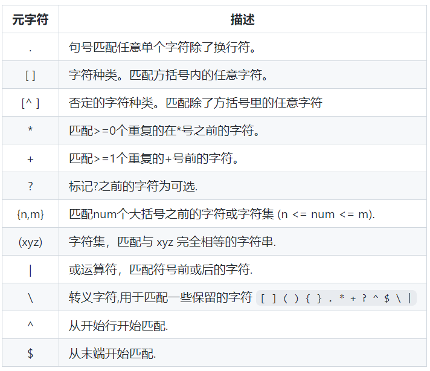
    * [ ]：字符集，内部可使用连字符来指定字符集范围 如[a-z]
    * 重复次数元字符：
      * *：大于等于0
      * +：大于等于1
      * ?：0或1次
    * { }：量词，限定一个或一组字符可以重复出现的次数。
    * 锚点：匹配指定开头或结尾的字符串就要使用到锚点
      * ^：指定开头
      * $：指定结尾
