## 软光栅化渲染器

* 项目背景：【C+】为了更好地理解计算机图形学中的一些基础知识和算法而实现的一个简易的光栅化渲染器，其由CPU完成整个渲染流程，生成帧缓冲，并在屏幕上显示。
  主要内容：
  1、通过齐次裁剪空间进行视椎体剔除，使得在不影响渲染效果的情况下大幅减少渲染消耗。
  2、通过透视矫正插值算法矫正透视投影下所得的插值，使得各像素点的插值属性更加精确。
  3、通过Blinn-Phong着色模型渲染图形，其相比于Phong模型大大加速了镜面反射项角度的计算速度。
  4、通过Z-Buffer算法进行深度剔除，处理了图元的可见性问题。
  个人收获：对渲染管线的各个流程有了更深的理解，也明白了数学基础的重要性。

* 项目难点：
  * 项目所需要的数学理论知识和推导较为复杂，如**线性代数知识和一些初等数学知识**等。
    * 如在透视投影矩阵的数学推导中，我们需要将视锥体压缩成一个立方体， 推导过程中我们需要**对视锥体的横截面**进行观察，发现**符合三角形相似定义**，我们可以利用**相似三角形比例相等**的原则来**根据原坐标推出投影后的目标坐标。**
    * **透视投影后再做插值时对应属性数据会有一定误差**，我们需要**矫正插值**，可以通过一个**表达式进行矫正**，推导过程：需先将问题从3维转为2维(固定一个维度)，通过相机点与投影点和目标点的连线，同样可以得出相似三角形，然后我们再利用插值公式，就可以得出**投影前的插值与投影后的插值以及各顶点的属性的关系**，我们就得到**这个表达式就能代入参数求出投影前的插值了，就纠正插值了。**

* 优化点：
  * 可能存在**深度冲突**问题，深度冲突就是**深度缓冲没有足够的精度来决定两个三角面哪个在前面。结果就是这两个形状不断地在切换前后顺序，这会导致很奇怪的花纹。**我这里用float表示深度，精度为6-7位，可以改为**精度更高的浮点数**，比如double，其能表示15-16位小数，**但也会更占用空间。**我们也可通过为存在重叠的两个物体**添加偏移量**来解决，但这可能比较麻烦，因为需要**手动调节**。

* 图元是**由顶点组成的**。**一个顶点，一条线段，一个三角形或者多边形都可以成为图元**。

* 片元是在图元经过光栅化阶段（这个阶段比较复杂，这里不赘述）后，被分割成一个个像素大小的基本单位。片元其实已经很接近像素了，但是它还不是像素。片元包含了比RGBA更多的信息，比如可能**有深度值，法线，纹理坐标**等等信息。片元需要在通过一些**测试**（如深度测试）后才会最终成为像素。可能会有多个片元竞争同一个像素，而这些测试会最终筛选出一个合适的片元，**丢弃法线和纹理坐标等不需要的信息后，成为像素。**

* 像素就很好理解了，最终呈现在屏幕上的**包含RGBA值的图像最小单元**就是像素了。

## 计算机图形学

* 计算机图形学(GC)是研究计算机在**硬件和软件的帮助**下**创建计算机图形**的科学学科。

* 计算机图形学的主要研究内容就是研究如何在计算机中表示[图形](https://zh.wikipedia.org/wiki/图形)、以及利用计算机**进行图形的计算、处理和显示的相关原理与算法**。图形通常由[点](https://zh.wikipedia.org/wiki/点)、[线](https://zh.wikipedia.org/wiki/线)、[面](https://zh.wikipedia.org/wiki/平面_(数学))、体等[几何](https://zh.wikipedia.org/wiki/几何)元素和[灰度](https://zh.wikipedia.org/wiki/灰度图像)、[色彩](https://zh.wikipedia.org/wiki/色彩)、线型、线宽等**非几何属性组成。**

* 计算机图形学一个主要的目的就是要**利用计算机产生令人赏心悦目的真实感图形。**为此，必须建立图形**所描述的场景的几何表示**，再用**某种光照模型**，计算**在假想的光源、纹理、材质属性下**的**光照明效果**。

* 大致可分为以下几类【不只是实时渲染】
  * **渲染**rendering：以软件**读取模型数据**生成图像的过程。
  
    渲染算法：
  
    * 光栅化渲染：
      * 遍历每个基元【三角形】确定其影响的像素，然后相应修改影响的像素。
    * 
  
    按需求分为实时渲染和离线渲染
  
    **实时渲染**主要服务于**游戏等实时交互应用**，**离线渲染**服务于**影视特效，3D动画。**
  
    实时渲染使用**光栅化（Rasterization）方法**，离线渲染使用**光线追踪（Raytracing）**和**光子映射（Photon Mapping）方法**。不过这两年在nVidia的努力下，实时渲染也开始用光线追踪了。
  
  * **几何**geometry
  
  * **模拟**simulation
  
* 数学杂项：
  
  * 三角学：
    * 三角形也可以定义在**非平面**上，球面三角形的边是球面上的大圆（单位半径的圆）的线段。对这些三角形的研究是一个被称为**球面三角学**的领域。
  
  * 向量：
    * 如果两个向量具有相同的长度和方向，它们就是相等的，单位向量是**任何长度为1的向量**。**零向量是长度为0的向量**。零向量的**方向是未定义**的。
    * 存储一个偏移量、表示为从另一个位置开始的位移
    * **一个二维向量**可以被写成任何**两个不平行的非零向量的加权和**。两个向量的这一属性被称为**线性独立**。两个线性独立的向量构成一个**二维基**，因此这些向量被称为**基向量**。【笛卡尔坐标系的引入】
    * a和b的**点乘**表示为a·b，因为它返回一个**标量**，所以通常被称为**标量积**，a ⋅ b = ∥a∥ ∥b∥cosϕ，
      * 最常见的用途是计算**两个向量之间的角度余弦**
      * 寻找一个向量对另一个**向量的投影**，向量a的长度a→b，以直角投影到一个向量b上【标量】
      * 点积遵循我们在**实数算术**中熟悉的**结合律和分配律**
  
  * 叉积：
    * 叉积返回一个**与叉积的两个参数垂直的三维向量**。所得**向量的长度与 sin ϕ 有关**。
    * 叉积a×b是一个**垂直于a和b两个三维矢量的三维矢量**，其**长度**等于**所示平行四边形的面积**。
    * 一个向量的**叉积本身就是零矢量**，所以x×x=0
    * 右手坐标系：x×y = z
    * 叉积**不是交换性**的
    * 
  
  * 正交基和坐标系：
    * 正交基：在三维空间中，**任意三个三维向量u, v和w构成一个标准正交基**，前提是它们是**正交的(且垂直)并且每个向量都是单位长度**。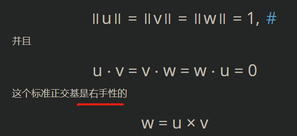
    * 注意笛卡尔标准正交基只是**无穷多个可能的标准正交基中的一个**。它的特殊之处在于，它和它的**隐式原点位置用于程序中的低级表示**。[因此，向量x、y和z永远**不会被显式存储**，**标准原点位置o也不会被存储**。全局模型通常存储在这个标准坐标系中，因此它通常被称为**全局坐标系**。]
      * 如果我们想用另一个坐标系**原点是p标准正交基向量u v w**，那么我们要**明确地存储这些向量**。这样的系统称为**参照系或坐标系**。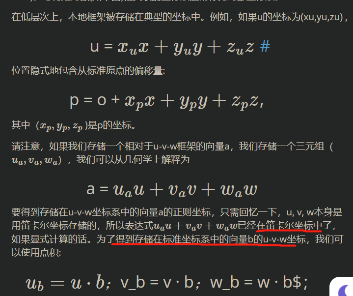
      * 一般游戏开发中存在**全局坐标系与局部坐标系**，每个模型设置一个原点**，模型原点有一个世界坐标，模型自己有以该原点为参考的局部坐标系**，通过**全局原点坐标+局部坐标偏移**我们可以快速计算出**模型的全局坐标**
        * 好处是在移动物体时可以**将物体作为整体移动**，节约效率
      * 摄像机系统中**常通过field of view来表示摄像机的局部坐标**。
      * 在摄像机系统里，我们经常使用**forward**, left/right, up三个方向来表示摄像机的局部坐标系，其中经常利用**forward来计算其他两个基**，即利用任何一个与forward**不在同一直线的向量 与forward叉乘来得到left**（需要长度为1），然后用forward和left来**叉乘计算up**。【**从单个向量构造一组基**】
  
  * 曲线和曲面
    * 一个常见的描述曲线的方法是使用**隐式方程**，f (x, y) = 0，该值为零的点(x, y)在 曲线上，而数值为非零的点则不在曲线上。【**曲线上的点(x, y)不能立即从方程中计算出来，而必须通过解方程来确定】**
  
  * 线性插值
    * 插值法的目的是已知一些点，希望能找到一个**穿过这些点的一个连续函数。**
    * 应用：希望**三角形内的点的该信息是基于三个顶点信息的某种混合**，一个简单的做法则是通过线性插值，即越接近某个点**则受该点的影响更大且总影响系数为1**。
  
* **光栅图像**：
  
  * 大多数计算机图形图像是在**某种光栅显示器**上呈现给用户的。光栅显示器**将图像显示**为**像素的矩形阵列**。
  
  * 光栅图像是**存储和处理图像**的最常见方式。**光栅图像只是一个二维数组**，它存储**每个像素的像素值**——通常将一种颜色存储为三个数字，分别代表红色、绿色和蓝色。存储在存储器中的光栅图像可以通过使用存储图像中的每个像素来**控制显示的一个像素的颜色**来显示。
  
  * 除了使用像素阵列外，还有其他描述图像的方法。**矢量图像**的描述是通过**存储形状的描述–由线条或曲线限定的颜色区域，而不参考任何特定的像素网格**。
    * 从本质上讲，这相当于**存储了显示图像的指令**，而**不是显示图像所需的像素**。矢量图像的主要优点是它们**与分辨率无关，可以在非常高的分辨率设备上很好地显示。**相应的缺点是它们**在显示之前必须经过光栅化处理。**
    
  * 每像素存储一个**32位浮点数**(对于**灰度或黑白图像**)或**三个32位浮点数**(对于**RGB彩色图像)**。
  
  * 像素有一个**有界的范围**是完全足够的，为了简单起见，通常将其设为[0,1]。例如，8位图像中可能的值为0,1/255,2/255，…, 254/255, 1。用**浮点数存储的图像**(允许大范围的值)通常被称为**高动态范围**(HDR)图像，以区别于**用整数存储的固定范围**或**低动态范围**(LDR)图像。
  
  * **RGB色彩空间**的基本理念是，通过**混合三种主要的灯光**来**显示颜色**：**一种红色、一种绿色和一种蓝色**。这些灯光以**加法方式**混合。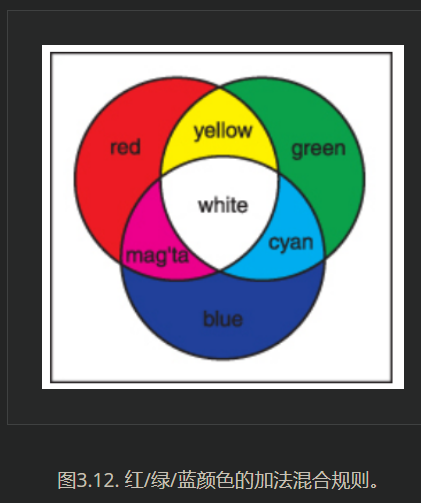
  
    红、绿、蓝像素值创造了一个**三维的RGB颜色立方体**，它有一个红、一个绿、一个蓝轴。
  
    实际的RGB等级通常以**量化**的形式给出，**每个分量都用一个整数来指定**。这些整数最常见的大小是**每个字节**，所以RGB的三个分量都是**0到255之间的整数**。这三个整数加起来**占了三个字节**，也就是24位。
  
  * Alpha合成
  
    如果我们想在背景色cb上合成一个前景色cf，而前景色覆盖的像素比例是α，那么我们可以使用这个公式：c = αcf + (1 − α)cb.解释是**前景物体覆盖了像素矩形内的面积α【不透明度】，而背景物体覆盖了剩余的面积，即（1 -α）**。
  
    一个图像中**所有像素的α值**可能被存储在一个**单独的灰度图像**中，然后被称为**α掩码或透明度掩码**。或者，这些信息可以作为RGB图像的**第四个通道存储**，在这种情况下，它被称为**α通道**，图像可以被称为**RGBA图像**。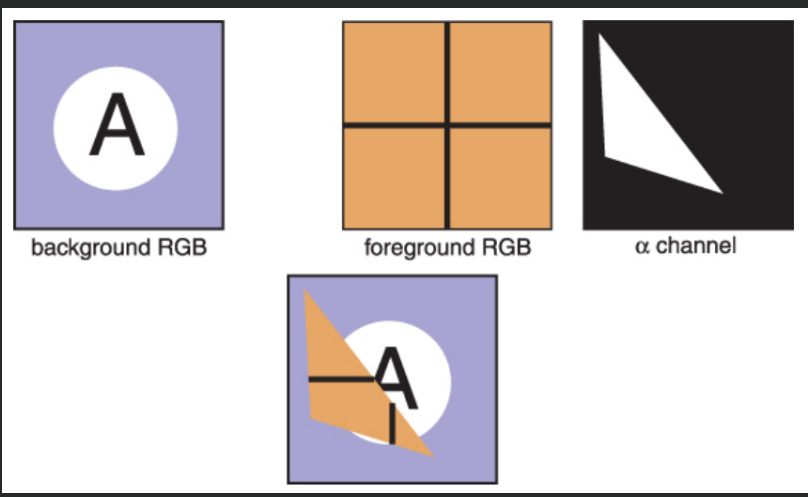
  
  * 图像存储：
  
    为了**减少存储需求**，大多数图像格式**允许某种压缩**。在高水平上，这种压缩是**无损或有损的**。在无损压缩中，**没有信息被丢弃**，而在有损系统中，一些信息会**不可恢复地丢失**。流行的图像存储格式包括：
  
    * **jpeg。**这种**有损格式**是根据**人类视觉系统的阈值**来**压缩图像块**。这种格式对于自然图像来说效果很好。
    * **tiff。**这种格式最常用于**保存二进制图像或无损压缩的8位或16位RGB**，尽管存在许多其他选择。
    * **ppm。**这种非常简单的**无损、未压缩的格式最常被用于8位RGB图像**，尽管存在许多选择。
    * **png。**这是一套**无损格式**，有一套良好的开源管理工具。
  
  * 
  
* **渲染管线**：

  * 定义：以流水线的形式，将一个模型的**顶点坐标，法线，切线，颜色等数据信息**从CPU传递给GPU，然后通过GPU进行计算，最终将这些**顶点数据通过插值的形式**显示到屏幕上，**最终能从屏幕上看到该模型的样子。**
  * 渲染管线通常被分为四个阶段：**应用阶段，几何阶段，光栅化阶段，像素处理阶段。**
  * **应用阶段：**游戏中包含大量的模型，3D模型中保存着模型的**顶点坐标，法线，切线，颜色等数据**，这些数据一般通过向量进行存储，CPU**从模型中获取这些顶点信息数据**，并**将这些数据传送给GPU作为最开始的输入数据**。然后将数据送到渲染管线中。
  * **几何阶段[顶点着色器]：**几何阶段主要执行**顶点坐标变换、顶点处理、坐标裁剪等操作**，计算对象为顶点数据，即模型的顶点数据，在这个阶段，做的最多的操作就是顶点坐标变换，**从模型空间变换到世界空间，然后再从世界空间变换至相机空间**。这样**在相机坐标系下就能方便地进行裁剪**，裁剪的作用是**判断顶点是否可见**。
  * **光栅化阶段：**将**两个顶点之间的空缺部分通过插值的形式**进行填充，以达到能**实现从顶点数据到像素上的一一映射**，就是**将两个顶点之间缺少的像素点通过插值的形式**进行补充，**生成片元着色器可以处理的片段。**
  * **片元处理阶段[片元着色器]：**像素处理阶段包括**像素颜色计算、像素变换，透明度混合等操作**，处理物体渲染顺序及深度测试等。这个阶段要处理的内容比较多，可以在此阶段中利用一些算法实现非常多的**屏幕特效**，比如高斯模糊，景深等，此阶段是游戏渲染中应用非常广泛的阶段，但因为**计算对象是像素点**，因此实现相关特效时比较耗费性能。
  * **帧缓冲处理阶段**：**将所有的像素颜色信息整合在一起，输送给显示设备加以显示**

* 视图变化(**Viewing Transformation**)

  * 目的：将虚拟世界中以（x,y,z)为坐标的物体变换到 以一个个像素位置(x,y) 来表示的屏幕坐标系之中(2维)
  *  **模型变换(modeling tranformation)：利用基础的变换矩阵将世界当中的物体调整至我们想要的地方(旋转，平移，缩放)。**
  * **摄像机变换(camera tranformation)：在游戏中我们真正在乎的是摄像机(或者说眼睛)所看到的东西，也就是需要得到物体与摄像机的相对位置**
  * **投影变换(projection tranformation)：在摄像机变换之后，我们得到了所有可视范围内的物体相对于摄像机的相对位置坐标(x,y,z)，之后根据具体情况选择平行投影或是透视投影，将三维空间投影至标准二维平面([-1,1]^2)之上 （tips：这里的z并没有丢掉，为了之后的遮挡关系检测）**
  * **视口变换(viewport transformation)：将处于标准平面映射到屏幕分辨率范围之内，即[-1,1]^2→[0,width]\*[0,height], 其中width和height指屏幕分辨率大小**

* **齐次空间裁剪**：

  * 定义：**将视锥体之外的物体剔除，不进行渲染**，**裁剪过程在四维的齐次空间下进行**。
  * 为什么采用齐次空间裁剪：简单裁剪的操作为检查每个顶点的坐标，如果超过了标准立方体的方位，则将该顶点所属的三角面完全剔除，其具有**裁剪结果不够平滑的缺点**，**因为三角面只有一部分在立方体内，但仍被完全剔除了**。
  * 发生时间：在透视除法之前进行。
  * 过程：【**核心就是求得需要保留下来的顶点集合，再重新组合成新三角形即可。**】
    * 得出立方体**对应齐次空间下的裁剪平面**
    * 根据点与面的关系，内测还是外侧，推导出边与面的关系，完全位于内测、外侧还是有交点。
    * 如果相交，则**通过插值系数得到交点以及交点的uv坐标，法向向量等属性值。**
    * 经过以上所有步骤裁剪之后，得到的是**所有在裁剪空间内部的顶点**，我们需要的是**将这些顶点重新组合成1个或多个三角形面**，**再输入光栅化渲染管线**。【为了在背面剔除的时候不受影响，组合的顶点顺序往往是很重要的，一般与原三角形顶点顺序保持不变】

* **透视纠正插值**：

  * 原因：**透视后再做插值会造成一定的误差**。

  * 解决：【线性插值下】设屏幕空间下的插值比例为s，视图空间下的插值比例为t，**纠正深度的插值结果**

    根据**插值公式和三角形相似**得出t与s的关系：

    

    故利用屏幕空间下的插值比例得到**正确的深度插值结**果为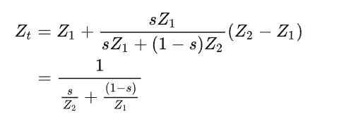

    以上为线性插值的纠正结果，**对于重心坐标，可以类似推导得出**

    依然以线性插值推导**任意属性的插值纠正**：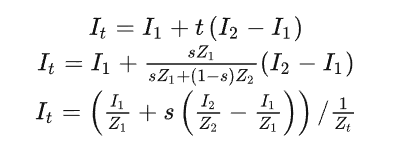

    同样通过类比得出重心坐标的正确插值：

* 锯齿/走样问题以及解决方法

  

  * 锯齿/走样问题出现的原因：**用有限离散的像素点去逼近连续的三角形**，即像素精度不够。
  * **锯齿算法应用于硬件，且在光栅化阶段执行**
    * 光栅化：将顶点数据通过插值计算，将两个顶点之间不存在的点进行弥补，然后实现到屏幕像素点上的一一映射。
    * 抗锯齿：缓解**走样**现象，从而产生更**平滑**的边缘。
  * 解决方法：
    * **超采样反走样(Super Sampling AA) SSAA**：
      * 把原来的**每个像素点分成多个采样点去逼近**，对每个采样点进行着色，**将所有采样点颜色全部加起来求平均值作为像素点的颜色**。[**一个像素点与一个采样点进行对应**]
      * **计算负担增加并且浪费大量内存。**
    * **多采样反走样(Multi-Sampling AA) MSAA**：
      * MSAA其实是对SSAA的一个改进，降低了计算负担。具体实现是不再对每个采样点着色，**而是计算三角形覆盖的采样点占当前像素的比例，计算颜色的时候只会利用像素中心坐标计算一次颜色**，将**该颜色乘以比例就得到该像素的颜色了**。[**一个像素点与多个采样点进行对应**，每个像素点只着色一次]
      * 对于每个像素来说，越少的子采样点被三角形所覆盖，那么它受到三角形的影响就越小。**三角形的不平滑边缘被稍浅的颜色所包围后，从远处观察时就会显得更加平滑了。**
      * 同样耗费大量显存，不适用于延迟渲染，因为延迟渲染本身就耗费了大量的显存。

* **Z-Buffer算法**

  https://learnopengl-cn.github.io/04%20Advanced%20OpenGL/01%20Depth%20testing/

  * 作用：进行**深度剔除**，即**只将离摄像头最近的像素点显示**。通过**MVP变化后的深度值z**进行。

  * 流程：
    * **为每个像素点维持一个深度数组记为zbuffer，其每个位置初始值置为无穷大（即离摄像机无穷远）**
    * **随后我们遍历每个三角形面上的每一个像素点[x,y]，如果该像素点的深度值z，小于zbuffer[x,y]中的值，则更新zbuffer[x,y]值为该点深度值z，并同时更新该像素点[x,y]的颜色为该三角形面上的该点的颜色。**
    * 即**深度测试**：深度值存储在每个片段里面（作为片段的**z**值），当片段想要输出它的颜色时，OpenGL会**将它的深度值和z缓冲进行比较**，如果当前的片段在其它片段之后，它将会被丢弃，否则将会覆盖。
    
  * 问题：

    * 可能存在**深度冲突**问题。

    * 深度冲突：**深度缓冲没有足够的精度来决定两个三角面哪个在前面。结果就是这两个形状不断地在切换前后顺序，这会导致很奇怪的花纹。**

    * 解决方法：

      * 使用**高精度的深度缓冲**：在大部分的系统中，**深度缓冲的精度都是24位的但现在大部分的显卡都支持32位的深度缓冲**，这将会极大地提高精度。所以，**牺牲掉一些性能，你就能获得更高精度的深度测试，减少深度冲突**。

      * **手动添加一些偏移值**：通过在**两个原本重叠物体之间设置一个用户无法注意到的偏移值**，你可以完全避免这两个物体之间的深度冲突。然而，这**需要对每个物体都手动调整**，并且需要**进行彻底的测试来保证场景中没有物体会产生深度冲突**。

        

* **Blinn-Phong着色模型**：

  * 作用：**计算出每个采样像素点的颜色是多少。**

  * 优点：**计算快，效果可以接受**

  * 光线分类：

    * **镜面反射光**：当观察方向集中**在反射方向周围很近的时候才能看见反射光**。

    * **漫反射光**：光从一定角度入射之后从入射点向四面八方反射，且**每个不同方向反射的光的强度相等**，而**产生漫反射的原因是物体表面的粗糙**，导致了这种物理现象的发生。

      【 注意**漫反射光线强度是与出射方向无关**的，因此无论**人眼在哪观察接收到的强度都是一样**的！】

    * **环境光**：环境光强*物体表面对环境光的反射率。

  * 常见着色模型：

    * **泛光模型**：只考虑环境光。

    * **Lambert漫反射模型**：在泛光模型的基础上**增加了漫反射项**。

      漫反射项：

    * **Phong反射模型：**在Lambert漫反射模型的基础上增加了**镜面反射项**。

      镜面反射项：

    * Blinn-Phong反射模型：**对phong模型计算反射方向与人眼观察方向角度的一个优化**。

      这样的得到的结果其实是**与真实计算反射与人眼观察夹角的结果是非常近似的**(具体来说**该角度是正确角度的一半**)，但好处在于**大大加速了角度计算的速度**，提升了效率！

      整体计算公式：

* 光线追踪：

  * 利用**光路可逆**性质通过模拟**从摄像机处发射光线按照原路返回还原出所有的光路**。

  * 原理：

    * **光线投射：**

      * 从人眼或**摄像机向近投影平面上的每一个像素点发射一条光线，判断与场景物体的交点**，考虑遮挡关系，只去**找最近的交点**，**连接该交点和光源，只要判断这条连线之间是否有物体存在就可以知道该交点是否在阴影之中**，利用Blinn-Phong模型对这个点进行局部光照模型计算，得到该点的直接光照。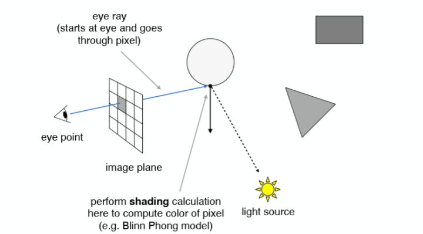

    * **递归光线追踪：**

      * 原因：**点接收的光线也可以来自于其他点的折射也可以来自反射**，故需对其增加反射项和折射项。因此**每一个**交点的颜色贡献来自这样种几类型 **直接光照，反射方向间接光，折射方向间接光（如果有折射的话）**
      * 计算**当前点对应所有反射点和折射点的局部光照模型的结果**，将其按照**光线能量权重**累加。
      * 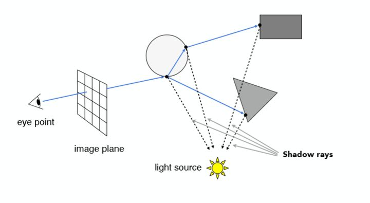**有光照射到其他物体，再沿着eye rays的反射或折射的光线方向传回人眼！**

    * 伪代码：

      

    * 注意：

      * 整体过程是一个**递归的过程**，因此需要一定的递归终止条件，比如说**允许的最大反射或折射次数为10。**
      * 光线在**每次反射和折射之后都有能量损耗的**，由系数决定，因此**越往后的折射和反射光贡献的能量越小**，这也是为什么在上文中提**到根据光线能量权重求和**。 e.g. 反射系数为0.7，那么第一次反射折损30%，第二次反射折损1-（70%x70%），依次类推。
      * 如果反射或折射光线**没有碰撞到物体，一般直接返回一个背景色**。

    * 光线表示：

      * 光线有**原点和方向**表示，根据像素点的位置得出后一个点以及相机位置得出前一个点。就为了方向和原点。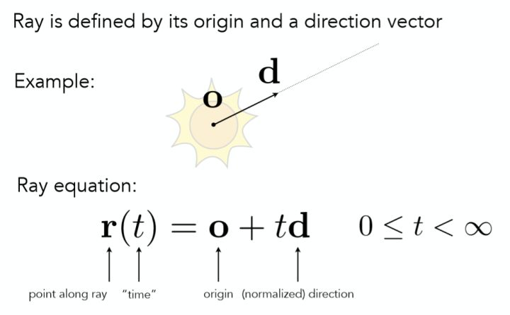

    * 光线与物体求交：

      * 与隐式曲面求交：
        * 隐式曲面：给出面上所有点的表达式。
        * 直接代入方程求解判断是否相交并得出交点即可。
      * 与显示曲面相交：
        * 显示曲面：曲面的所有点被直接给出，或者可以通过映射关系直接得到
        * 图形学中曲面大多由许多三角形面组成，**先求出光线与平面的交点，然后再判断交点是否在三角形内即可。**【叉积或着重心坐标】

    * 反射与折射的计算：

      * 反射：

        * 已知入射方向 l 和法向量方向 n 求反射方向：

          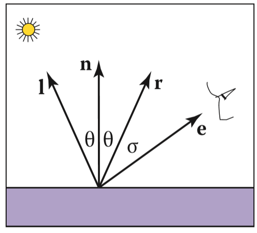

      * 折射：

        * 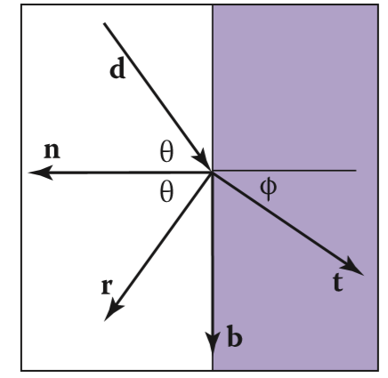

* 着色频率：

  * 面着色(**Flat Shading**)：以**每一个面作为一个着色单位**，**利用每个面的法线向量进行一次Blinn-Phong反射光照模型的计算**，将该颜色赋予整个面。
    * 优点：计算快
    * 缺点：效果差，会很明显的看到一块块面形状。
  * 顶点着色(**Gouraud Shading**)：**对每个三角形的顶点进行一次着色**，【通过对共享该顶点的所有面的法向量求平均得到顶点的法向量】，而**三角形内部的每个点的颜色则是通过插值得到**。
  * 像素着色(**Phong Shading**)：**对三角形内部每个点进行着色**，通过**插值得到每个点的法向量**再进行着色。

* 透明度相关

  https://learnopengl-cn.github.io/04%20Advanced%20OpenGL/03%20Blending/#_1

  * 透明：一个物体（或者其中的一部分）不是纯色(Solid Color)的，**它的颜色是物体本身的颜色和它背后其它物体的颜色的不同强度结合。**

  * **混合(Blending)通常是实现物体透明度(Transparency)的一种技术。**

  * 透明的物体可以是**完全透明的（让所有的颜色穿过），或者是半透明的（它让颜色通过，同时也会显示自身的颜色）**。一个**物体的透明度**是通过它**颜色的alpha值**来决定的。[alpha越低透明度越高]

  * 透明物体实现反射出周围物体的效果：

    * **开销小，效果相对差点**：**环境贴图**实现。
      * 环境贴图：**保存了周围环境的纹理贴图，避免了光照的实时计算。**
      * 获取环境贴图：**将照相机放在对应目标位置计算接收的光照即可【相当于一次光线追踪】**
    * **开销大，效果好**：**光线追踪**实现。

  * 实现**完全透明和完全不透明**：

  * 实现**完全透明**

    * 通过**丢弃片段**实现，即**在片段着色器中将alpha值低于某个阈值的片段丢弃**，不将其进入颜色缓冲。

  * 实现**半透明**：

    * 通过**混合方程**实现：

      具体流程：在片元通过深度测试后，片段着色器将**片元颜色向量和当前颜色缓冲中的值作为参数应用于混合方程得出当前片元的最终颜色。**

      **源因子值一般应为源颜色向量的alpha值，目标因子值则为1-源因子值。**

    * 可能出现的问题：由于**渲染顺序的不规范**和**深度测试**导致的**半透明物体遮挡了后面的半透明问题**。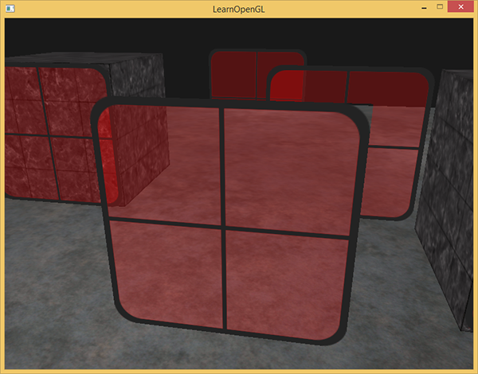

      解决方法：

      * **先绘制所有不透明的物体。**
      * **对所有透明的物体排序。**
      * **按顺序绘制所有透明的物体。**

        **确保渲染前面的透明物体时颜色缓冲中的颜色为后面所有物体比较更新的最终值。**

        【这里的排序为按**摄像机位置向量和物体的位置向量之间的距离**排序，**从远到近渲染**】

        可把距离为key和模型为value的节点存储到map中，渲染时逆序从map中获取模型进行渲染即可。[反向迭代器]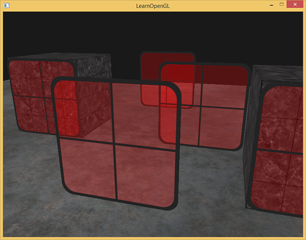

* 各种buffer的作用

  https://blog.csdn.net/yinhun2012/article/details/86702380

  * 深度缓冲：顶点集经过裁剪变换到标准立方体后，就给予了每个顶点附带一个-1到1的z（depth）值，而**这个z值保存的显存区域就是深度缓冲区**，用于写入**深度信息**来**防止被阻挡的面渲染到其它面的前面**。

  * 颜色缓冲：**最终在显示屏硬件上显示颜色的GPU显存区域**，**这个缓冲区储存了每帧更新后的最终颜色值**，图形流水线经过一系列测试，包括片段丢弃、颜色混合等，**最终生成的像素颜色值就储存在这里，然后提交给显示硬件显示。**

  * 模板缓冲：允许我们根据一些条件**丢弃特定片段**

    https://learnopengl-cn.github.io/04%20Advanced%20OpenGL/02%20Stencil%20testing/

  * 帧缓冲：

    * 定义：上述缓冲结合起来的一个总称。

* 渲染

  https://learnopengl-cn.github.io/05%20Advanced%20Lighting/08%20Deferred%20Shading/

  * 正向渲染**(Forward Rendering)**：

    * 渲染过程：对于每一个需要渲染的物体，程序都要对每一个光源**每一个需要渲染的片段进行迭代，非常消耗性能**，因为**大部分片段着色器的输出都会被之后的输出覆盖**。

  * 延迟渲染**(Deferred Shading)**：

    渲染过程：由正向渲染改进而来的，将**计算量非常大的光照计算延迟到后期进行处理**。

    几何处理阶段：将场景中对象的**各种几何信息以片段形式**存储在G缓冲中。

    **期间深度测试已经最终将这里的片段信息作为最顶层的片段。保证了对于在光照处理阶段中处理的每一个像素都只处理一次，所以我们能够省下很多无用的渲染调用。**

    光照处理阶段：对最终片段的**每个像素执行一次昂贵的光照运算**。

    * 缺点：
      * 不能使用混合，即渲染透明物体，因为G缓冲中所有的数据都是从一个单独的片段中来的，而**混合需要对多个片段的组合进行操作。**
        * 通过将渲染分两部分进行，一部分延迟渲染，一部分正向渲染。

      * 比较以片段形式记录各种几何信息，**大内存开销**。[GBuffer至少存depth，normal，basecolor3张RT]
      * 迫使你对**大部分场景的光照使用相同的光照算法**

    * 优点：
      * 在大量光源或者复杂的场景下，相比正向渲染，延迟渲染的渲染性能依旧能让人接收。

* 阴影相关：

  https://learnopengl-cn.github.io/05%20Advanced%20Lighting/03%20Shadows/01%20Shadow%20Mapping/#_1

  * 阴影绘制的实现基础是**阴影贴图（shadow mapping）**
  * Shadow Map算法流程：
    * 将**物体顶点数据**通过**矩阵运算**转移到**灯光空间**下。
    * 在灯光空间下创建**深度纹理贴图**，用于**保存物体在灯光空间下的深度信息**。
      * 渲染深度贴图的过程比较简单，首先在该视口下的顶点信息进行判断，如果**某个顶点的深度值**比深度贴图中的值小，就更新贴图数据，反之丢弃掉该数据，直到**遍历完场景所有顶点**。遍历完成后，便得到了**深度信息图**。

    * **获取到深度贴图后，开始阴影渲染**，**如果某个点在光源视角下的深度值大于深度贴图中对应位置的深度值，就说明它被某个物体遮挡，因此是在阴影中的**；反之，**深度值小于深度贴图中的值，则不在阴影之中。**
    * 判断完成该顶点是否需要接收阴影后，需要做的最后一步就是**对该顶点乘上阴影的颜色**，遍历完一遍**该物体的所有顶点后，**便**可得到该物体接收阴影的效果。**

* 纹理相关：

  * 纹理：一个**2D图片**（甚至也有1D和3D的纹理），存储着**模型的数据**（颜色、法向量等）

  * 纹理坐标：用于**将顶点与纹理数据进行对应**，用来**标明该从纹理图像的哪个部分采样**。

  * 纹理过滤：

    * 纹理坐标是浮点值，我们需要通过纹理坐标获取对应位置的数据，纹理可理解为一张由许多纹素像素组成的图片。
    * 纹理过滤即**如何使用纹理坐标提取到想要的数据**（直接提取，插值提取）
      * **邻近过滤** Nearest Neighbor Filtering：**选择中心点最接近纹理坐标的那个纹理像素作为目标数据。**
      * **线性过滤** (Bi)linear Filtering：**基于纹理坐标附近的纹理像素，计算出一个插值**，一个纹理像素的中心距离纹理坐标越近，那么这个纹理像素的数据对最终的样本数据的贡献越大。
      * 
      * 两者差别：
        * 邻近过滤造成屏幕像素点的对应纹理数据不够平滑，故会有**颗粒的效果**。
        * 线性过滤获取纹理数据时采用插值方式进行，故能有更**平滑的效果**。

  * **多级渐远纹理**(Mipmap)：

    * 出现背景：当**物体距离摄像机非常远**时，**映射到屏幕上的像素点非常少**，这就导致**表示远处的物体的多个邻近屏幕像素对应的纹理坐标差距过大导致颜色差别过大**，这样导致**不真实**的感觉。同时如果**纹理图片分辨率过高**，也会造成**不必要的内存**浪费。【采样率过低】

    * Mipmap：

      * 存在一系列的纹理图像，**后一个纹理图像的分辨率是前一个的四分之一**，根据**物体距离摄像机距离的远近使用不同分辨率的纹理图像**，**距离越远使用的纹理图像分辨率越低**【距离不是直接计算距离，而是通**过模型映射到屏幕时对应的像素点数进行判断选择**】

      * 

        

        通过保存原尺寸贴图的四分之一大小，**直到最小尺寸为2*2为止**

      * 优点：

        * **图像质量高**：**避免了在远距离情况下的采样频率低造成的失真和摩尔纹**

      * 缺点：

        * **空间占用增加**：多用33%的空间
    
  * 凹凸贴图：

    * 用于实现：模型的**凹凸效果**。

    * 凹凸贴图内存储的是该模型上该片元的**相对高度值，我们应该把他的高度提高多少。**

    * 通过**计算法线的偏移向量**，将**原本的法线进行偏移得到新的法线**，从而**计算光照的时候产生不同的光照效果，得到凹凸不平的效果。**

      

* 三维中旋转表示：

  在三维几何中，有三种**用于表示旋转的方式**，它们分别是**四元数、欧拉角和旋转矩阵。**

  * 欧拉角：
  * 四元数：
  * 旋转矩阵：

* 游戏性能优化点：

  * 相关概念：

    * 在游戏开发过程中，优化主要从三个方面入手，**CPU端优化，数据传输过程和GPU端优化。**

    * **游戏逻辑由CPU执行**，如果是**脚本执行效率低**，则是**CPU端需要优化**，如果是**渲染速度慢，则需要GPU端进行优化**，如果是**CPU向GPU发送指令过程慢，**则说明要**减少Draw Call（CPU向GPU发送渲染指令数量）数量。**

    * 游戏有“帧”的概念， **一帧的运行时间并不等于CPU渲染时间+CPU向GPU发送渲染指令时间+GPU渲染时间，因为这三项是由三个线程执行的，基本等于其中耗时最长的那一项，因此只要降低耗时最长的一项，就能有效提升帧速率。**

    * **CPU需完成数据准备工作才能发出命令让GPU渲染**，所以会以**流水线**的方式执行。【**达到类似顺序执行和利用机器的性能的目的**】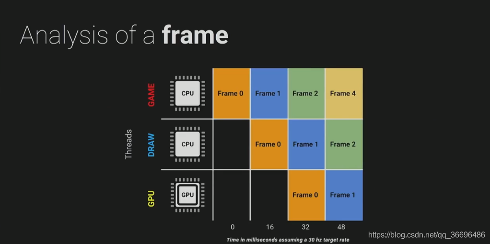

      **即将整个帧渲染过程分布到多帧进行，如第0帧处理游戏逻辑，第1帧由另一线程调用Draw Call 第2帧GPU接收到数据进行实际渲染。**

  * CPU端优化：

    * **CPU端主要处理的逻辑**有**动画，物理，AI**等
      * 对于常见的逻辑，**能用事件触发就用事件触发，不必每帧都去更新。**
      * 对于频繁出现的游戏对象，可以通过**内存池**实现复用。

  * 数据传输优化：

    * **数据传输**就是**Draw Call**了，在每次调用Draw Call之前，**CPU需要向GPU发送很多内容，包括数据，状态，命令等**。如果想减少Draw Call
      * **减少模型复杂度，减少顶点数量，这是最直接的方案**
      * 利用**遮挡剔除，减少绘制模型数量**
      * 共享材质，对不同的mesh尽量使用相同的材质，或者继承自相同的父材质，这样引擎可以对这些mesh打包发送给GPU做渲染，减少传送指令和数据次数。

  * GPU端优化：

    * **对于可编程的顶点着色器和片元着色器进行**
      * **优化shader，不要写太费的shader，尽量简化运算**

* 垂直同步：

  https://zhuanlan.zhihu.com/p/127974083s

  https://blog.csdn.net/xiaoyafang123/article/details/79268157

  * 显示器刷新率：**屏幕一秒逐行扫描生成的画面个数**
  * 帧率：**显卡每秒生成的画面个数。**
  * 垂直同步出现的背景：**帧率大于显示器刷新率时，由于前后缓冲区频繁交换可能引起画面撕裂的问题**。
  * **打开垂直同步选项后，当显示器尚未完成一帧画面的刷新时，两个缓冲区就不允许交换；只有当显示器刷新完一帧画面时，缓冲区才可以进行交换**。
  * 杜绝了“在进行数据传输的过程中交换缓冲区“的可能，自然也就解决了**画面撕裂**的问题。
  * 引发出的其他问题：**延迟**
    * **为了将显示器的刷新时间和显卡向缓冲区写入画面的时间保持同步，帧缓存中的画面将会延后一个刷新周期被显示出来。**带来了延迟。
    * 解决方案：**三重缓冲**。
      * 在双重缓冲的基础上再加入了一个后缓冲区，**组成了一个前缓冲区，两个后缓冲区的规格。**程序来回向两个后缓冲区写入图像**，每次显示器刷新时，前缓冲区就和最近完成写入的那个后缓冲区交换。**可以看到，即便**有一个缓冲区要等待垂直同步信号**，另外两个缓冲区还是**可以来回写入图像**，于是就不需要人为增加画面延迟了。
      * 缺点：**需要一个额外的缓冲区，会占用更多的显存空间。相比不开启垂直同步，还是存在一点延迟，因为还是要等到显示器刷新完成才能交换，不像无垂直同步直接读取最新帧画面。**

术语：

* LOD：细节水平，表示模型的三角形数量。

## 模拟摸鱼小游戏

* 项目背景：【Unity，C#，SVN】4399游戏x广东工业大学游戏研发实训的课程大作业，由同组成员集体完成，该游戏是一款2D像素风游戏，要求玩家在被监察者抓住和倒计时结束前尽量多地摸鱼来赚取金钱，金钱可用来购买一些物品来提供摸鱼效率。
  负责内容：
  1、通过单例模式实现各界面控制类全局唯一，节约了一定的系统资源。
  2、通过Resources方式来动态加载各种资源。
  3、通过Grid Layout Group实现了商品项的网格布局。
  4、为监察者添加基于AStart算法的自动寻路功能。
  5、通过修改技能图片的fillAmount来实现技能冷却的效果。
  个人收获：对Unity中各组件的使用有了基本的了解，学习了SVN的基本使用。

* 遇到的问题：

  * 主要是**协作开发遇到**的问题，初期项目设计规划不够合理，比如模块划分不够细致导致每个人负责的模块和其他模块的耦合度都挺大的，导致后续代码提交的时候或多或少会把其他人的代码冲突甚至覆盖了，这些都导致了开发进度大大减慢，到后面我们主要是如果你提交的模块涉及到其他模块的代码的改动时，要通知对应模块的负责人，让其进行检查，确保无误后才能进行提交。
  * 后续的改进：
    * 前期整个项目设计尽量用时比较长点，明确项目需求，各功能模块颗粒度应划分得更加细致，同时应该合作协商搭建出一个整体的项目结构框架，然后再按模块细分开发。
    * 后续开发应该有规范的开发流程，大体应该是这样，远程仓库应该开辟多个分支，比如开发分支和测试分支，本地仓库也有对应分支，开发流程应该是从远程开发分支中拉取代码，开发完成后将本地开发分支和测试分支合并，并在本地测试完成后按提交规范提交申请到远程测试分支，提交规范就是简单阐述本次提交内容，进行提交申请后，相关测试人员同步从测试分支的代码进行更专业的测试，测试通过后才会同意该提交，然后项目总负责人再将远程测试分支和开发分支进行合并，就大概这样一个流程。
  
* 优化点：

  https://www.cnblogs.com/Dean27/p/6109506.html

  * **创建子弹时涉及频繁创建游戏对象的操作**，可以用**对象池来管理对象并重复利用进行优化节省内存**。

  * 大致实现：一个**单例对象池管理器**，**内部有一个字典**，**键为对象类型名，值为装填对象的容器，这里选用list，因为增加元素和查找操作比较多**，对象池管理器应该提供**获取某种类型对象和初始化对象池中某种类型对象的方法。**
  
  * 获取某种类型对象的方法应该是**从装填对象的容器中遍历对象找到未激活的对象即可，如果没有则创建新对象。**
  
  * 初始化对象池则**根据可能产生的对象数目**进行初始对象的添加，初始对象状态为未激活。
  
* 资源加载

  * 编辑模式

    * 资源

      * 引擎可识别的资源，如Prefab、声音、视频、动画和UI等。
      * 引擎不可识别的资源，需要将信息解析出来并组织成引擎内可识别资源。

    * 编辑模式下**负责读取工程内资源的标志类**：**AssetsDatabase**。【需要保证所有资源放在Assets目录下，否则无法读取。】

    * 卸载资源：

    * 游戏对象与资源的关系：

      游戏对象与资源是一种引用关系

  * 运行模式：

    * 引用资源：打包时**只有被引用到的资源Unity才会打包，常见的是场景中的资源**。

    * Resources：

      一般使用Resources.Load< T >来加载资源

      **`Resources`这种动态加载方式是只读的，在游戏打包后，就无法对文件夹的内容进行修改**

      * 删除资源
        * **游戏对象删除了，它引用的资源其实并没有删除。**  
        * 使用Resources.UnloadAsset() 以及Resources.UnloadUnusedAssets() 方法强制
          卸载资源。由于**卸载资源是异步操作**，所以可以使用isDone 来判断是否完成。  

      尽量不要使用Resources来进行资源加载，因为打包后可能会包体过大，**构建的应用启动时间过长，内存管理也更困难**。对于移动平台或需要**热更新的场景下极不友好**（无法进行增量更新 incremental content upgrades ），同时这种**依赖资源名的调用方式**很容易在替换资源时出现问题。

  * AssetBundle：与`Resources`不同，`AssetBundle`主要是用于**热更新**，要用AssetBundle 首先要**把资源打包成.assetbundle文件，再动态的去加载这个文件**，本地或者网络服务器都可以。

    * 组成：AssetBundle 由**头文件（ Header ）和数据段（ Data Segment ）组成**，数据段中**包含着所有资源对象**，而**头文件**中包含了 **AssetBundle 的信息**，此 AB 包的标识符（ Identifier ），压缩类型（ Compression Type，是否压缩，LZMA - 全包压缩，LZ4 - 单独压缩）以及数据清单（ Manifest，对象名作为 key 用来查找数据段位置）。
    * 工作流程：先将资源按照一定的方式**打包成多个 AssetBundle**（ BuildPipline.BuildAssetBundles 方法 ），然后将这些**二进制文件放到 StreamingAssets 目录**下（ 类似 Resources，但**构建时不会进行打包的处理** ），在**运行时加载需要的 AssetBundle**（ 4 个 API，最快最好的是 AsseBundle.LoadFromFile ），之后**使用 AssetBundle 中的资源对象**（ 3 种 6个 API，LoadAllAssets 最快，LoadAsset，LoadAssetsWithSubAssets ）。
    * 卸载：对于 AssetBundle 的卸载需要有一定的讲究，因为两种卸载方式各有各的好处（坑？），卸载 AssetBundle 使用 API AssetBundle.Unload(bool)，**参数表示是否卸载从此 AB 包中加载的资源对象实例**。**true 时，会立即卸载实例化的所有对象**，造成的问题是如果场景中依然有对象对这些卸载了的资源的对象进行访问会出现 missing 的情况（确保不会再使用，比如场景切换时）；**false 时，会在下次加载同样的 AB 包时，造成同样的资源对象重复的情况，因为先前加载的对象没有被卸载**，并与 AB 包切断了联系，在重复加载时并不会修复这种联系，**所以内存中有了重复的对象**（对这些资源对象进行清理，如引用计数）。

* A星算法

  https://zhuanlan.zhihu.com/p/225466669

  https://blog.csdn.net/weixin_41069437/article/details/106751806

  * **目标：找到起始点到目标点的最短路径，找到路劲后就开始移动。**

  * 先将搜索区域网格化，并有两个容器，一个称为开放列表，一个称为关闭列表，开放列表初始只有起点，每次从开放列表中取出F值最小的节点【F值由G值和H值组成，G值表示离起点距离，H值表示离目标点的大致距离】，将其加入关闭列表中，然后取其周围八个点，遍历每个点判断是否已在开放列表中，如果已在开放列表中，则判断经过当前处理点到达的G值是否更小，更小则进行父节点和F值的更新，不在开放列表中，计算节点的F值并记录父节点，重复这个过程直到将目标点加入开放列表中，这样**从目标点沿着父节点的路径直至起点就是目标路径了。**

  * 时间复杂度 O(NlogN)

  * 相关的问题：

    * 如果地图中有两种地形，一种是草地，一种是沙地，然后有一个角色优先考虑走沙地 问我怎么实现

      在A*算法中每个格子设置一个值 就作为草地和沙地的权重
    优先选择权重较大的 比如设置草地为1 沙地为2 优先选择沙地
  
  * 如何优化A*算法中角色移动的轨迹（使得路径尽量保持类似直线）
  
    可以设置上一次路径的方向，优先选择方向相同的，比如上一步是向上走的，我们就给各个方向设置一个权重，离上一次的路线角度越小 权重越大 反之依然，最后我们还是找权重大的路线

