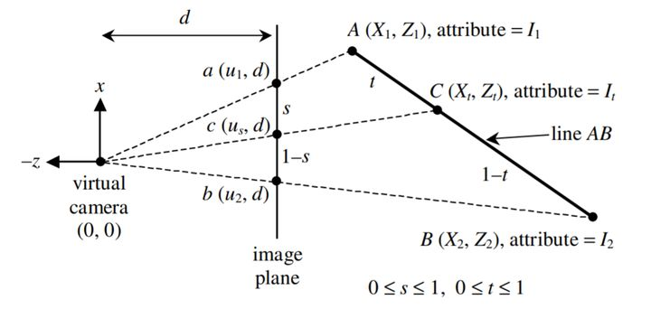
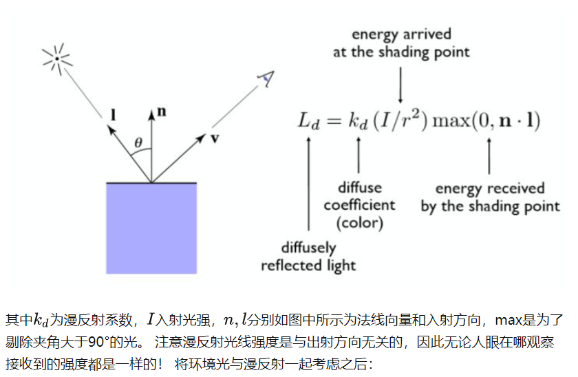

## 软光栅化渲染器

* 项目背景：【C+】为了更好地理解计算机图形学中的一些基础知识和算法而实现的一个简易的光栅化渲染器，其由CPU完成整个渲染流程，生成帧缓冲，并在屏幕上显示。
  主要内容：
  1、通过齐次裁剪空间进行视椎体剔除，使得在不影响渲染效果的情况下大幅减少渲染消耗。
  2、通过透视矫正插值算法矫正透视投影下所得的插值，使得各像素点的插值属性更加精确。
  3、通过Blinn-Phong着色模型渲染图形，其相比于Phong模型大大加速了镜面反射项角度的计算速度。
  4、通过Z-Buffer算法进行深度剔除，处理了图元的可见性问题。
  个人收获：对渲染管线的各个流程有了更深的理解，也明白了数学基础的重要性。

* **渲染管线**：

  * 定义：以流水线的形式，将一个模型的**顶点坐标，法线，切线，颜色等数据信息**从CPU传递给GPU，然后通过GPU进行计算，最终将这些**顶点数据通过插值的形式**显示到屏幕上，**最终能从屏幕上看到该模型的样子。**
  * 渲染管线通常被分为四个阶段：**应用阶段，几何阶段，光栅化阶段，像素处理阶段。**
  * **应用阶段：**游戏中包含大量的模型，3D模型中保存着模型的**顶点坐标，法线，切线，颜色等数据**，这些数据一般通过向量进行存储，CPU**从模型中获取这些顶点信息数据**，并**将这些数据传送给GPU作为最开始的输入数据**。然后将数据送到渲染管线中。
  * **几何阶段[顶点着色器]：**几何阶段主要执行**顶点坐标变换、顶点处理、坐标裁剪等操作**，计算对象为顶点数据，即模型的顶点数据，在这个阶段，做的最多的操作就是顶点坐标变换，**从模型空间变换到世界空间，然后再从世界空间变换至相机空间**。这样**在相机坐标系下就能方便地进行裁剪**，裁剪的作用是判断顶点是否可见。
  * **光栅化阶段：**将**两个顶点之间的空缺部分通过插值的形式**进行填充，以达到能**实现从顶点数据到像素上的一一映射**，就是**将两个顶点之间缺少的像素点通过插值的形式**进行补充，**生成片元着色器可以处理的片段。**
  * **片元处理阶段[片元着色器]：**像素处理阶段包括**像素颜色计算、像素变换，透明度混合等操作**，处理物体渲染顺序及深度测试等。这个阶段要处理的内容比较多，可以在此阶段中利用一些算法实现非常多的**屏幕特效**，比如高斯模糊，景深等，此阶段是游戏渲染中应用非常广泛的阶段，但因为**计算对象是像素点**，因此实现相关特效时比较耗费性能。
  * **帧缓冲处理阶段**：**将所有的像素颜色信息整合在一起，输送给显示设备加以显示**

* 视图变化(**Viewing Transformation**)

  * 目的：将虚拟世界中以（x,y,z)为坐标的物体变换到 以一个个像素位置(x,y) 来表示的屏幕坐标系之中(2维)
  *  **模型变换(modeling tranformation)：利用基础的变换矩阵将世界当中的物体调整至我们想要的地方(旋转，平移，缩放)。**
  * **摄像机变换(camera tranformation)：在游戏中我们真正在乎的是摄像机(或者说眼睛)所看到的东西，也就是需要得到物体与摄像机的相对位置**
  * **投影变换(projection tranformation)：在摄像机变换之后，我们得到了所有可视范围内的物体相对于摄像机的相对位置坐标(x,y,z)，之后根据具体情况选择平行投影或是透视投影，将三维空间投影至标准二维平面([-1,1]^2)之上 （tips：这里的z并没有丢掉，为了之后的遮挡关系检测）**
  * **视口变换(viewport transformation)：将处于标准平面映射到屏幕分辨率范围之内，即[-1,1]^2→[0,width]\*[0,height], 其中width和height指屏幕分辨率大小**

* **齐次空间裁剪**：

  * 定义：**将视锥体之外的物体剔除，不进行渲染**，**裁剪过程在四维的齐次空间下进行**。
  * 为什么采用齐次空间裁剪：简单裁剪的操作为检查每个顶点的坐标，如果超过了标准立方体的方位，则将该顶点所属的三角面完全剔除，其具有**裁剪结果不够平滑的缺点**，**因为三角面只有只有一部分在立方体内，但仍被完全剔除了**。
  * 发生时间：在透视除法之前进行。
  * 过程：【**核心就是求得需要保留下来的顶点集合，再重新组合成新三角形即可。**】
    * 得出立方体对应齐次空间下的裁剪平面
    * 根据点与面的关系，内测还是外侧，推导出边与面的关系，完全位于内测、外侧还是有交点。
    * 如果相交，则**通过插值系数得到交点以及交点的uv坐标，法向向量等属性值。**
    * 经过以上所有步骤裁剪之后，得到的是**所有在裁剪空间内部的顶点**，我们需要的是**将这些顶点重新组合成1个或多个三角形面**，**再输入光栅化渲染管线**。【为了在背面剔除的时候不受影响，组合的顶点顺序往往是很重要的，一般与原三角形顶点顺序保持不变】

* **透视纠正插值**：

  * 原因：**透视后再做插值会造成一定的误差**。

  * 解决：【线性插值下】设屏幕空间下的插值比例为s，视图空间下的插值比例为t，**纠正深度的插值结果**

    根据**插值公式和三角形相似**得出t与s的关系：

    

    故利用屏幕空间下的插值比例得到**正确的深度插值结**果为

    以上为线性插值的纠正结果，对于重心坐标，可以类似推导得出

    依然以线性插值推导**任意属性的插值纠正**：

    同样通过类比得出重心坐标的正确插值：

* 锯齿/走样问题以及解决方法

  

  * 锯齿/走样问题出现的原因：**用有限离散的像素点去逼近连续的三角形**
  * 解决方法：
    * **超采样反走样(Super Sampling AA)**：
      * 把原来的每个像素点分成多个采样点去逼近，对每个采样点进行着色，**将所有采样点颜色全部加起来求平均值作为像素点的颜色**。
      * 计算负担增加。
    * **多采样反走样(Multi-Sampling AA)**：
      * MSAA其实是对SSAA的一个改进，降低了计算负担。具体实现是不再对每个采样点着色，**而是计算三角形覆盖的采样点占当前像素的比例，计算颜色的时候只会利用像素中心坐标计算一次颜色**，将**该颜色乘以比例就得到该像素的颜色了**。

* **Z-Buffer算法**

  * 作用：进行**深度剔除**，即**只将离摄像头最近的像素点显示**。通过**MVP变化后的深度值z**进行。
  * 流程：
    * **为每个像素点维持一个深度数组记为zbuffer，其每个位置初始值置为无穷大（即离摄像机无穷远）**
    * **随后我们遍历每个三角形面上的每一个像素点[x,y]，如果该像素点的深度值z，小于zbuffer[x,y]中的值，则更新zbuffer[x,y]值为该点深度值z，并同时更新该像素点[x,y]的颜色为该三角形面上的该点的颜色。**

* **Blinn-Phong着色模型**：

  * 作用：**计算出每个采样像素点的颜色是多少。**

  * 优点：**计算快，效果可以接受**

  * 光线分类：

    * **镜面反射光**：当观察方向集中**在反射方向周围很近的时候才能看见反射光**。

    * **漫反射光**：光从一定角度入射之后从入射点向四面八方反射，且**每个不同方向反射的光的强度相等**，而**产生漫反射的原因是物体表面的粗糙**，导致了这种物理现象的发生。

      【 注意**漫反射光线强度是与出射方向无关**的，因此无论**人眼在哪观察接收到的强度都是一样**的！】

    * **环境光**

  * 常见着色模型：

    * **泛光模型**：只考虑环境光。

    * **Lambert漫反射模型**：在泛光模型的基础上**增加了漫反射项**。

      漫反射项：

    * **Phong反射模型：**在Lambert漫反射模型的基础上增加了**镜面反射项**。

      镜面反射项：

    * Blinn-Phong反射模型：**对phong模型计算反射方向与人眼观察方向角度的一个优化**。

      这样的得到的结果其实是**与真实计算反射与人眼观察夹角的结果是非常近似的**(具体来说**该角度是正确角度的一半**)，但好处在于**大大加速了角度计算的速度**，提升了效率！

      整体计算公式：

* 着色频率：
  * 面着色(**Flat Shading**)：以**每一个面作为一个着色单位**，**利用每个面的法线向量进行一次Blinn-Phong反射光照模型的计算**，将该颜色赋予整个面。
    * 优点：计算快
    * 缺点：效果差，会很明显的看到一块块面形状。
  * 顶点着色(**Gouraud Shading**)：**对每个三角形的顶点进行一次着色**，【通过对共享该顶点的所有面的法向量求平均得到顶点的法向量】，而**三角形内部的每个点的颜色则是通过插值得到**。
  * 像素着色(**Phong Shading**)：**对三角形内部每个点进行着色**，通过**插值得到每个点的法向量**再进行着色。

## 模拟摸鱼小游戏

* 项目背景：【Unity，C#，SVN】4399游戏x广东工业大学游戏研发实训的课程大作业，由同组成员集体完成，该游戏是一款2D像素风游戏，要求玩家在被监察者抓住和倒计时结束前尽量多地摸鱼来赚取金钱，金钱可用来购买一些物品来提供摸鱼效率。
  负责内容：
  1、通过单例模式实现各界面控制类全局唯一，节约了一定的系统资源。
  2、通过Resources方式来动态加载各种资源。
  3、通过Grid Layout Group实现了商品项的网格布局。
  4、为监察者添加基于AStart算法的自动寻路功能。
  5、通过修改技能图片的fillAmount来实现技能冷却的效果。
  个人收获：对Unity中各组件的使用有了基本的了解，学习了SVN的基本使用。

* 资源加载

  * 编辑模式

    * 资源

      * 引擎可识别的资源，如Prefab、声音、视频、动画和UI等。
      * 引擎不可识别的资源，需要将信息解析出来并组织成引擎内可识别资源。

    * 编辑模式下**负责读取工程内资源的标志类**：**AssetsDatabase**。【需要保证所有资源放在Assets目录下，否则无法读取。】

    * 卸载资源：

    * 游戏对象与资源的关系：

      游戏对象与资源是一种引用关系

  * 运行模式：

    * 引用资源：打包时**只有被引用到的资源Unity才会打包，常见的是场景中的资源**。

    * Resources：

      一般使用Resources.Load< T >来加载资源

      **`Resources`这种动态加载方式是只读的，在游戏打包后，就无法对文件夹的内容进行修改**

      * 删除资源
        * **游戏对象删除了，它引用的资源其实并没有删除。**  
        * 使用Resources.UnloadAsset() 以及Resources.UnloadUnusedAssets() 方法强制
          卸载资源。由于**卸载资源是异步操作**，所以可以使用isDone 来判断是否完成。  

      尽量不要使用Resources来进行资源加载，因为打包后可能会包体过大，**构建的应用启动时间过长，内存管理也更困难**。对于移动平台或需要**热更新的场景下极不友好**（无法进行增量更新 incremental content upgrades ），同时这种**依赖资源名的调用方式**很容易在替换资源时出现问题。

  * AssetBundle：与`Resources`不同，`AssetBundle`主要是用于**热更新**，要用AssetBundle 首先要**把资源打包成.assetbundle文件，再动态的去加载这个文件**，本地或者网络服务器都可以。

    * 组成：AssetBundle 由**头文件（ Header ）和数据段（ Data Segment ）组成**，数据段中**包含着所有资源对象**，而**头文件**中包含了 **AssetBundle 的信息**，此 AB 包的标识符（ Identifier ），压缩类型（ Compression Type，是否压缩，LZMA - 全包压缩，LZ4 - 单独压缩）以及数据清单（ Manifest，对象名作为 key 用来查找数据段位置）。
    * 工作流程：先将资源按照一定的方式**打包成多个 AssetBundle**（ BuildPipline.BuildAssetBundles 方法 ），然后将这些**二进制文件放到 StreamingAssets 目录**下（ 类似 Resources，但**构建时不会进行打包的处理** ），在**运行时加载需要的 AssetBundle**（ 4 个 API，最快最好的是 AsseBundle.LoadFromFile ），之后**使用 AssetBundle 中的资源对象**（ 3 种 6个 API，LoadAllAssets 最快，LoadAsset，LoadAssetsWithSubAssets ）。
    * 卸载：对于 AssetBundle 的卸载需要有一定的讲究，因为两种卸载方式各有各的好处（坑？），卸载 AssetBundle 使用 API AssetBundle.Unload(bool)，**参数表示是否卸载从此 AB 包中加载的资源对象实例**。**true 时，会立即卸载实例化的所有对象**，造成的问题是如果场景中依然有对象对这些卸载了的资源的对象进行访问会出现 missing 的情况（确保不会再使用，比如场景切换时）；**false 时，会在下次加载同样的 AB 包时，造成同样的资源对象重复的情况，因为先前加载的对象没有被卸载**，并与 AB 包切断了联系，在重复加载时并不会修复这种联系，**所以内存中有了重复的对象**（对这些资源对象进行清理，如引用计数）。

* A星算法

  https://zhuanlan.zhihu.com/p/225466669

  * 1、把起点加入 open list 。

    2、重复如下过程：

    a. 遍历 open list ，查找 F 值最小的节点，把它作为当前要处理的节点。

    b. 把这个节点移到 close list 。

    c. 对当前方格的 8 个相邻方格的每一个方格？

    ◆ 如果它是不可抵达的或者它在 close list 中，忽略它。否则，做如下操作。

    ◆ 如果它不在 open list 中，把它加入 open list ，并且把当前方格设置为它的父亲，记录该方格的 F ， G 和 H 值。

    ◆ 如果它已经在 open list 中，检查这条路径 ( 即经由当前方格到达它那里 ) 是否更好，用 G 值作参考。更小的 G 值表示这是更好的路径。如果是这样，把它的父亲设置为当前方格，并重新计算它的 G 和 F 值。如果你的 open list 是按 F 值排序的话，改变后你可能需要重新排序。

    d. 停止，当你

    ◆ 把终点加入到了 open list 中，此时路径已经找到了，或者

    ◆ 查找终点失败，并且 open list 是空的，此时没有路径。

    3、保存路径。从终点开始，每个方格沿着父节点移动直至起点，这就是你的路径。

  * 时间复杂度 O(NlogN)

  * 相关的问题：

    * 如果地图中有两种地形，一种是草地，一种是沙地，然后有一个角色优先考虑走沙地 问我怎么实现

      在A*算法中每个格子设置一个值 就作为草地和沙地的权重
      优先选择权重较大的 比如设置草地为1 沙地为2 优先选择沙地

    * 如何优化A*算法中角色移动的轨迹（使得路径尽量保持类似直线）

      可以设置上一次路径的方向，优先选择方向相同的，比如上一步是向上走的，我们就给各个方向设置一个权重，离上一次的路线角度越小 权重越大 反之依然，最后我们还是找权重大的路线

